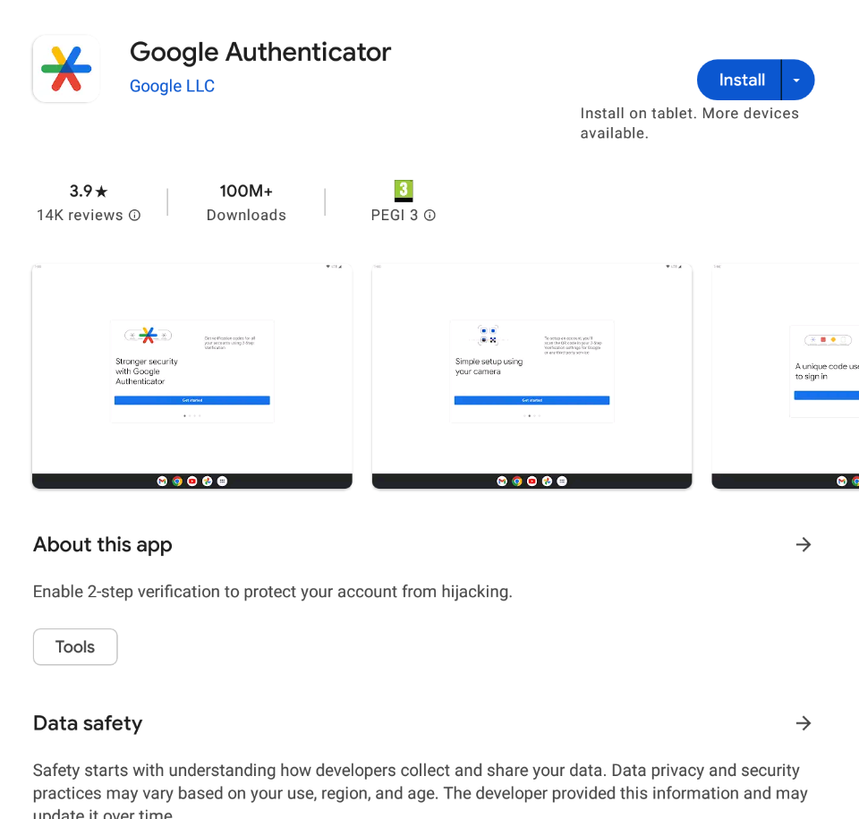
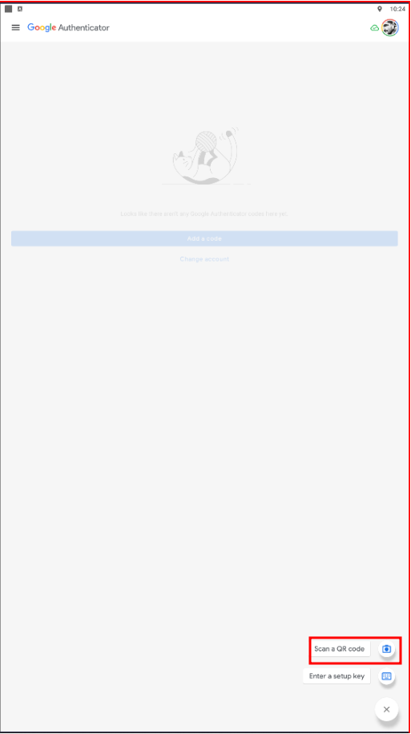
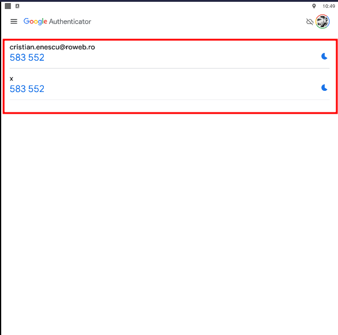

# 2 Factor Authentication

### Overview 

**Two-Factor Authentication (2FA)** — is a security process that adds an extra layer of protection to your online accounts beyond just a username and password.

Here’s how it works:

1. **First factor:** You log in with something you _know_ — usually your password.
2. **Second factor:** You verify your identity with something you _have_ or _are_, such as:
   * A **code** generated by an authentication app (e.g., Google Authenticator, Authy, Microsoft Authenticator)
   * A **code sent by SMS** or **email**

### Purpose 

As we know, 2FA is an extra layer of security used to make sure that people trying to gain access to an online account are who they say they are.

### Short description 

First, a user will enter their username and a password. Then, instead of immediately gaining access, they will be required to provide another piece of information.

### Working principle 

* **Super Administrator** This feature will be activated by a Super Admin from Users → Companies → Feature Access.

<figure><figcaption></figcaption></figure>

* **System Setup** We'll add a new setting window in order to choose what 2FA methods will be used. It's recommended to select all methods. But, it will be up to you.

<figure><figcaption></figcaption></figure>

* **User setup** We will set the user's email and password that will be used for authentication

<figure><figcaption></figcaption></figure>

Two additional fields for input of mail address will be added to user profile interface. These two fields will (currently) only be in use for the 2FA authentication code in supplement to the existing functions of the 1st field. When the 2nd and or 3rd field is infilled, the 2FA email will be sent to these addresses also. When the field is empty, it will be ignored.

<figure><figcaption></figcaption></figure>

If any of the fields are wrong, the user's profile will not be saved and an error "Email fields must be empty (including no spaces) or with recognized e-mail address format" will appear to the user.

**Note: The first field is mandatory.**

* **Main LOGIN screen**

After the login will be made as it is now, the user will complete the username and password, and then a new pop-up will appear with the following text:

<figure><figcaption></figcaption></figure>

In this pop-up, we’ll have the following elements:

* The email/ mobile phone of the user, partially displayed.
* A time counter that will allow the user to resend the code, just after the time expire.
* Redirection to another method of verification, just if it exists.
* Details regarding the company, in order to not leaving the user locked out

### 2 FA Methods 

* **Text Message**
  * Text messages for two-factor authentication send a login code to a mobile device number you register with the account (in a User case it will be sent to the phone number from the User's profile, and in a Customer case it will be sent to the Customer mobile number). This is the most streamlined form of 2FA.
  * In addition, personal phone plans may not offer service everywhere, which risks a user locking themselves out of their accounts while on an international business trip.
*   **Email**

    * Text messages for two-factor authentication send a login code to a mail address you register with the account (in a User case it will be sent to the email from the User's profile, and in a Customer case it will be sent to the Customer email address).
    * Any internet connection is enough to access your account.

    **Note: The details from the user: Email and phone number are usually used into the Select Offer Template. Still, if the user doesn’t want these details to be displayed, just simply mark this checkbox:**
* #### Google Authenticator Methods 

We will set the user email, and we will generate the QR code that will be used for authenticator

**Note: This settings will be configured before activate the 2FA from system setup**

<figure><figcaption></figcaption></figure>

Install on your device (Android / iOS) the Google Authenticator app

<figure><figcaption></figcaption></figure>

After you install the app, you will have 2 possibilities to get your code:

* Using a QR code scanner
* Enter the encoded key

<figure><figcaption></figcaption></figure>

**Using the QR code scanner**

* click on scan QR code
* place the QR code within yellow lines
* a code will be generated on your device (the code is changing every 30 seconds)

<figure><figcaption></figcaption></figure>

<figure><figcaption></figcaption></figure>

<figure><figcaption></figcaption></figure>

**Enter the Encoded key**

* copy the encoded key from the user authenticator
* click on enter a setup key on your device
* fill the account name
* fill the encoded key from the auth
* click add

<figure><figcaption></figcaption></figure>
