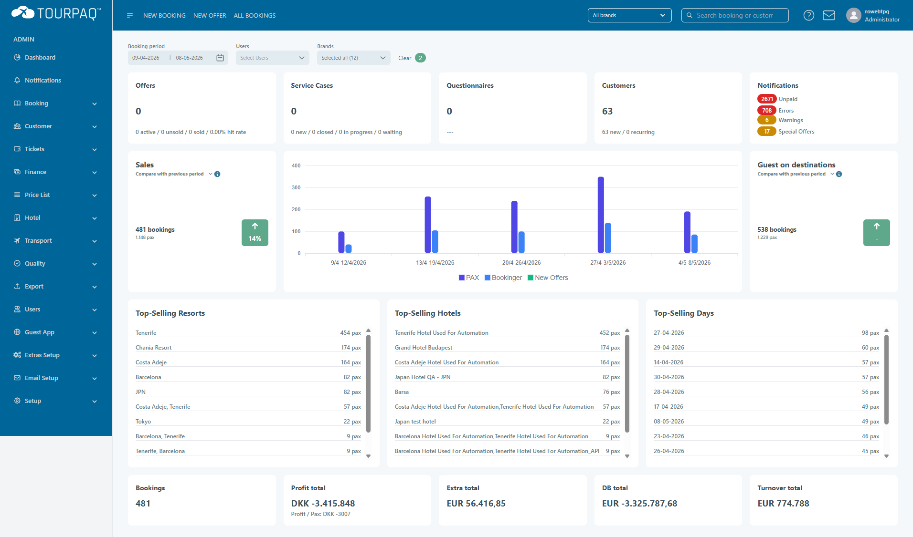

# What's new



## Tourpaq Release May 2026

New features, performance improvments and automation enhancements to help you work faster

<a href="./#recent-release-history" class="button primary" data-icon="book-open">See What's New -></a>



<figure><figcaption></figcaption></figure>




### Release symbols

* 🟢 **New** — New feature or page added.
* 🔵 **Improved** — Enhancement / Update to an existing feature.
* 📄 **Docs** — Documentation added or updated with no product change.

### Recent release history



##

fsadmvslmdl

<pre class="language-mmd" data-overflow="wrap"><code class="lang-mmd"><strong>```mermaid
</strong>timeline
    title What's New Timeline
    2026-05-20 : Auto paymnt
Reconciliation : v2.36.0
    2026-05-15 : Hotel Contarct Search
Enhenchements  : v2.35.0
    2026-05-10 : fixed issue
``` 
</code></pre>




{% column width="25%" %}
<details>

<summary>All time</summary>


</details>


{% column width="25%" %}
<details>

<summary>All categories</summary>

<i class="fa-group-arrows-rotate" style="color:$primary;">:group-arrows-rotate:</i> New updates

<i class="fa-dochub" style="color:violet;">:dochub:</i> Docs

<i class="fa-integral" style="color:$warning;">:integral:</i> Integration

<i class="fa-file-import" style="color:$success;">:file-import:</i>Improvments

</details>


{% column width="25%" %}
<details>

<summary>All modules</summary>


</details>



<p align="center"><button type="button" class="button primary" data-action="search" data-icon="magnifying-glass">Search updates…</button></p>





##





## 2026-06 (Tourpaq v15.2)

* 🔵 Extra Category - Display in Hotel List filter
* 🔵 Extra Category - One product must be selected



## 2026-04 (Tourpaq v15.1)

* 📄 **What's new** was added to track recent Tourpaq releases and documentation updates. See [What's new](./).
* 📄 **Price List** was updated with clearer search behavior, display logic, and bulk pricing guidance. See [Price List](price-list/pricelist.md).
* 📄 **Allotments** was updated with manual allotments, linked-to-transport allotments, and generic allotment guidance for Extras. See [Allotments](extras-setup/extras/allotments.md).
* 📄 **Print Tickets** was updated with clearer single-booking and bulk reprint workflows. See [Print Tickets](tickets/print-tickets.md).
* 📄 **Autobilling** was updated with prerequisites, invoice generation flow, lifecycle states, and troubleshooting. See [Autobilling](autobilling/).
* 🟢 Editable board hotel allotment. See [Hotel Allotment](hotel/hotel-creation/hotel-allotments/editable-board.md).
* 🟢 Log for Gouda & Europeiske insurance. See [Internal Logs](setup/internal-logs/insurance-payload-log-gouda-and-europaeiske.md).
* 🟢 Land days to Real Transports. [See Real Transport - Departures](real-transports/departures/add-land-days-to-real-transports-offset-handling.md).
* 🟢 Releases/Stop Sales Log. See [Releases/Stop Sales Log](releases-stop-sales-log.md).
* 🟢 Support user role. See [Users - Support User Role](users/users/support-user-role-gdpr-compliance.md)
* 🟢 Payment file import/File import format. See [File import format](finance/payment-file-import/skjernbank-file-import-format.md).
* 🔵 Hotel Release reporting. See [Hotel release - Reporting](hotel/hotel-creation/releases/hotel-release-reporting.md).
* 🔵 Remove GMT Offset. See [Arrival Gateway](setup/arrival-gateways/) & [Departure Gateway](setup/departure-gateways/).
* 🔵 Improvement to the new price list. See [Price List](price-list/pricelist.md#price-list-search).
* 🔵 Add code/name where missing in fields/tables. See [Special Offers](special-offers.md) & [Flight change](flight-change/).
* 🔵 Rounding on Extras & Discount/Supplements. See the [Extras Category](extras-category/) & [Discounts/Supplements Categories](disc-suppl-categories.md).
* 🔵 Add a new Room Types filter in All bookings. See [All Bookings](booking/all-bookings/).
* 🔵 Display Bookings and Total Pax for guide/guidemaster users in All Bookings. See [All Bookings](booking/all-bookings/).
* 🔵 Payment registration new filtering. See [Payment registration](finance/payment-registration.md).



## 2026-03 (Tourpaq v15.0)

* 🟢 **Transport Rules** added automatic extension support for transport rules. See [Edit Transport Rule](transport-rules/edit-transport-rule.md).
* 🔵 **Hotel release automation** now flags unused allotments as **Suitable for release** and emails suppliers automatically. See [Hotel release - automation](hotel/hotel-creation/releases/hotel-release-automation.md).
* 🔵 **Transport Rule Weekdays Support** adds weekday-based generation for transport rules that use two external providers. See [Transport Rule Weekdays Support](transport-rules/transport-rule-weekdays-support.md).
* 🔵 **Hotel release rules** were expanded with clearer day-level release logic, release-status recalculation, and editable past-date handling. See [Releases](hotel/hotel-creation/releases/).
* 📄 **Onboard a new employee (Tourpaq Office access)** was added to support user creation, role assignment, brand scope, and security setup. See [Onboard a new employee (Tourpaq Office access)](users/users/onboard-a-new-employee-tourpaq-office-access.md).
* 📄 A known transport-search edge case is now documented: departures can appear without a valid return date in specific rule-extension scenarios. See [Transport Search Displays Departure Without Return Date (Known Limitation)](booking/new-booking/new-booking/transport-search-displays-departure-without-return-date-known-limitation.md).



## 2026-02 (Tourpaq v14.9)

* 🟢 **Automatic ticket issue** was added for Amadeus GDS bookings, including deadline-based daily ticketing for eligible paid reservations. See [Automatic ticket issue](gds-queue-place/submit-a-gds-booking/automatic-ticket-issue.md).
* 🟢 **Individual payments** was added, allowing separate payment links per passenger on the same booking. See [Individual payments](booking/new-booking/individual-payments.md).
* 🟢 **QR code for vouchers** was added for faster voucher lookup and on-site validation. See [QR code for vouchers](booking/new-booking/qr-code-for-vouchers.md).
* 🔵 **Keep automatic discount prices** improves booking-edit handling by making price lock vs reprice behavior explicit for discounts, extras, and travel insurance. See [Keep automatic discount prices](booking/new-booking/keep-automatic-discounts-prices.md).
* 🔵 **No-show handling** was clarified for both transport reporting and export lists, improving operational consistency for outbound and homebound removals. See [Remove pax on outbound or homebound only, Transport Reporting Impact](booking/new-booking/remove-pax-on-outbound-or-homebound-only/remove-pax-on-outbound-or-homebound-only-transport-reporting-impact.md) and [Remove pax on outbound or homebound only, Export lists impact](booking/new-booking/remove-pax-on-outbound-or-homebound-only/remove-pax-on-outbound-or-homebound-only-export-lists-impact.md).
* 🔵 **Customer details on customer card** improves in-booking customer maintenance by saving reusable customer details directly from the booking flow. See [Customer info / Details on customer card](booking/new-booking/customer-info-details-on-customer-card.md).
* 📄 Ticket errata placement across ticket versions is now documented. See [Customer Information displayed on the Ticket](customer-information-errata/customer-information-displayed-on-the-ticket.md).



### Example

A release entry marked **🟢 New** means a new feature or workflow became available in that month.

A release entry marked **📄 Docs** means the manual changed, but the product behavior did not.

### Related pages

* [Welcome to the Tourpaq Manual](<README (2).md>)
* [Getting Started with Tourpaq](<README (1).md>)
* [Onboard a new employee (Tourpaq Office access)](users/users/onboard-a-new-employee-tourpaq-office-access.md)
