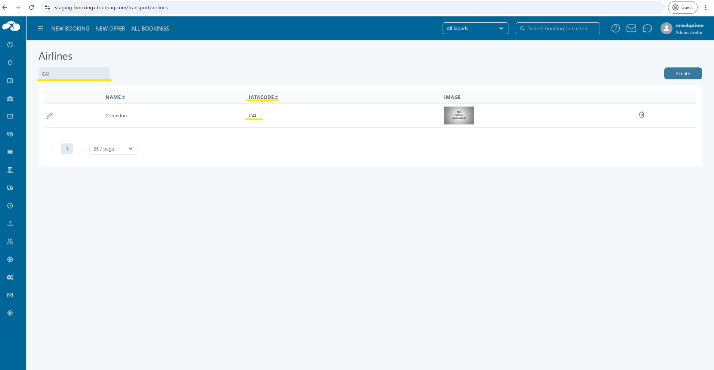

# Airlines

This feature is available for administrator user type.

Airlines page can be found in **Transport/Arilines**

### General 

Mandatory fields:

* Name - Name of the Airline.

Other fields:

* IATA Code - The IATA Code of the Airline
* Logo - The Airline logo, scaled to 55x30 size

<figure><figcaption></figcaption></figure>

Airline page contains a search filter using to search arilines by IATA Code

<figure><figcaption></figcaption></figure>
