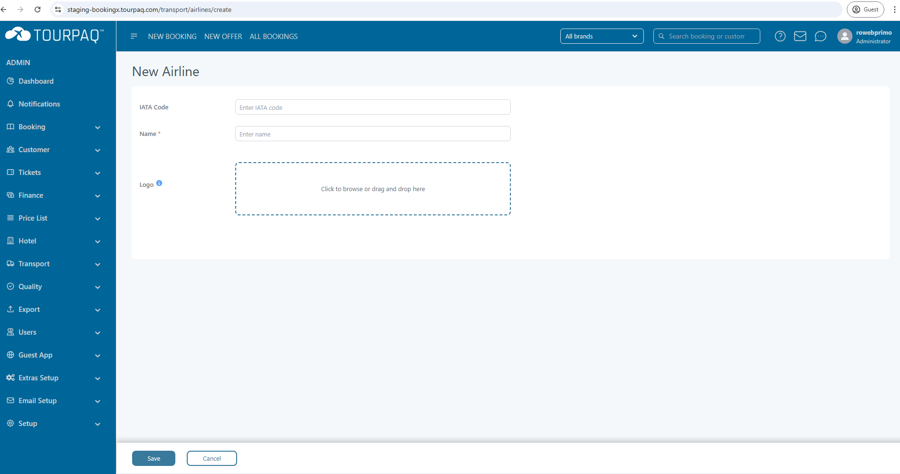

# Airlines

### Overview

The **Airlines** page allows administrators to manage the list of airlines available in the system. Each airline entry includes its name, IATA code, and an associated logo or image. These airlines can later be linked to transport rules, flight schedules, and booking processes.

### Purpose

This module ensures that all flights and transport allocations are associated with the correct airline information, using standardized IATA codes for consistency across integrations and reporting.

<figure><figcaption></figcaption></figure>

#### Table Columns

* **Name** – The full name of the airline (e.g., _Air France_, _Qatar Airways_).
* **IATA Code** – The official two- or three-letter IATA code identifying the airline (e.g., _AF_ for Air France, _QR_ for Qatar Airways).
* **Image** – The airline’s logo or image (optional, can be uploaded).

#### Actions

* **Create** – Opens a form to add a new airline with Name, IATA Code, and optional logo/image.
* **Edit (pencil icon)** – Allows editing an existing airline entry.
* **Delete (trash icon)** – Removes the airline from the list.

Airline page contains a search filter used to search airlines by IATA Code

### Create

#### **Overview**

The _New Airline_ form allows you to add airline information into the system. Airlines added here can later be linked to flights, bookings, or transport modules. This ensures that all air travel options are properly associated with the correct airline provider.

***

#### **Purpose**

* Maintain a centralized list of airlines used in the system.
* Ensure accuracy and consistency by using the **IATA Code** and official airline name.
* Upload airline logos for clear identification in booking documents and customer-facing materials.

***

#### **Preconditions**

Before creating a new airline:

1. Verify that the airline is not already present in the system to avoid duplicates.
2. Ensure you have the **official IATA code** (three-letter code) for the airline.
3. Prepare the **logo file** in an accepted format (e.g., JPG or PNG).

***

#### **Field Explanations**

<figure><figcaption></figcaption></figure>

* **IATA Code**:\
  A unique 2- or 3-letter code assigned by IATA (e.g., _LH_ for Lufthansa, _AF_ for Air France).\
  This field ensures standardized airline identification across systems and integrations.
* **Name**\*:\
  The full official airline name (e.g., _Lufthansa German Airlines_).\
  &#xNAN;_&#x54;his is a mandatory field._
* **Logo**:\
  Upload the airline’s official logo. You can click the field to browse or drag & drop the file.\
  The logo helps in easy visual identification on tickets, itineraries, and reports.

***

#### **Instructions**

1. Open the **New Airline** form.
2. Enter the airline’s **IATA Code** (must match the official one).
3. Enter the full **Name** of the airline.
4. Upload the airline **Logo** by clicking or dragging a file into the upload box.
5. Review the details to ensure correctness.
6. Save the new airline entry.
