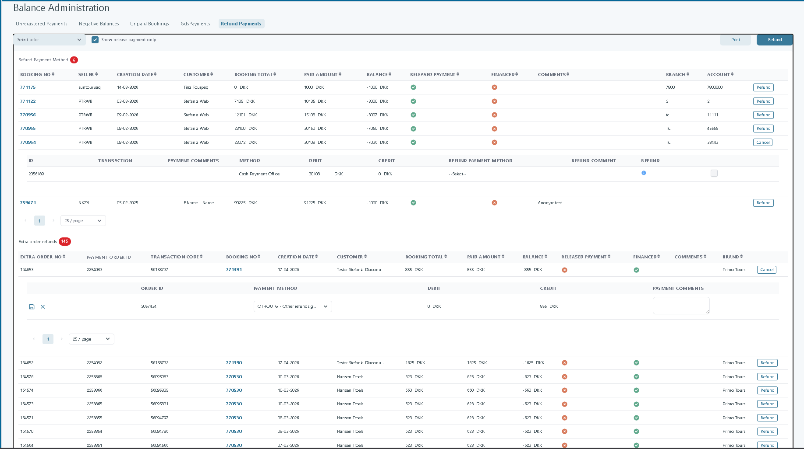
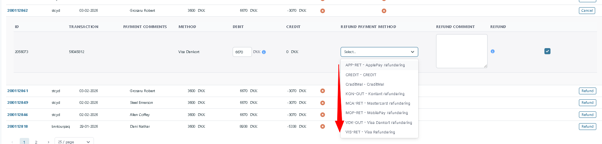
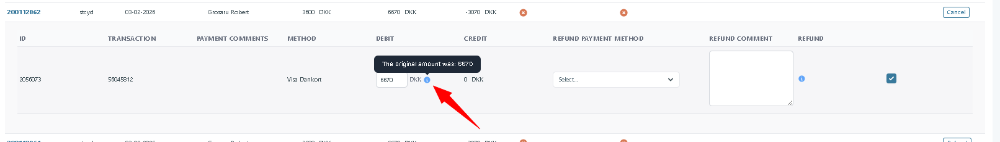
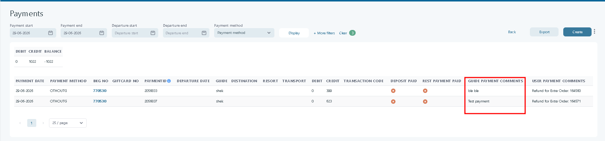
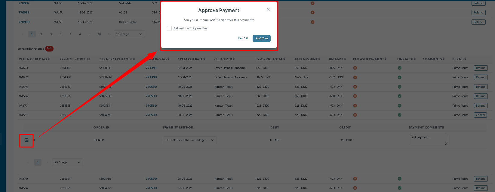

# Balance Administration

### Overview

**Balance Administration** helps you reconcile **booking balances** in Tourpaq Office Finance.

Use it to find **unregistered payments**, **unpaid bookings**, **overpayments**, and **refund cases**.

You need **Financial** or **Administrator** permissions.

Balance Administration includes these submodules:

* Unregistered payments
* Negative balances
* Unpaid bookings
* GDS payments
* Refund payments

### Unregistered payments

<figure><figcaption>
Unregistered payments: payment lines missing a booking number (Booking No).
</figcaption></figure>

Unregistered payments are payment lines without a **Booking No**.

When you assign the payment to a booking, it moves to [Payment Registration](finance/payment-registration.md).

#### **Table Fields Explained**

| Field               | Description                                                                                                                                                                   |
| ------------------- | ----------------------------------------------------------------------------------------------------------------------------------------------------------------------------- |
| **Payment Date**    | The calendar date the payment was made by the payer. Format: `DD-MM-YYYY`.                                                                                                    |
| **Accounting Date** | The date the payment is officially recognized in the ledger. May match or lag behind the Payment Date.                                                                        |
| **Payment Method**  | How the payment was made. Examples: `FI` (bank transfer), `GAVEKORT KOMP` (gift card compensation), `GAVEKORT GEVINST` (gift card prize), `GAVEKORTFAKT` (gift card invoice). |
| **Debit**           | Amount posted on the debit side (depends on your finance setup).                                                                                                              |
| **Credit**          | Amount posted on the credit side (depends on your finance setup).                                                                                                             |
| **Tracking Code**   | A system-generated or externally supplied reference for tracing or auditing payments.                                                                                         |
| **Fee Type**        | Placeholder for any transaction-associated fees (currently unused).                                                                                                           |
| **Fee Amount**      | Amount of any transaction fee (currently unused).                                                                                                                             |
| **Booking No**      | Reference to a booking if the payment has been or will be linked to one (currently empty).                                                                                    |

### Negative balances

<figure><figcaption>
Negative balances: bookings with an overpayment that may require a refund.
</figcaption></figure>

This list shows bookings where the customer likely paid **too much**.

Refund approval is controlled by **Release payment** on the booking.

#### **Functional Options**

* **Seller Filter:** Dropdown to view negative balances linked to specific sellers.
* **Show Release Payment Only:** Checkbox that filters the list to show only records marked for release payment.

#### **Table Fields Explained**

| Field               | Description                                                                                                      |
| ------------------- | ---------------------------------------------------------------------------------------------------------------- |
| **Booking No**      | Unique identifier for a booking. Clickable link for detailed booking view.                                       |
| **Seller**          | Identifier for the agency, travel operator, or partner responsible for the booking.                              |
| **Creation Date**   | The date the booking was first registered in the system.                                                         |
| **Departure Date**  | The scheduled start date of the trip or service.                                                                 |
| **Customer**        | The name or anonymized identifier of the customer linked to the booking.                                         |
| **Booking Total**   | The original total amount expected for the booking.                                                              |
| **Paid Amount**     | The actual amount received from the customer. May exceed the booking total.                                      |
| **Balance**         | The difference between **Booking total** and **Paid amount**. A negative balance typically means an overpayment. |
| **Release Payment** | Indicates whether the overpaid amount is approved for refund handling.                                           |
| **Financed**        | May denote if the balance was covered by financing or external source.                                           |
| **Comments**        | Manual notes or system-generated explanations, often anonymized for data privacy.                                |
| **Branch**          | Internal branch code or identifier                                                                               |
| **Account**         | May refer to the financial ledger account to which this balance belongs                                          |

### Unpaid bookings

<figure><figcaption>
Unpaid bookings: bookings with outstanding balance based on payment due dates.
</figcaption></figure>

This list shows bookings that are **not fully paid**.

Use filters like **departure dates** and **payment due dates** to narrow results.

Typical fields:

* Booking number
* Seller (seller ID)
* D.Due.Date (due date 1)
* SP.Due Date (due date 2)
* RP due Date (due date 3)
* Departure date
* Customer
* Booking total
* Paid amount
* Balance (amount remaining)
* Due amount

You can typically sort and filter by seller and agency.

### GDS payments

GDS payments help you reconcile costs for **Global Distribution System (GDS)** bookings.

Review ticket cost prices, airlines, and passenger details.

<figure><figcaption>
GDS payments: review ticket cost prices, PNR, airlines, and passenger details for reconciliation.
</figcaption></figure>

1. **Filter the Data:**
   * Use **Departure Period** and **Booking Period** filters to narrow down transactions.
   * Select a **Seller** to view specific payment records.
   * Click **+ More filters** for additional filtering options.
2. **Review Payment Records:**
   * Check the **booking number** to identify a specific transaction.
   * Review **customer, phone number, and passenger details** for accuracy.
   * Verify **PNR codes, airlines, and cost prices** to confirm payment details.
   * Cross-check **departure & arrival airports** for route confirmation.
3. **Manage Comments & Notes:**
   * Review **payment comments** for any transaction-specific notes.
   * Check **Admin Comments** for additional insights or follow-ups.
4. **Edit or Update Payments:**
   * Click on the **Edit (Pencil) Icon** next to a record to modify details.
   * Ensure all updates align with booking and financial records.

**Key fields explained:**

* **Booking No.:** Unique reference number for the transaction.
* **Customer & Phone:** Identifies the traveler and contact details.
* **Passengers No.:** Number of passengers for the booking.
* **Departure & Arrival Dates:** Flight schedule details.
* **PNR Codes & Airlines:** Booking reference and airline information.
* **Cost Price:** Total ticket price in the designated currency.
* **Departure & Arrival Airports:** Flight route details.
* **Payment & Admin Comments:** Notes related to transaction status.

**Additional Actions:**

* Use the **filters** to refine searches for specific time frames, sellers, or bookings.
* Ensure **cost prices** match expected payments to avoid discrepancies.

## Refund Payments

### Overview

The **Refund Payments** feature provides a centralized workspace for managing customer refunds within **Balance Administration**. It enables finance users to identify refundable payments, review their payment details, and process refunds without leaving the page.

The feature displays two categories of refundable transactions:

* **Booking Refunds**, for payments made directly against a booking.
* **Extra Order Refunds**, for payments related to Extra Orders purchased separately from the booking.

Only payments that are eligible for refund are displayed. This provides finance users with a clear overview of outstanding refunds while keeping booking payments and Extra Order payments separated.

***

### Configuration

The Refund Payments feature does not require dedicated configuration.

The information displayed is automatically generated from:

* Registered customer payments.
* Booking balances.
* Extra Order payments.
* Payment release status.
* Financing status.
* Seller, branch, account, and brand information.

A payment becomes available for refund when the customer has paid more than the outstanding balance, resulting in a refundable amount.

***

### Access

Navigate to:

**Balance Administration → Refund Payments**

<figure><figcaption></figcaption></figure>

***

### How the Feature Works

The refund workflow is now identical for Booking Payments and Extra Orders.

1. Open **Finance → Balance Administration → Refund Payments**.
2. Locate the booking or Extra Order requiring a refund.
3. Click **Refund**.
4. Review the payment information.
5. Confirm or change the automatically selected Refund Method.
6. Enter an optional Refund Comment.
7. Click **Refund** in the page toolbar.

If the payment was processed through a supported payment provider, Tourpaq executes the refund directly with the provider while simultaneously registering the refund transaction in Tourpaq.

***

## Refund Payment Method

The **Refund Payment Method** section displays refundable booking payments.

#### Available Filters

| Filter                        | Description                                                           |
| ----------------------------- | --------------------------------------------------------------------- |
| **Seller**                    | Displays refundable payments for the selected seller.                 |
| **Show release payment only** | Displays only payments that have been released for refund processing. |

#### Information Displayed

<table data-search="false"><thead><tr><th>Column</th><th>Description</th></tr></thead><tbody><tr><td>Booking No</td><td>Booking number.</td></tr><tr><td>Seller</td><td>Seller responsible for the booking.</td></tr><tr><td>Creation Date</td><td>Booking creation date.</td></tr><tr><td>Customer</td><td>Customer name.</td></tr><tr><td>Booking Total</td><td>Total booking value.</td></tr><tr><td>Paid Amount</td><td>Total amount paid by the customer.</td></tr><tr><td>Balance</td><td>Refundable balance. Negative values indicate an amount that can be refunded.</td></tr><tr><td>Released Payment</td><td>Indicates whether the payment has been released.</td></tr><tr><td>Financed</td><td>Indicates whether the payment is financed.</td></tr><tr><td>Comments</td><td>
The comment is associated with the refund transaction and is displayed in the <strong>Guide Payment Comments</strong> section of the Payment Registration window.

This comment is independent of the existing <strong>Payment Comments</strong>, which remain unchanged.
</td></tr><tr><td>Branch</td><td>Branch number.</td></tr><tr><td>Account</td><td>Customer account number.</td></tr><tr><td>Refund</td><td>Opens the refund workflow.</td></tr></tbody></table>

When a refund is initiated:

* If the original payment method has a configured **Refund Method**, it is selected automatically.
* Otherwise, the payment method remains unselected and displays **-- Select --**.

A refund cannot be completed until a refund payment method has been selected.

The Booking Refund table has been updated with several usability enhancements:

* Refunds are sorted by **Creation Date**, newest first.
* **Show release payment only** is enabled by default.
*   Payment methods are displayed alphabetically as `<CODE> - <NAME>`.  &#x20;

    <figure><figcaption></figcaption></figure>
*   Tooltips display the original transaction amount while editing a refund.&#x20;

    <figure><figcaption></figcaption></figure>
* Currency is shown for all monetary values, including:
  * Booking Total
  * Paid Amount
  * Balance
  * Debit
  * Credit

***

## Extra Order Refunds

The **Extra Order Refunds** section displays refundable payments originating from Extra Orders.

Each refundable Extra Order is presented independently from the booking payments.

When a refund is initiated, the user can:

* Review the payment information.
* Select the refund payment method.
* Enter payment comments.
* Process the refund directly from the expanded row.

#### Information Displayed

<table data-search="false"><thead><tr><th>Column</th><th>Description</th></tr></thead><tbody><tr><td>Extra Order No</td><td>Internal Extra Order identifier.</td></tr><tr><td>Payment Order ID</td><td>Payment provider reference.</td></tr><tr><td>Transaction Code</td><td>Payment transaction identifier.</td></tr><tr><td>Booking No</td><td>Related booking number.</td></tr><tr><td>Creation Date</td><td>Extra Order creation date.</td></tr><tr><td>Customer</td><td>Customer name.</td></tr><tr><td>Booking Total</td><td>Total order value.</td></tr><tr><td>Paid Amount</td><td>Amount paid.</td></tr><tr><td>Balance</td><td>Refundable amount.</td></tr><tr><td>Released Payment</td><td>Indicates whether the payment has been released.</td></tr><tr><td>Financed</td><td>Indicates whether the payment is financed.</td></tr><tr><td>Comments</td><td>Internal comments.</td></tr><tr><td>Brand</td><td>Booking brand.</td></tr><tr><td>Refund</td><td>Opens the refund workflow.</td></tr></tbody></table>

***

## Processing a Refund

Selecting **Refund** expands the selected row and displays the payment information required to process the refund.

The refund is configured directly within the page before it is submitted.

### Booking Refunds

For booking payments, the expanded section displays the original payment transaction together with the refund configuration.

<figure><figcaption></figcaption></figure>

The following information is available:

<table data-search="false"><thead><tr><th>Field</th><th>Description</th></tr></thead><tbody><tr><td>ID</td><td>Internal payment transaction identifier.</td></tr><tr><td>Transaction</td><td>Original payment transaction.</td></tr><tr><td>Payment Comments</td><td>Existing comments for the payment.</td></tr><tr><td>Method</td><td>Original payment method.</td></tr><tr><td>Debit</td><td>Original debit amount.</td></tr><tr><td>Credit</td><td>Credit amount.</td></tr><tr><td>Refund Payment Method</td><td>Select the payment method that will be used for the refund.</td></tr><tr><td>Refund Comment</td><td>Optional internal comment for the refund.</td></tr><tr><td>Refund (info point)</td><td>Selected lines will be refunded the amount specified, using the selected method. The refund is executed when the "Refund" button is pressed.</td></tr></tbody></table>

***

### Extra Order Refunds

For Extra Order refunds, expanding the row displays the payment order that will be refunded.

<figure><figcaption></figcaption></figure>

The following information is available:

| Field            | Description                                                                                                                                                                             |
| ---------------- | --------------------------------------------------------------------------------------------------------------------------------------------------------------------------------------- |
| Order ID         | Internal payment order identifier.                                                                                                                                                      |
| Payment Method   | Payment method used for the refund.                                                                                                                                                     |
| Debit            | Debit amount.                                                                                                                                                                           |
| Credit           | Refund amount.                                                                                                                                                                          |
| Payment Comments | Optional comment stored with the refund transaction. The comments are shown in the Payment Registration menu under the Guide Payment Comments column.  |

***

### Payment Provider Refunds

Extra Order refunds now support automatic refunds through supported payment providers.

Currently supported:

* Altapay

If the payment was made using a supported credit card payment method, Tourpaq sends the refund directly to the payment provider, matching the existing behaviour for booking refunds.

<figure><figcaption></figcaption></figure>

### Completing the Refund

To process a refund:

1. Open **Balance Administration → Refund Payments**.
2. Locate the booking or Extra Order that requires a refund.
3. Click **Refund**.
4. Review the payment details.
5. Select the appropriate **Refund Payment Method**.
6. Optionally enter a refund comment.
7. Mark the payment for refund, if applicable.
8. Click **Refund** in the page toolbar to complete the refund.

The transaction is then processed using the configured payment provider.

***

### How the Feature Appears in Tourpaq

The **Refund Payments** page provides a complete overview of refundable customer payments in a single workspace.

The interface consists of two independent grids:

* **Refund Payment Method**, listing refundable booking payments.
* **Extra Order Refunds**, listing refundable Extra Order payments.

Each grid supports:

* Filtering (booking refunds by seller)
* Pagination
* Adjustable page size
* Inline expansion of refund details
* Direct refund processing

After clicking **Refund**, the selected row expands to display the original payment information together with the fields required to configure the refund. This allows finance users to review the transaction, select the refund payment method, add optional comments, and complete the refund without navigating away from the page.
