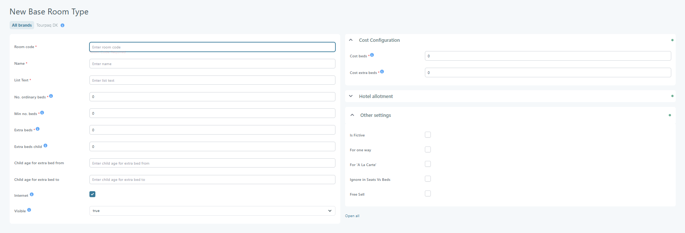

# Base room types

### Overview

The **Base Room Types** feature is used to define and insert room types into the system. Each hotel has a variety of room types available for sale. These room types are chosen from the predefined **Base Room Types**, which must first be set up in the system by an administrator.


Think of a base room type as a “master” room definition. You can still adjust name and beds per hotel later.


### Where base room types are used

* Hotel setup, when you add room types to a hotel.
* Exports, where the room name can differ from the UI name.
* Availability dashboards like [Seats vs. Beds](seats-vs-beds.md) (unless excluded).

### Creating a New Room Type

1. Navigate to **Hotel → Base Room Types**.
2. Click the **Create** button.
3. Complete the required fields described below.

### Field Descriptions

<figure><figcaption></figcaption></figure>

#### General Information

* **Room Code** – Unique system identifier. Treat this as stable once used.
* **Name** – Room name shown in Tourpaq Office.
* **List Text** – Room name used in export files.
* **Internet** – Makes the room available via API. Used for website sales and integrations.
* **Status** – Shows or hides the room type in the UI.
* **Is Fictive** – Marks the room as virtual. Use for internal logic or planning. Common for one-way hotels and one-way transport seats.
* **For One Way** – Only for one-way transport. Only one room type can be defined per company. Enables price list creation for one-way trips.
* **Ignore in Seats vs. Beds** – Excludes the room from **Seats vs. Beds**.
* **For A La Carte** – Makes the room available for [A La Carte](booking/new-booking/a-la-carte/) bookings.

#### Bed Configuration

* **No. Ordinary Beds** – The number of beds in the room that are not extra beds.
* **Min No. Beds** – The minimum number of beds (guests) that must be used by a booking in this room.
* **Extra Beds** – The minimum number of beds (guests) that must be used by a booking in this room.
* **Extra Beds Child** – The number of child-sized beds in the room. The age range for child beds can be specified in "Child age for extra beds" here, but if specified in the hotel, it takes precedence.
* **Child age for extra bed from** – Minimum child age for child extra beds.
* **Child age for extra bed to** – Maximum child age for child extra beds.

#### Cost Configuration

* **Cost Beds** – The number of beds (guests) who shall pay full price, independently of age.
* **Extra Beds Cost** – The number of beds that are used for "Extra beds cost" in the hotel.

### Hotel Allotment

Shows all hotels and periods with allotments for this room type.

<figure><figcaption></figcaption></figure>

#### Child Rooms

When you add a room type to a specific hotel, you can override:

<figure><figcaption></figcaption></figure>

* The room name.
* The number and type of beds.

<figure><figcaption></figcaption></figure>

<figure><figcaption></figcaption></figure>

### FAQ

#### 1. What is the difference between a base room type and a hotel room type?

**Q:** What’s the difference?\
**A:** A base room type is a shared template. A hotel room type is the hotel-specific version. The hotel version can override name and beds.

#### 2. Why can’t I see my room type in the booking flow?

**Q:** The room type exists, but it does not show up. Why?\
**A:** Check the room **Status** first. Then check if **Internet** must be enabled for your channel.

#### 3. When should I use “Is Fictive”?

**Q:** What is a fictive room type for?\
**A:** Use it for virtual configurations. Examples include one-way hotels or internal planning setups.

#### 4. What does “Ignore in Seats vs. Beds” do?

**Q:** Will it affect availability or sales?\
**A:** It only removes the room type from the **Seats vs. Beds** overview. It does not delete the room type.

#### 5. Can I rename the room without breaking exports?

**Q:** I want one name in the UI and another in exports. Can I do that?\
**A:** Yes. Use **Plaintext** for the UI name. Use **List Text** for the export name.

#### 6. Can I change the Room Code later?

**Q:** Is it safe to change?\
**A:** Avoid changes after the room type is in use. It is a unique identifier. Changing it can break references and integrations.
