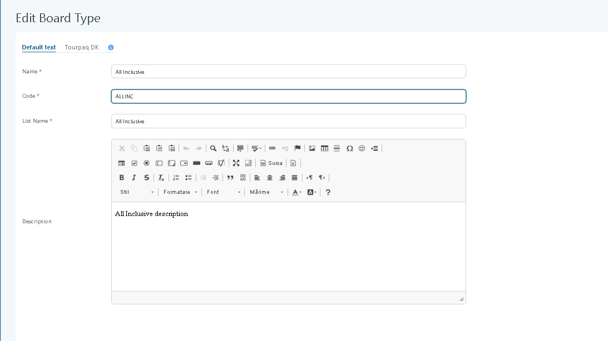
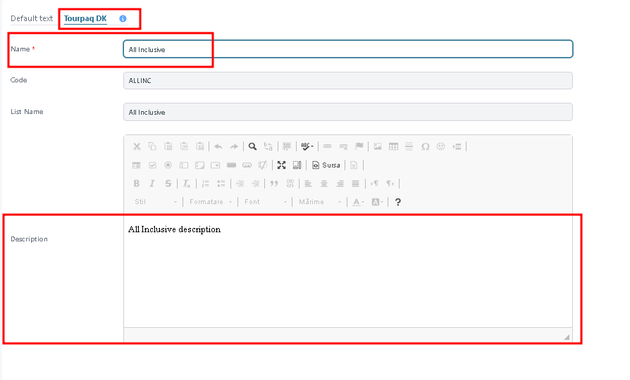

# Board Type

## Board Type

### Overview

**Board Type** defines the meal plans available in the system. A board type represents a specific meal arrangement, such as Breakfast, Half Board, or All Inclusive.

At the hotel level, the **Board Basis** defines which meal plan is included in the price.

A **Board Basis Extra** represents the meal plan included in the price of the room. Each Board Basis Extra is linked to a Board Type, which identifies the meal plan it represents.

A **Board Supplement Extra** represents an upgrade to a different meal plan. Like a Board Basis Extra, it is linked to a Board Type that defines the meal plan being offered.

**Board Supplement Policy** controls how board supplements are handled in the booking process. The policy is configured on the **Extra Category** level and is shared by all hotels linked to that Extra Category.

Board type assignments are subject to change over time. A hotel contract may define one board type for a room in a given year and a different board type for the same room in other contract periods, depending on negotiated terms.

### Board types management

The **Board Types** section allows Administrators to configure and maintain the list of board types available in the system. These types are used to define the meal and service options associated with a room booking at a hotel.

<div data-with-frame="true"><figure><figcaption></figcaption></figure></div>

#### Interface overview

Board Types represent different service packages offered by hotels. These may include combinations of meals, drinks, and seasonal offerings. Each board type is uniquely identified by a code and can be used across multiple hotel contracts and room configurations.

#### Interface elements

| Column                                                                                                       | Description                                                                                                                                                                              |
| ------------------------------------------------------------------------------------------------------------ | ---------------------------------------------------------------------------------------------------------------------------------------------------------------------------------------- |
| **Name**                                                                                                     | Display name of the board type, shown in system (mandatory)                                                                                                                              |
| **Code**                                                                                                     | Unique system identifier (mandatory).                                                                                                                                                    |
| **List Name**                                                                                                | Is used in all communication with the hotel (lists) (mandatory)                                                                                                                          |
| **Order** <i class="fa-arrow-up-long">:arrow-up-long:</i><i class="fa-arrow-down-long">:arrow-down-long:</i> | <p>The order of Board types is used when the system must automatically downgrade or upgrade a board type.<br>The board type with the highest order is considered the most expensive.</p> |
| **Trash icon** <i class="fa-trash-can">:trash-can:</i>                                                       | Deletes the selected board from the list.                                                                                                                                                |

#### Actions

* **Create**:
  1. In **Board Types**, click **Create**.
  2. Enter **Name**, **Code**, and **List Name**.
* **Delete**: Use the **Trash icon** next to a board type to remove it. Deletion is only possible when existing contracts or configurations do not reference the board type.
* **Ordering:** The order of Board types is used when the system automatically downgrades or upgrades a board type.
* **Edit:** Opens the selected Board Type for configuration changes, including **Name**, **Code**, **List Name**, and **Description**.

### Editing a board type

<div data-with-frame="true"><figure><figcaption></figcaption></figure></div>

#### Overview

This page supports the following tasks:

* Modify an existing board type.
* Maintain multilingual translations in **Custom text**.
* Add a customer-facing description that can be displayed in different parts of the system.

#### Page layout

The page contains two language tabs:

* **Default text**: The default language used by the system.
* **Custom text (for example Tourpaq DK)**: Customizes the appearance and description of the board type in booking flows or documentation.

<div data-with-frame="true"><figure><figcaption></figcaption></figure></div>

Only the text fields are translated. The board type code and list name remain the same across all languages.

### Field descriptions

#### Name

**Name \*** is the internal name of the board type.

This value is used throughout Tourpaq when selecting a board type during hotel contract configuration.

**Example:**

| Value         | Result                                               |
| ------------- | ---------------------------------------------------- |
| All Inclusive | Displayed as the board type in configuration screens |
| Breakfast     | Used when assigning breakfast to hotel rooms         |

#### Code

**Code \*** is the unique identifier for the board type.

The code is primarily used internally by the system and integrations. It should be short, unique, and should not be changed after the board type has been used in hotel contracts.

**Example:**

```
ALLINC
```

#### List Name

**List Name \*** is the customer-facing name shown in selection lists and dropdown menus.

**Example:**

| Name          | List Name     |
| ------------- | ------------- |
| All Inclusive | All Inclusive |
| Breakfast     | Breakfast     |

#### Description

**Description** provides additional information about what the board type includes.

This text can be displayed in customer-facing areas such as web booking or travel documents, depending on system configuration.

Use this field to explain exactly what is included in the meal plan.

**Example:**

```
Breakfast, lunch, dinner, snacks and selected local beverages are included throughout the stay.
```

### Custom text

**Custom text** customizes the appearance and description of the board type in booking flows or documentation.

The customized fields are:

* **Name**
* **Description**

The **Code** remains identical in every language.

**Example:**

| Default       | Danish        |
| ------------- | ------------- |
| All Inclusive | All Inclusive |
| Breakfast     | Morgenmad     |
| Half Board    | Halvpension   |

### Example

The following example creates a standard **All Inclusive** board type.

| Field       | Value                                                                                      |
| ----------- | ------------------------------------------------------------------------------------------ |
| Name        | All Inclusive                                                                              |
| Code        | ALLINC                                                                                     |
| List Name   | All Inclusive                                                                              |
| Description | Breakfast, lunch, dinner, snacks, and selected beverages are included throughout the stay. |

Once saved, the board type becomes available when configuring hotel room board basis in hotel contracts and can be selected during room setup.

### Use in the system

Board Types are used in:

* **Hotel / Allotment**
* **Extras/Extras**
* **Webbooking**
* **Booking window**
* **Ticket**
