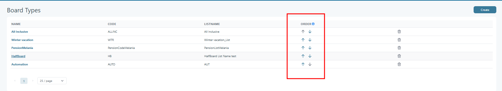

# Board Behaviour During Booking

### Overview

This functionality defines how the system handles **board types (pension)** during the booking flow, especially in scenarios where:

* the board must remain consistent throughout the entire stay
* the board changes within the contract period
* availability or closeout restrictions exist on certain days

The goal is to ensure that the customer is offered a valid board option for the **entire stay**, not just partially.

***

### Customer Outcome

The customer will only see board options that are valid for the entire booking period.

Example:

* The hotel offers:
  * BB for the first days
  * HB for the remaining days
* The system will check availability across the full stay and propose:
  * HB for the entire stay (if possible via combination)

If no valid combination exists:

* no consistent board will be offered
* only individually available supplements will be displayed

***

### Key Concepts

#### Board Consistency Rule

A board can only be selected if:

* it is available for all days in the booking
* there is no closeout on any day

***

### Extras Setup | Board Types

#### Ordering Board Types

To support automatic upgrade/downgrade scenarios, board types must be ordered.

#### Functionality

* Board types can be reordered
* Reordering is done via:
  * drag & drop or
  * arrow buttons

#### UI Placement

* Move arrows are located between List Name and the delete (trash) icon

<figure><figcaption></figcaption></figure>

**Tooltip**

> The order of Board types is used when the system has to downgrade or upgrade a board type automatically.\
> The topmost board type will be considered the highest order (most expensive).

**Rules**

* Top position = highest board (e.g. ALLINC)
* Bottom position = lowest board (e.g. HB)

***

### Extras Category Setting

#### New Option: All stay days must be available

<figure><figcaption></figcaption></figure>

<figure><figcaption></figcaption></figure>

**Location**

* Extras Category → Settings

**Visibility**

This option is only visible when:

* Category type = Pension
* Category type = Gala dinner

**Tooltip**

> If selected, the extra is only eligible if it is available for the full booking period.

**Behaviour**

If enabled:

* the extra is eligible only if:
  * it has pricing for all days
  * it is not closed out on any day

**Note**

Used for:

* Board supplements → enabled
* Gala dinner → optional

***

### Boards Eligible for Booking

A board supplement can only be selected if:

* it is available for all days of the booking
* it complies with the "All stay days must be available" rule

***

### Board Basis Changes During Booking Period

#### Problem

Some hotels have different board basis depending on the period (e.g. BB → HB)

#### System Solution

**Step 1: Identify the main board**

* Select the board with the **highest order** within the booking period

**Step 2: Find supplements**

* Search for board supplements for days where the board differs from the main board

**Step 3: Build a combination**

* Create a combination:
  * main board basis
  *   supplements for differences

      <figure><figcaption></figcaption></figure>

**Step 4: Validate**

The combination is valid only if:

* it covers all days
* all supplements are available

***

#### Fallback

If NO valid combination is found:

* the system stops trying to build a consistent board
* displays only individually available supplements

***

### Booking Behaviour

If the user selects a combination:

#### Ticket Display

* The system displays the main board (highest order)

#### Pricing

* The price:
  * includes all supplements
  * is aggregated into the base booking price

***

### Hotel Contract Import

During import,the Board Supplements must automatically be set with:

* "All stay days must be available" = TRUE

***

### Backward Compatibility

#### Identify Existing Board Supplements

An extra is considered a board supplement if:

* Category type = Pension
* "Use Stay days in prices" is enabled

#### Action

* All such extras:
  * will be automatically updated:
    * "All stay days must be available" = TRUE

### Example Scenario

#### Input

* Booking: 7 nights
* Hotel:
  * days 1–3: BB
  * days 4–7: HB
* Board Types order:
  * HB (top)
  * BB

#### Output

* The system:
  * selects HB as the main board
  * adds supplements for days 1–3

#### Result

* Customer sees:
  * HB for the entire stay
* Price:
  * includes upgrade supplements

### FAQ

#### Why does the booking show the higher board for the full stay?

Tourpaq uses the highest ordered valid board as the main board.

Supplement lines cover the days where the hotel contract uses a lower board.

This keeps the stay consistent in booking output and pricing.

#### What happens if one board day is closed out?

That board cannot be used for a full-stay combination.

The system only accepts a board when every required day is available.

If no full-stay combination is valid, only individually available supplements are shown.

#### Does this rule apply only to board supplements?

No. The same availability rule can also be used for **Gala dinner** extras.

The option is available only for **Pension** and **Gala dinner** category types.

#### What happens to existing board supplements after this behavior is enabled?

Existing board supplements that match the supported setup are updated automatically.

Tourpaq sets **All stay days must be available** to active for those extras.

### Related pages

* [Board Type - Hotel allotment / Ticket](board-type-hotel-allotment-ticket.md)
* [Board Type - Extra](board-type-extra.md)
* [Board Type - Webboking](board-type-webboking.md)
* [Extra Category Overview](../extras-category/extra-category-overview/)
