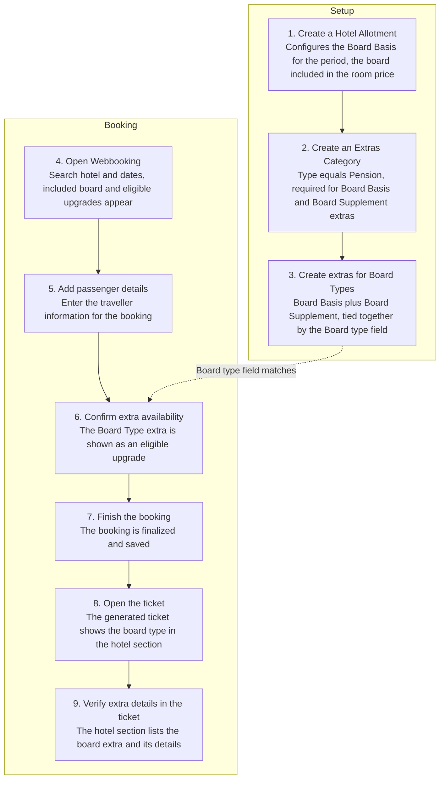

# How to use a Board Type

## How to use a Board Type

### Overview

This page walks through a complete example of setting up and using a [.](./ "mention"), from initial configuration through to how it appears on a booking and its ticket.

The example covers two parts:

* **Setup** — creating the Hotel Allotment, the Extras Category, and the Board Basis and Board Supplement extras that represent the board type.
* **Booking** — searching Webbooking, adding a passenger, and confirming how the board type and any Board Supplement upgrade appear on the booking and the generated ticket.

### 1. Create a Hotel Allotment

Create a Hotel Allotment for the room type. Configure its Board Basis for the relevant period. This setting determines the board included in the room price.

<figure><figcaption></figcaption></figure>

### 2. Create an Extras Category

Create an Extras Category with the type Pension. Board Basis and Board Supplement extras must belong to a category of this type.

### 3. Create extras for Board Types

Create a Board Basis extra for the board included in the room price, and a Board Supplement extra for any upgrade. The **Board type** field identifies the board represented by the extra. Tourpaq uses this field to match extras on the web and support upgrades. The **Board basis filter** limits a Board Supplement extra to rooms with a matching Board Basis. For example, create a Breakfast (BB) Board Basis extra, then create an All Inclusive Board Supplement extra with **Board basis filter** set to Breakfast.

<figure><figcaption></figcaption></figure>

<figure><figcaption></figcaption></figure>

### 4. Open Webbooking

Open Webbooking. Search for the hotel and travel dates. Rooms appear with the Board Basis included in the price and eligible Board Supplement upgrades.

<figure><figcaption></figcaption></figure>

### 5. Add passenger details

Enter passenger details.

<figure><figcaption></figcaption></figure>

### 6. Confirm extra availability

Tourpaq shows the Board Type extra as an eligible option.

<figure><figcaption></figcaption></figure>

### 7. Finish the booking

Finalize the booking. The booking is saved successfully.

### 8. Open the ticket

Open the generated ticket. The ticket shows the board type in the hotel section.

<figure><figcaption></figcaption></figure>

### 9. Verify extra details in the ticket

The ticket's hotel section shows the board type together with the extra's details.

<figure><figcaption></figcaption></figure>

