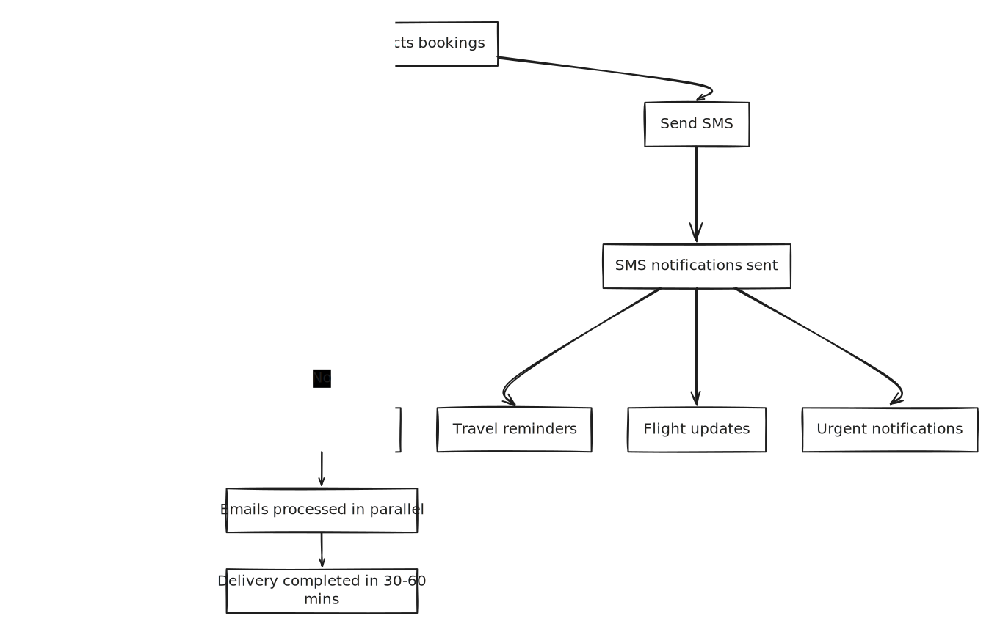

# All bookings

### .**Overview**

**All Bookings** is the central search and management hub for existing reservations. It allows agents, operations staff, finance teams, and managers to find any booking quickly, review its details, and drill into statistical and financial reports — all within a single, highly filterable interface.

Whether you are looking for one specific booking by number, reviewing today's departures, analysing last month's sales performance, or checking outstanding balances, All Bookings is your starting point.


**Need to create a new booking?** All Bookings is for managing existing reservations. To create a new one, go to [New Booking](https://manual.tourpaq.com/booking/new-booking).&#x20;


***

### **Purpose**

All Bookings is designed to support three distinct use cases:

**Daily operations** — Agents use it to quickly locate a specific booking, check its status, and open it for editing or communication.

**Management reporting** — Managers use the Statistics and Totals views to analyse booking volumes, turnover, profit, and trends across brands, destinations, hotels, and periods.

**Finance reconciliation** — Finance teams use filters like Status, Owner, and Booking Period combined with the Totals view to verify revenue, outstanding balances, and profitability per segment.

***

### **Preconditions**

Before using All Bookings, ensure the following:

* You are logged in with a user role that has access to the Booking module. Contact your administrator if All Bookings is not visible in your sidebar.
* You must select at least one **Brand** before clicking Display — without a Brand selected, no results will load.
* Date range filters that work in pairs (e.g. Booking Start + Booking End) must always be filled in together. Leaving one half of a pair empty will not return the expected results.
* Statistics views require a Brand to be selected and Display to be clicked first before the Statistics button becomes active.


If no bookings appear after clicking Display, the first thing to check is whether a **Brand** has been selected. This is the most common cause of empty results.&#x20;


***

### **Common use cases**

* Find bookings by **brand**, **booking period**, and **travel dates** (departure/arrival/return).
* Track **arrivals** and **departures** for operations.
* Report **turnover** and **profit** by hotel, resort, transport, or owner.
* Compare periods using booking statistics and totals.

***

### How to Use All Bookings

#### Step 1 — Open All Bookings

Go to **Booking → All Bookings** in the left sidebar. The page opens with an empty filter panel and no results loaded — results only appear after you apply filters and click **Display**.

***

#### Step 2 — Select a Brand

In the **Brands** filter, select one or more Brands you want to search within. This is mandatory — no data will load without it.

***

#### Step 3 — Apply filters

Set the filters that match what you are looking for. You do not need to fill in every filter — use only what is relevant to your query. The most common filter combinations are:

* **Find a specific booking** → Booking No. only
* **Today's new bookings** → click **Today's Bookings** shortcut
* **All bookings for a departure period** → Departure Period (Start + End)
* **Bookings for a specific hotel** → Hotels filter
* **All bookings by a specific agent** → Owners filter
* **Cancelled bookings in a period** → Status = Cancelled + Booking Period


Use the **More Filters** button to access additional filter options not shown by default. A green badge on the button indicates how many additional filters are currently active.&#x20;


***

#### Step 4 — Click Display

Click the **Display** button to execute the search. The bookings table loads with all reservations matching your filter criteria. The statistics bar at the bottom of the page immediately shows summary totals for the filtered result set.

***

#### Step 5 — Work with the results

From the results table you can:

* **Open a booking** by clicking its **Booking No.** in the first column
* **Sort the list** by clicking any column header
* **Adjust visible columns** using the column selector (⋮) on the right side of the table header
* **Navigate pages** of results using the pagination controls at the bottom
* **View a quick financial summary** in the statistics bar below the table

***

#### Step 6 — Access Statistics or Totals

For deeper analysis, use the additional views available after clicking Display:

* Click **Statistics** to open a detailed breakdown by passengers, turnover, profit, and more
* Click **Totals** to see a cost and profit summary for the filtered bookings
* See [Statistics in All Bookings](https://manual.tourpaq.com/booking/all-bookings/statistic-in-all-bookings) and [All Bookings Totals](https://manual.tourpaq.com/booking/all-bookings/all-bookings-totals) for full details on these views

***

#### Step 7 — Save a View (optional)

If you run the same filter combination regularly, click **Save View** to save it as a named shortcut. Saved views appear as quick-access options so you don't need to rebuild the same filters every session. Examples of useful saved views: _Today's Arrivals_, _This Week's Departures_, _Brand X — Hotel Y Performance_.

***

#### Step 8 - Booking Selection (Checkbox Column)

<figure><figcaption></figcaption></figure>

#### 1. Bookings Selection (Checkbox Column)

The **first column** contains checkboxes that allow users to select bookings.

#### Functions

* **Select individual bookings** by ticking the checkbox next to the booking.
* **Select multiple bookings** for bulk actions.
* **Select all bookings in the filtered results** using the top checkbox.

Example:

* Selecting 5 bookings allows sending an email or SMS to all selected customers at once.

***

#### 2. Bulk Action Menu

**Overview**

This functionality enables sending emails to a large number of bookings directly from the **All Bookings** page. It is designed for high-volume scenarios, especially critical situations where rapid communication is required.

Above the booking table, the following actions are available:

#### Send Email

Bulk Selection and Sending

* Users can select **one booking**, **different bookings,** or **all bookings** from the _All Bookings_ page
* A single **Send Email** action applies to the entire selection

<figure><figcaption></figcaption></figure>

Typical use cases:

* Sending travel documents
* Sending booking confirmations
* Sending reminders or updates

#### Step-by-step interaction

1. **Select bookings**
   * Users select multiple bookings using the checkboxes in the list
2. **Trigger action**
   * Click **Send email** (highlighted on the left side of the image)
3. **Send Email modal opens**
   * The pop-up contains:
     * Subject field
     * Rich text editor for email body
     * Attachment option (bottom left)
     * **“Don’t send attachments” checkbox (bottom right)**
     * Send button

#### Checkbox: “Don’t send attachments”

* **Location:**\
  Bottom-right corner of the Send Email popup (visible in image)
* **Behavior:**
  * When checked:
    * Attachments are excluded from emails
      * Sending speed increases significantly
* **Tooltip text:**

> If enabled, emails will be sent faster. This is especially useful when sending large volumes (e.g. 1,000+ emails) in a short time.

* **Functional Behavior**
  * With attachments
    * Emails include selected files
    * Larger payload → slower delivery
  * Without attachments
    * Attachments are skipped
    * Smaller payload → faster processing and delivery

#### Example Scenario

* User selects 11,000 bookings
* Opens Send Email modal
* Enables **Don’t send attachments**
* Clicks **Send email**

**Expected result:**

* Emails are processed in parallel
* Delivery completed within 30–60 minutes
* No need for manual batching

***

#### Send SMS

Allows sending SMS notifications to customers associated with the selected bookings.

Typical use cases:

* Travel reminders
* Flight updates
* Urgent notifications


If multiple sms are queued with the same message and destination, only the first one is sent. The others are marked as sent, but remain queued.


***

#### Export

Exports the selected bookings into a file for reporting or analysis.

Example: Export bookings for a specific departure period to generate a report.

***

### Field Reference

<figure><figcaption></figcaption></figure>

#### Toolbar Buttons

| Button               | Description                                                                                       |
| -------------------- | ------------------------------------------------------------------------------------------------- |
| **Display**          | Executes the search using the current filters and loads the bookings table                        |
| **More Filters**     | Expands additional filter options. A green badge shows the number of active additional filters    |
| **Clear**            | Resets all filters to their default empty state                                                   |
| **Save View**        | Saves the current filter combination as a named reusable view                                     |
| **Today's Bookings** | Shortcut that sets the Booking Period to today and immediately loads bookings created today       |
| **Statistics**       | Opens the Statistics view for the current filter result set. Requires Display to be clicked first |
| **Totals**           | Opens the Totals / Cost and Profit view. Requires Display to be clicked first                     |

***

#### Booking & General Filters

| Filter                           | Description                                                                                                                         | Example                   |
| -------------------------------- | ----------------------------------------------------------------------------------------------------------------------------------- | ------------------------- |
| **Brands**                       | Select one or more Brands. **Required** — no results load without a Brand selected                                                  | `Tourpaq DK`              |
| **Booking Period**               | Date range in which the booking was created. Must be filled as a pair (start + end)                                                 | `01/03/2026 – 31/03/2026` |
| **Departure Period**             | Date range for the outbound travel date. Must be filled as a pair                                                                   | `Start: 01/06/2026`       |
| **Arrival Period**               | Date range for the arrival date at destination                                                                                      | `01/06/2026`              |
| **Return Period**                | Date range for the return travel date                                                                                               | `End: 15/06/2026`         |
| **Booking No.**                  | Search by the unique booking identifier                                                                                             | `123456`                  |
| **Customer**                     | Search by customer name                                                                                                             | `Jensen`                  |
| **Pax No.**                      | Filter by number of passengers in the booking                                                                                       | `2`                       |
| **Status**                       | Filter by booking status: OK, Cancelled, Error, Warning, Locked, Waiting List                                                       | `OK`                      |
| **GDS Status**                   | Filter by GDS ticketing status for airline bookings processed via a Global Distribution System                                      | `GDSTKOK`                 |
| **Internal Comment**             | Search bookings containing specific text in internal comments                                                                       | `Group leader`            |
| **Bonus Code**                   | Filter by promotional or bonus codes applied at booking time                                                                        | `SUMMER26`                |
| **Hotels**                       | Filter by hotel name or hotel assignment                                                                                            | `Grand Hotel`             |
| **Room Types**                   | Filter by room type. If a hotel is selected, filtering will be done by the room types of the selected hotel.                        | `2/22`                    |
| **Transports / Real Transports** | Filter by transport code or specific real transport assignments                                                                     | `SK1234`                  |
| **Extra**                        | Filter by extra type and/or extra category                                                                                          | `Travel Insurance`        |
| **Owners**                       | Filter by the agent, user, or company responsible for the booking                                                                   | `RW/TPQ`                  |
| **All Bookings**                 | When checked, ignores all date range filters and returns all bookings for the selected Brand(s). Use with caution on large datasets | _(checkbox)_              |

***

#### Bookings Table Columns

| Column                  | Description                                                                                                                                                   |
| ----------------------- | ------------------------------------------------------------------------------------------------------------------------------------------------------------- |
| **Booking No.**         | Unique booking identifier. Click to open the full booking details page                                                                                        |
| **Customer**            | Name of the lead customer or the system process that created the booking                                                                                      |
| **Transport**           | Transport type and code assigned to the booking                                                                                                               |
| **Resort**              | Destination resort                                                                                                                                            |
| **Hotel**               | Hotel assigned to the booking                                                                                                                                 |
| **Room Type**           | Room type and code assigned to the booking                                                                                                                    |
| **Bkg. Date**           | The date the booking was created                                                                                                                              |
| **Bkg. Time**           | The time the booking was created                                                                                                                              |
| **Nights / No.**        | Number of nights included in the accommodation                                                                                                                |
| **Phone**               | Customer's phone number                                                                                                                                       |
| **Pax No.**             | Total number of passengers on the booking                                                                                                                     |
| **Owner**               | The agent or user account responsible for the booking                                                                                                         |
| **Departure**           | Outbound travel date                                                                                                                                          |
| **Status**              | Current booking status (OK, Error, Warning, Cancelled, etc.)                                                                                                  |
| **Extras**              | Extras attached to the booking. Hover over the cell to see a tooltip listing each extra per passenger. This column can be toggled via the column selector (⋮) |
| **⋮ (Column selector)** | Opens the column visibility panel — toggle additional columns on or off to customise your table view                                                          |

***

#### Statistics Bar (Bottom of Page)

The statistics bar appears below the table immediately after Display is clicked, is available for the following user types: Administrator, Guide and Guide Master. It shows a real-time summary of the filtered result set.

<figure><figcaption></figcaption></figure>

<figure><figcaption></figcaption></figure>

| Metric             | Description                                                                                            |
| ------------------ | ------------------------------------------------------------------------------------------------------ |
| **Bookings**       | Total number of bookings in the filtered result set                                                    |
| **Total Pax**      | Total number of passengers across all filtered bookings                                                |
| **Pax / Booking**  | Average number of passengers per booking. Formula: `Total Pax ÷ Bookings`                              |
| **Total Turnover** | Total gross revenue from all filtered bookings before costs are deducted                               |
| **Turnover / Pax** | Average revenue per passenger. Formula: `Total Turnover ÷ Total Pax`                                   |
| **Profit Total**   | Net profit across all filtered bookings. May be negative in periods with high cancellations or refunds |
| **Profit / Pax**   | Average net profit per passenger. Formula: `Profit Total ÷ Total Pax`                                  |

***

#### Hide Filters Functionality

For teams with many configured transports, hotels, or users, the filter dropdowns can become long and hard to navigate. The Hide Filters feature keeps these lists manageable.

| Control                              | Description                                                                                                                                                                                                                                               |
| ------------------------------------ | --------------------------------------------------------------------------------------------------------------------------------------------------------------------------------------------------------------------------------------------------------- |
| **Hide Filters**                     | Hides all inactive or rarely used filter options to reduce visual clutter                                                                                                                                                                                 |
| **Show Hidden**                      | Checkbox on individual filter items — reveals or hides that specific item from the filter list                                                                                                                                                            |
| **Choose All**                       | Selects all items in a filter dropdown, including any that are currently hidden                                                                                                                                                                           |
| **Hide as Filter on Lists**          | Manually marks a specific item (e.g. a transport or user) as hidden so it no longer appears in filter dropdowns                                                                                                                                           |
| **System Setup → Hide Filter Input** | A system-level setting (configured by administrators under System Setup) that automatically hides filter items that have not been active for a defined number of days. For example, setting this to `10` hides any transport not used in the last 10 days |

<figure><figcaption></figcaption></figure>

<figure><figcaption></figcaption></figure>

***

### Statistics Views

After clicking Display, three additional analysis views are available. All statistics are calculated **per passenger** by default.

<figure><figcaption></figcaption></figure>

#### Available Statistics Types

<figure><figcaption></figcaption></figure>

| Category              | Available breakdowns                                   |
| --------------------- | ------------------------------------------------------ |
| **Passengers**        | Total, Per Country, Per Arrival, Per Resort, Per Hotel |
| **Average Turnover**  | Total, Per Country, Per Arrival, Per Resort            |
| **Profit**            | Total, Per Country, Per Arrival, Per Resort, Per Hotel |
| **Average Profit**    | Total, Per Country                                     |
| **Percentage**        | Total                                                  |
| **Possible vs. Sold** | Total, Per Country                                     |

#### Additional Analysis Tools

| Tool                                       | Description                                                                                                                                             |
| ------------------------------------------ | ------------------------------------------------------------------------------------------------------------------------------------------------------- |
| **Totals / Cost and Profit**               | Shows overall cost vs. profit for the filtered bookings. See [All Bookings Totals](https://manual.tourpaq.com/booking/all-bookings/all-bookings-totals) |
| **Additional Sales per Seller / Turnover** | Breaks down extra sales and turnover by individual agent or seller                                                                                      |
| **Booking Date Statistic**                 | Groups bookings by their creation date, per day or per week — useful for identifying sales peaks and quiet periods                                      |
| **Compare Statistics**                     | Adds a secondary filter set (Booking Period, Departure, Arrival) so you can compare two different periods side by side                                  |


For screenshots and detailed usage examples of each statistics type, see [Statistics in All Bookings](https://manual.tourpaq.com/booking/all-bookings/statistic-in-all-bookings).&#x20;


***

### **Turnover**

The **Turnover** view gives you a compact economic overview based on your current filters, showing how revenue and profit are distributed across the selected bookings.

<figure><figcaption></figcaption></figure>

Use this to quickly answer questions like:

* “What is the total turnover for this campaign period?”
* “How much revenue does this hotel or resort generate in the selected period?”

For a more detailed, totals‑focused explanation, see [All bookings Totals](all-bookings-totals.md).

***

### **Example Workflow**

1. Select a **Brand**.
2. Define a **Booking Period** using _Booking Start Date_ and _End Date_.
3. (Optional) Add filters like **Transport**, **Hotel**, **Status**, or **Owner**.
4. Click **Display** to see the booking results.
5. Review the **statistics bar** for a quick overview.
6. Click **Statistics** to view a detailed analytical breakdown by passengers, profit, turnover, and more.

***

### FAQ

**Q: I applied filters and clicked Display but no bookings appeared — why?** The most common cause is a missing Brand selection — select at least one Brand and try again. If a Brand is selected, check that your date range filters are filled in as pairs (both start and end dates). Also verify that the Status filter isn't set to a value that excludes the bookings you're looking for. Click **Clear** to reset all filters and start fresh.

***

**Q: Can I see cancelled bookings in All Bookings?** Yes. Set the **Status** filter to `Cancelled` and click Display. By default, when no status filter is applied, all statuses including cancelled bookings are returned, but if you have a saved view with a status filter active this may exclude them.

***

**Q: How do I find a booking if I only know the customer's name?** Enter the customer name (or partial name) in the **Customer** filter, select a Brand, and click Display. You can search with partial names — for example, entering `Jensen` will return all bookings with "Jensen" in the customer name.

***

**Q: The statistics bar shows a negative Profit Total — is something wrong?** Not necessarily. A negative profit in a filtered period is common when the period includes a high volume of cancellations, refunds, or bookings with costs that exceed revenue. Cross-reference with the [Finance module](https://manual.tourpaq.com/finance/payment-registration) and the Totals view for a full breakdown before drawing conclusions.

***

**Q: What is the difference between Booking Period and Departure Period?** **Booking Period** filters by when the booking was _created_ in the system. **Departure Period** filters by when the customer _travels_. Use Booking Period for sales analysis (e.g. "how many bookings did we take last month?") and Departure Period for operational planning (e.g. "who is departing next week?").

***

**Q: How do I save a filter combination I use every day?** Apply your filters and click **Save View**. Give the view a descriptive name (e.g. "This Week's Departures") and save it. It will appear as a shortcut the next time you open All Bookings so you can load it with one click.

***

### Related Pages

* [Booking Overview](https://manual.tourpaq.com/booking) — introduction to the full Booking section
* [New Booking](https://manual.tourpaq.com/booking/new-booking) — create a new reservation from scratch
* [Statistics in All Bookings](https://manual.tourpaq.com/booking/all-bookings/statistic-in-all-bookings) — detailed guide to the Statistics view
* [All Bookings Totals](https://manual.tourpaq.com/booking/all-bookings/all-bookings-totals) — cost and profit totals breakdown
* [Notifications](https://manual.tourpaq.com/notifications/notification) — monitor booking errors and warnings
* [Export](https://manual.tourpaq.com/export-1/export) — export filtered booking data for external reporting
* [Finance → Payment Registration](https://manual.tourpaq.com/finance/payment-registration) — register and track payments for individual bookings
