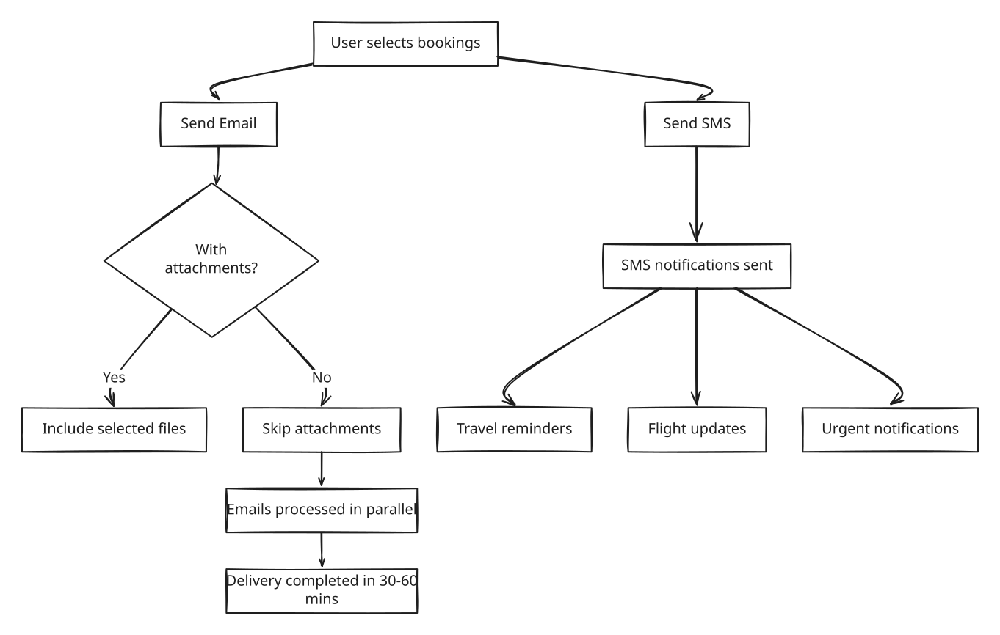

# All bookings

### Overview

**All Bookings** is the main list view within the All Bookings page. It is where you apply filters, run your search, and get a matching list of bookings to work with. Every other feature in the All Bookings section — Statistics, Totals, Saved Views — is built on top of the filter set you configure here.

Think of it as your search engine for bookings. The more precisely you filter, the more focused and useful your results will be.

***

### Purpose

Use All Bookings to:

* Locate a specific booking by number, customer name, hotel, transport, or any combination of criteria
* Build a filtered dataset that drives the **Statistics** and **Totals** views
* Save recurring filter combinations as named views for daily use
* Browse and open bookings directly from the results list

***

### Preconditions

Before using All Bookings, ensure the following:

* You are logged in with a user role that has access to the Booking module
* At least one **Brand** is selected — no results will load without a Brand
* Date range filters are always used as **pairs** — both a `From` and a `To` date must be filled in together. Leaving one half of a pair empty will not return the expected results


If no results appear after clicking **Display**, the first thing to check is whether a Brand has been selected and whether all date pairs are complete.


***

### How to Use All Bookings

#### Step 1 — Open the page

Go to **Booking → All Bookings** in the left sidebar.

***

#### Step 2 — Select a Brand

In the **Brands** filter, choose one or more Brands you want to search within. This step is mandatory.

***

#### Step 3 — Apply your filters

Set only the filters you need. You do not have to fill in every field — use the minimum set that narrows down your results to what you are looking for.

Common filter combinations:

| What you want to find              | Filters to use                      |
| ---------------------------------- | ----------------------------------- |
| A specific booking                 | Booking No. only                    |
| All bookings created today         | Click **Today's Bookings** shortcut |
| All departures next week           | Departure Period (From + To)        |
| All bookings for a hotel           | Hotels filter                       |
| Bookings by a specific agent       | Owners filter                       |
| All cancelled bookings in a period | Status = Cancelled + Booking Period |

Use **More Filters** to reveal additional filter options not shown by default.

***

#### Step 4 — Click Display

Click **Display** to run the search. The results table loads with all bookings matching your criteria. The statistics bar at the bottom of the page immediately shows summary totals for the filtered set.

***

#### Step 5 — Work with the results

From the results table you can:

* Click any **Booking No.** to open that booking in full detail
* Click any **column header** to sort the list ascending or descending
* Use the **column selector (⋮)** on the right side of the table header to show or hide columns
* Navigate between pages using the **pagination controls** at the bottom
* Proceed to **Statistics** or **Totals** for deeper analysis of the filtered set

***

#### Step 6 — Save a View (optional)

If you run the same filter combination regularly, save it for reuse:

1. Set your filters and click **Display**
2. Click **Save View** in the toolbar
3. Enter a descriptive name (e.g. `This Week's Departures`, `Brand DK — Hotel X`) and confirm

The saved view will appear as a quick-access shortcut each time you open All Bookings.

***

#### Step 7 — Manage Saved Views

To rename or delete an existing saved view:

<figure><figcaption></figcaption></figure>

1. In the views bar, click the **three dots (⋯)** button to open **Manage Views**
2. In the dialog that opens:
   * **Rename** a view by editing its name in the text field
   * **Delete** a view by clicking the **trash can** icon on its row
   * Use **Multiple delete** to remove several views at once
3. Click **Save** to apply your changes

***

#### Step 8: Booking selection (checkbox column)

<figure><figcaption></figcaption></figure>

#### Booking selection (checkbox column)

The **first column** contains checkboxes that allow users to select bookings.

#### Functions

* **Select individual bookings** by ticking the checkbox next to the booking.
* **Select multiple bookings** for bulk actions.
* **Select all bookings in the filtered results** using the top checkbox.

Example:

* Selecting five bookings allows sending an email or SMS to all selected customers at once.

***

#### Bulk action menu

**Overview**

This functionality enables sending emails to a large number of bookings directly from the **All Bookings** page. It is designed for high-volume scenarios, especially critical situations where rapid communication is required.

Above the booking table, the following actions are available:

#### Send email

**Bulk selection and sending**

* Select **one booking**, **different bookings**, or **all bookings** from the _All Bookings_ page
* A single **Send Email** action applies to the entire selection

<figure><figcaption></figcaption></figure>

Typical use cases:

* Sending travel documents
* Sending booking confirmations
* Sending reminders or updates

#### Step-by-step interaction

1. Select multiple bookings using the checkboxes in the list.
2. Click **Send email**.
3. Enter a subject.
4. Enter the email body.
5. Add an attachment, if needed.
6. Select **Don’t send attachments**, if needed.
7. Click **Send**.

#### Checkbox: **Don’t send attachments**

* **Location:**\
  Bottom-right corner of the Send Email popup (visible in image)
* **Behavior:**
  * When checked:
    * Attachments are excluded from emails
      * Sending speed increases significantly
* **Tooltip text:**

> If enabled, emails will be sent faster. This is especially useful when sending large volumes (e.g. 1,000+ emails) in a short time.

* **Functional behavior**
  * With attachments
    * Emails include selected files
    * Larger payload → slower delivery
  * Without attachments
    * Attachments are skipped
    * Smaller payload → faster processing and delivery

#### Example scenario

* Select 11,000 bookings.
* Open the **Send Email** dialog.
* Select **Don’t send attachments**.
* Click **Send email**.

**Expected result:**

* Emails are processed in parallel
* Delivery completed within 30–60 minutes
* No need for manual batching

#### Send SMS

Allows sending SMS notifications to customers associated with the selected bookings.

Typical use cases:

* Travel reminders
* Flight updates
* Urgent notifications


If multiple SMS messages are queued with the same message and destination, only the first is sent. The others are marked as sent, but remain queued.


### Field Reference

#### Filter Fields

<figure><figcaption></figcaption></figure>

| Filter                           | Description                                                                          | Notes                                                |
| -------------------------------- | ------------------------------------------------------------------------------------ | ---------------------------------------------------- |
| **Brands**                       | One or more Brands to search within                                                  | Required — no results without a Brand                |
| **Booking Start & End Date**     | Date range when the booking was created                                              | Must be used as a pair                               |
| **Departure Date From & To**     | Date range for the outbound travel date                                              | Must be used as a pair                               |
| **Arrival Date From & To**       | Date range for the arrival date at destination                                       | Must be used as a pair                               |
| **Return From & To**             | Date range for the return travel date                                                | Must be used as a pair                               |
| **Booking No.**                  | Unique booking identifier                                                            | Partial values not supported — enter the full number |
| **Customer**                     | Customer name search                                                                 | Partial name search is supported                     |
| **Status**                       | Booking status filter: OK, Cancelled, Error, Warning, Locked, Waiting List           | Leave blank to return all statuses                   |
| **GDS Status**                   | GDS ticketing status for airline bookings                                            | Only relevant if GDS integration is active           |
| **Bonus Code**                   | Promotional or bonus code applied at booking                                         |                                                      |
| **Room types**                   | Filter by room types                                                                 |                                                      |
| **Hotels**                       | Filter by hotel assignment                                                           |                                                      |
| **Transports / Real Transports** | Filter by transport code or specific real transport                                  |                                                      |
| **Extra**                        | Filter by extra type or extra category                                               |                                                      |
| **Owners**                       | Agent, user, or company responsible for the booking                                  |                                                      |
| **Internal Comment**             | Text search within internal booking comments                                         |                                                      |
| **All Bookings**                 | Checkbox — ignores all date filters and returns everything for the selected Brand(s) | Use with caution on large datasets                   |

***

#### Toolbar Buttons

| Button               | Description                                                                                    |
| -------------------- | ---------------------------------------------------------------------------------------------- |
| **Display**          | Executes the search and loads the results table                                                |
| **More Filters**     | Expands additional filter options. A green badge shows the number of active additional filters |
| **Clear**            | Resets all filters to their default empty state                                                |
| **Save View**        | Saves the current filter combination as a named reusable view                                  |
| **Today's Bookings** | Shortcut that sets the Booking Period to today and immediately loads results                   |
| **Statistics**       | Opens the Statistics analysis view for the current result set                                  |
| **Totals**           | Opens the Totals / Cost and Profit view for the current result set                             |

***

#### Statistics bar (bottom of page)

The statistics bar appears below the table immediately after Display is clicked. It shows a real-time summary of the filtered result set. This list is used to monitor late changes to arrivals, often spotted by a change in the totals.


The statistics bar is available for the following user types: Administrator, Guide, and Guide Master.


<figure><figcaption></figcaption></figure>

<figure><figcaption></figcaption></figure>

| Metric             | Description                                                                                            |
| ------------------ | ------------------------------------------------------------------------------------------------------ |
| **Bookings**       | Total number of bookings in the filtered result set                                                    |
| **Total Pax**      | Total number of passengers across all filtered bookings                                                |
| **Pax / Booking**  | Average number of passengers per booking. Formula: `Total Pax ÷ Bookings`                              |
| **Total Turnover** | Total gross revenue from all filtered bookings before costs are deducted                               |
| **Turnover / Pax** | Average revenue per passenger. Formula: `Total Turnover ÷ Total Pax`                                   |
| **Profit Total**   | Net profit across all filtered bookings. May be negative in periods with high cancellations or refunds |
| **Profit / Pax**   | Average net profit per passenger. Formula: `Profit Total ÷ Total Pax`                                  |

***

#### Hide Filters

For teams with large numbers of transports, hotels, or users configured, filter dropdowns can become difficult to navigate. The Hide Filters functionality keeps these lists clean.

| Control                              | Description                                                                                             |
| ------------------------------------ | ------------------------------------------------------------------------------------------------------- |
| **Hide Filters**                     | Hides inactive or rarely used filter items to reduce visual clutter                                     |
| **Show Hidden**                      | Checkbox on individual items — temporarily reveals that specific hidden item                            |
| **Choose All**                       | Selects all items in a filter, including hidden ones                                                    |
| **Hide as Filter on Lists**          | Manually marks a specific item (e.g. an old transport) as hidden so it no longer appears                |
| **System Setup → Hide Filter Input** | Administrator-level setting that automatically hides filter items inactive for a defined number of days |

***

### Related Pages

* [All Bookings](https://manual.tourpaq.com/booking/all-bookings) — parent page with full filter, statistics bar, and toolbar reference
* [Statistics in All Bookings](https://manual.tourpaq.com/booking/all-bookings/statistic-in-all-bookings) — per-passenger analytics built on your filter set
* [All Bookings Totals](https://manual.tourpaq.com/booking/all-bookings/all-bookings-totals) — aggregated booking counts, turnover, and profit
* [New Booking](https://manual.tourpaq.com/booking/new-booking) — create a new reservation from scratch
* [Notifications](https://manual.tourpaq.com/notifications/notification) — monitor booking errors and warnings
