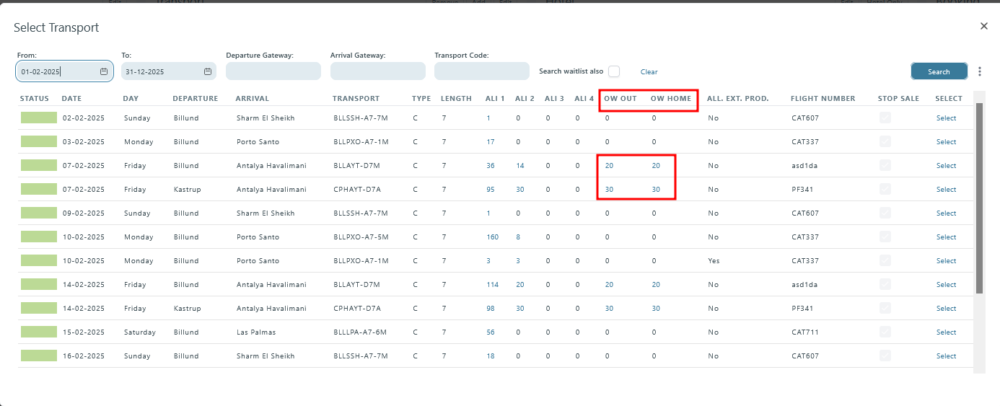
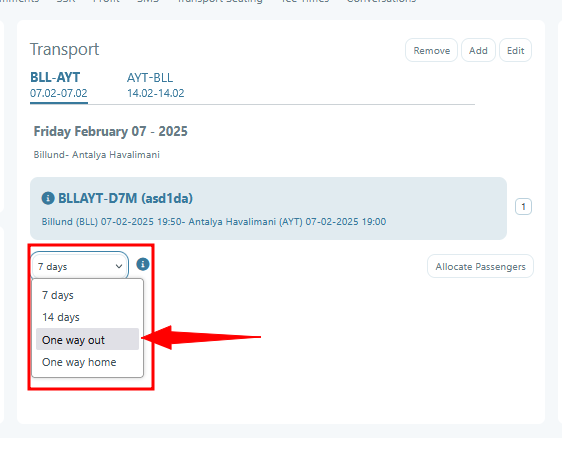
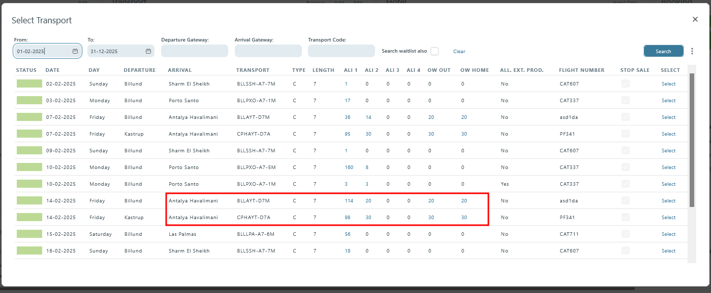
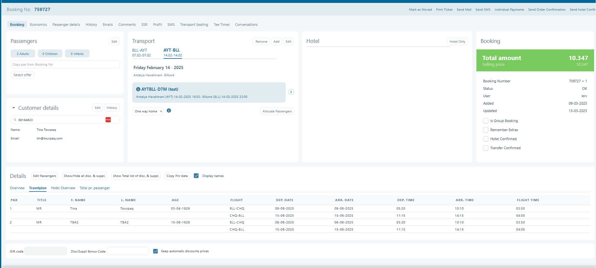
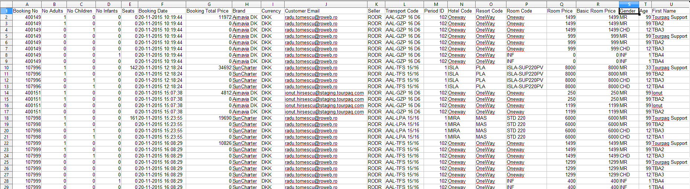
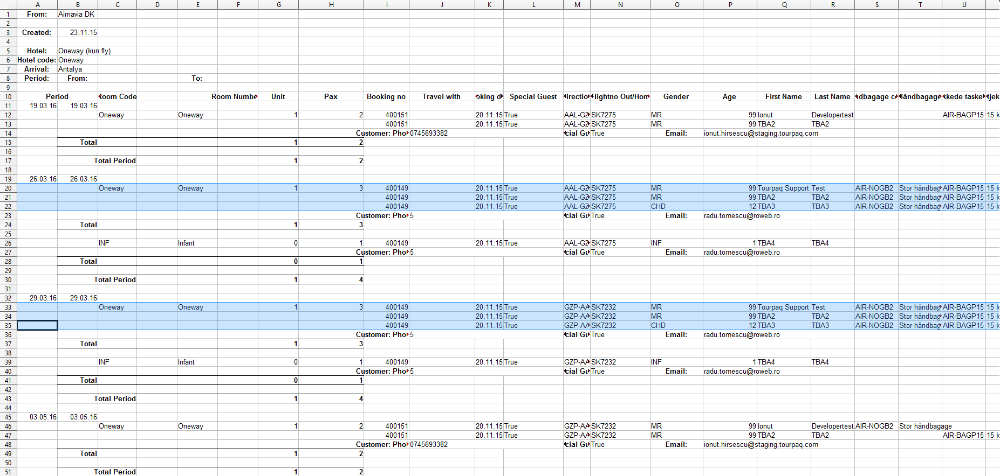

---
layout:
  title:
    visible: true
  description:
    visible: false
  tableOfContents:
    visible: true
  outline:
    visible: true
  pagination:
    visible: true
---

# Booking for 2 One Ways

It is a new type of booking that allows the user to select 2 one-way flights (outbound and homebound) in the same booking.&#x20;

The process is simple enough. Insert the number of passengers and select the transport. When selecting the transport, please check for it to have seats allocated to one-way flights, both outbound and homebound.

<figure><figcaption></figcaption></figure>

Change the Interval (Days dropdown) to one way out. In the transport window, a new tab appears. This tab allows the selection of a second one-way flight, the one-way home. Be advised that a booking leaving from Billund to any destination will have its return flight mandatory from said destination to Billund. On the other side, the booking can use another transport than the one used for outbound.

<figure><figcaption></figcaption></figure>

<figure><figcaption></figcaption></figure>

From here on, it's the same routine as a normal booking: introducing customer details, taking allotments, introducing passenger details, and selecting extras, supplements, and discounts. Since it's a one-way-based booking, products, supplements, and discounts used will be the ones checked for one-way and are also subject to the rules and filters set in **Extra/Price** and **Extra/Resources**.

<figure><figcaption></figcaption></figure>

In a 2-one-way booking, passengers appear doubled. The double is called a shadow. This is meant to distinguish between the flights, as there are two separate flights, each with its own products, supplements, and discounts.

In **Finance/Export,** the passengers will appear doubled.

<figure><figcaption></figcaption></figure>

In **Export/Lists** the passengers are grouped by the flight departure and arrival dates for **Guide list**

<figure><figcaption></figcaption></figure>
