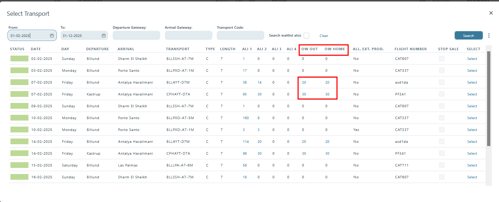
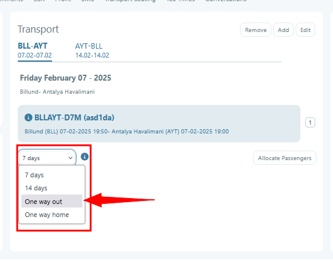
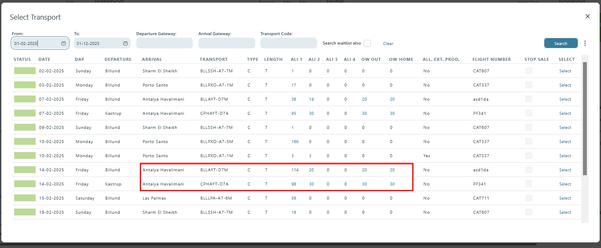
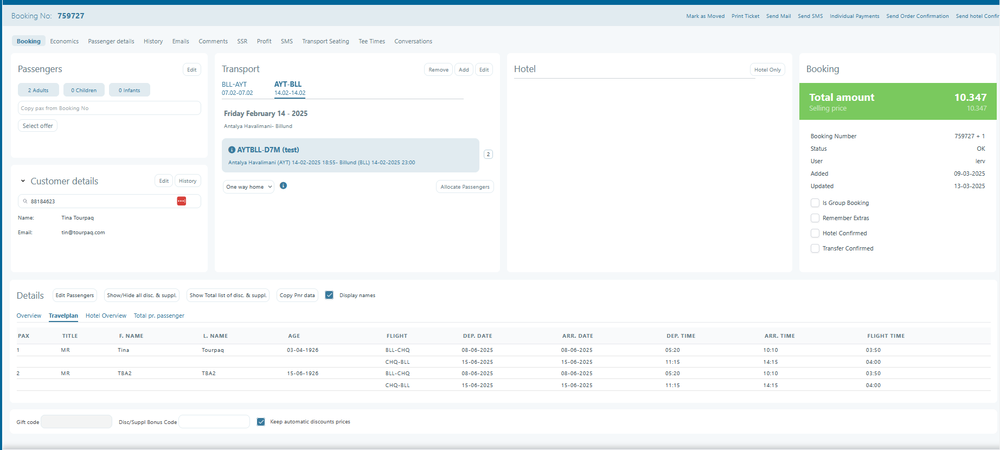
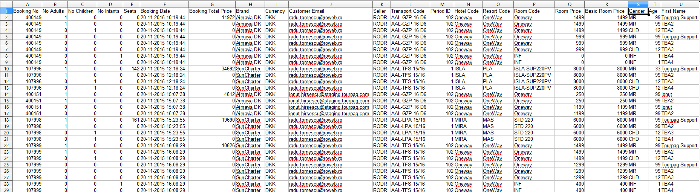

# Booking for 2 One Ways

### Overview

**Booking for 2 One Ways** lets you create one booking with **two one-way flights**:

* **One-way outbound** (OW OUT)
* **One-way homebound** (OW HOME)

This is also used for **open-jaw** style trips, where outbound and return are different transports.

### Preconditions

Before you start:

* One-way flights must be enabled for your setup.
* The selected transport(s) must have **one-way seat allotment** for **OW OUT** and **OW HOME**.

For broader one-way scenarios, see [Multiple one way flights bookings](multiple-one-way-flights-bookings.md).

### Create a 2 one-way booking



### 1. Start a new booking

Start in [New Booking](new-booking/).

Enter the number of passengers. Then open transport selection.



### 2. Select a transport with OW OUT / OW HOME seats

Pick a transport that has seat allocation for:

* **OW OUT**
* **OW HOME**

<figure><figcaption>
Select a transport that supports one-way seats for outbound and homebound.
</figcaption></figure>



### 3. Set interval to one-way out and select the one-way home flight

Change **Interval (Days)** to **one way out**.

This enables an extra tab in the transport window. Use it to select the **one-way home** flight.


The homebound leg is typically constrained by your gateway rules.

Example: If the booking departs from Billund, the return is typically required back to Billund.


<figure><figcaption>
Set Interval to <strong>one way out</strong> to enable selecting the homebound one-way flight.
</figcaption></figure>

<figure><figcaption>
Select the one-way home flight (return leg).
</figcaption></figure>



### 4. Continue like a normal booking

From here, the flow is the same as a standard booking:

* customer details
* take allotment
* passenger details
* extras, supplements, and discounts

For one-way bookings, products and rules must be eligible for one-way selection. This is controlled in **Extras → Price** and **Extras → Resources**.

<figure><figcaption>
After selecting both one-way legs, complete the booking as usual.
</figcaption></figure>



### Passenger behavior: “shadow” rows

In a 2 one-way booking, passengers appear **twice**.

The duplicate row is the **shadow passenger**. It separates data for the two flights, since each flight can have its own products, supplements, and discounts.

### Export and lists behavior

#### Finance export: passengers are doubled

In exports, passengers can appear **twice** due to the two flight legs.

<figure><figcaption>
Finance export: passengers appear twice (one row per one-way flight leg).
</figcaption></figure>

#### Export lists: grouped per leg for guide lists

In [Lists](../../export-1/lists.md), passengers are grouped by flight departure/arrival dates for guide lists.

<figure><figcaption>
Export lists: passengers are grouped per flight leg for guide lists.
</figcaption></figure>

### FAQ

<strong>When should I use a 2 one-way booking?</strong>

Use it when outbound and homebound are **different transports**.

Typical cases:

* **Open** trips (outbound and return are not the same route).
* You want to sell **one-way seat allotment** on both legs (OW OUT + OW HOME).

<strong>Why do passengers show up twice?</strong>

Because the booking contains **two flight legs**.

Tourpaq duplicates each passenger into a **shadow passenger** row.

This lets the system separate services and pricing per leg (outbound vs homebound).

<strong>Do products, supplements, and discounts apply to both legs?</strong>

Not automatically.

They can be applied **per leg**, because each passenger exists as a normal row + a shadow row.

If something looks “missing” on one flight, check which passenger row the product was added to.

<strong>Why is the homebound one-way flight selection limited?</strong>

The homebound leg is typically constrained by your **gateway rules**.

Example: If the booking departs from Billund, the return is usually required back to Billund.

<strong>Why are passengers doubled in exports?</strong>

Many exports are **leg-based**.

That means one booking with two one-way flights can produce **two rows per passenger** (one per leg).

