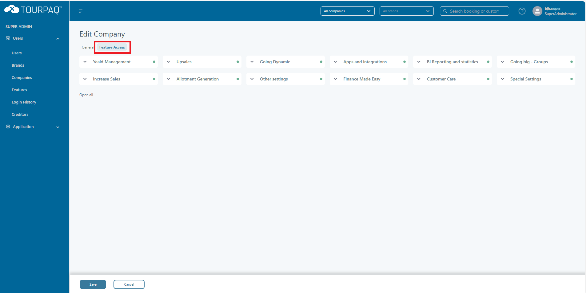
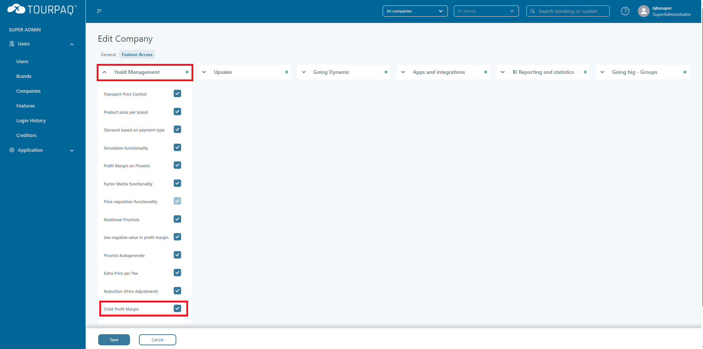

# Child Price

Child Price now works based on an option that can be activated/deactivated by a user that has super-admin rights. If you **DO NOT** activate this option, the prices will work the same as before. If you **DO** activate this option, how the child price gets calculated on a booking will be changed.

You can find this option by logging in as a super-admin and then going under **Users** => **Companies** => **Choose Company** and going under **Feature Acces** tab

<figure><figcaption></figcaption></figure>

Under the Yield **Management** card, we will find the check mark named **Child Profit Margin** that represents how the child price will be calculated on a booking.

<figure><figcaption></figcaption></figure>

### HOW THE PRICE WILL BE CALCULATED WHEN THE OPTION IS ACTIVATED 

If the option is checked and we have **SET** a child price on the price list that we want to use for our booking, the new price for the room will be represented by the value that was set on either "ChildPrice1," "ChildPrice2," "ChildPrice3," or "ChildPrice4," depending on what interval we use for our booking. If the option is checked but we **DO NOT** have a child price set, the system will work the same as before.

Booking with Child Price **NOT SET**:

<figure><figcaption></figcaption></figure>

<figure><figcaption></figcaption></figure>

Booking with Child Price **SET**:

<figure><figcaption></figcaption></figure>

<figure><figcaption></figcaption></figure>
