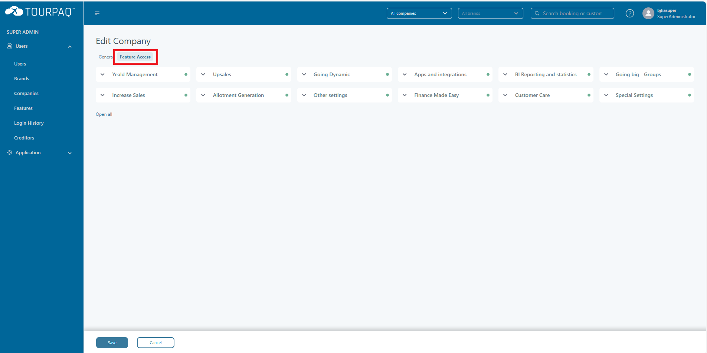
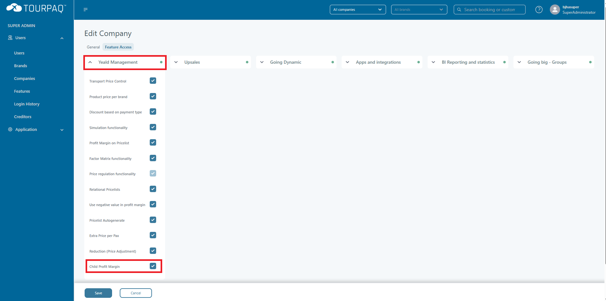

# Child Price

### Overview

Tourpaq can handle **child pricing** in two ways. Which behavior you get depends on a **feature setting** controlled by a **super-admin**.

* If **Child Profit Margin** is **disabled**, child prices behave as they did previously.
* If **Child Profit Margin** is **enabled**, Tourpaq will use **explicit child prices from the Price List** (when those prices are set).


Only users with **super-admin** rights can enable/disable this feature.


***

### Enable or disable Child Profit Margin (super-admin)

1. Log in as a **super-admin**.
2. Go to **Users → Companies → (select company)**.
3. Open the **Feature Access** tab.

<figure><figcaption></figcaption></figure>

4. Under the **Yield Management** card, find **Child Profit Margin**.

<figure><figcaption></figcaption></figure>

***

### What changes when Child Profit Margin is enabled

When **Child Profit Margin** is enabled:

* If the Price List has a **child price set** (for the interval used in the booking), Tourpaq uses that value for the child.
  * The relevant Price List fields are typically **ChildPrice1**, **ChildPrice2**, **ChildPrice3**, or **ChildPrice4** (depending on the interval).
* If the feature is enabled **but no child price is set** in the Price List, Tourpaq falls back to the **old behavior**.

#### Example: booking when child price is NOT set

<figure><figcaption></figcaption></figure>

<figure><figcaption></figcaption></figure>

#### Example: booking when child price IS set

<figure><figcaption></figcaption></figure>

<figure><figcaption></figcaption></figure>

***

### Related documentation (recommended)

If you need to validate or troubleshoot how child price values are derived and applied:

* [**How CH1P1 is used in booking**](../../../2-x-child-prices-+-child-price-discount/how-ch1p1-is-used-in-booking.md)
* [**How CH1P1 & CH2P1 are calculated in Price List**](../../../2-x-child-prices-+-child-price-discount/how-ch1p1-and-ch2p1-are-calculated-in-price-list.md)
* [**How CH1D1 & CH2D1 is calculated in Price List**](../../../2-x-child-prices-+-child-price-discount/how-ch1d1-and-ch2d1-is-calculated-in-price-list.md)
