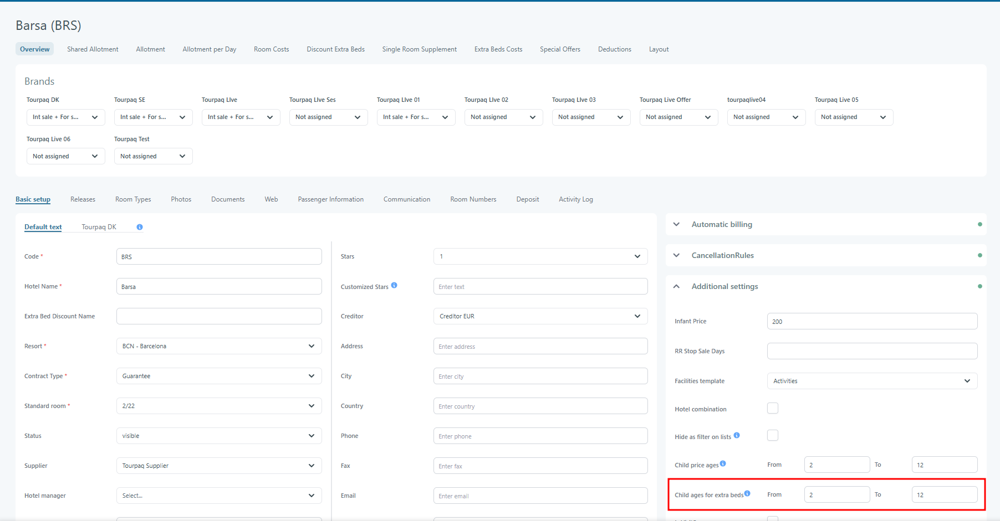
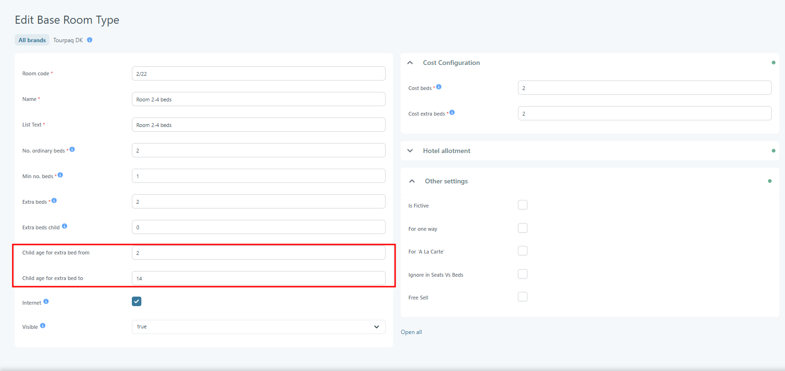
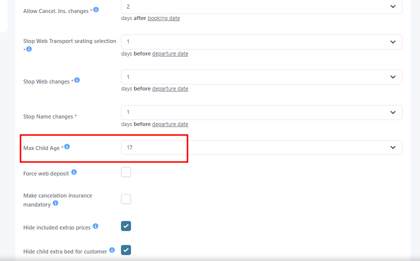
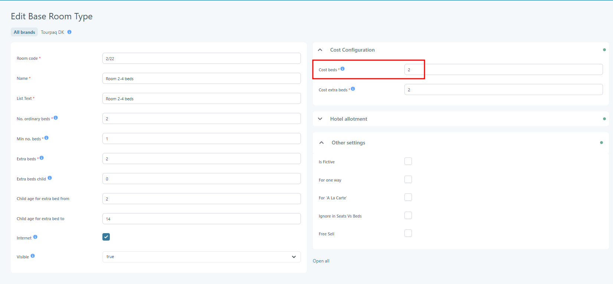
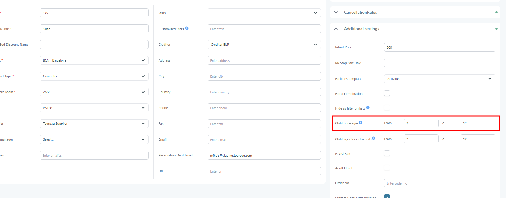

# Child age for beds and prices

### Overview

The system evaluates a child's age separately for bed allocation and price calculation. Different configuration levels are checked in a defined order to determine whether a child is eligible for a child bed and whether child pricing should be applied.

### Purpose

The child age configuration determines:

* Whether a child is eligible to occupy a child bed (extra bed).
* Whether a child receives child pricing or adult pricing.

The system evaluates child age separately for bed allocation and price calculation. This allows hotels to define different age limits for accommodation and pricing.

For example, a hotel may allow children up to 11 years old to use a child bed, while only children up to 9 years old qualify for child pricing.

***

## Configuration

Child age rules can be configured at multiple levels. The system evaluates the available settings according to a predefined priority.

### Child Age for Extra Beds

When determining whether a child may occupy a child bed, the system evaluates the available configuration in the following order:

#### 1. Hotel Child Ages for Extra Beds

Defines the age range that is eligible for child beds at the hotel level. If the hotel has a **Child Ages for Extra Beds** age range configured, this range is used.

<figure><figcaption></figcaption></figure>

#### 2. Base Room Type Child Age Range

Defines the age range that is eligible for child beds for a specific room type. If no hotel-specific age range exists, the system checks the base room type configuration:

* Child age for extra bed from
* Child age for extra bed to

If these values are defined, they are used to determine eligibility for a child bed.

<figure><figcaption></figcaption></figure>

#### 3. Agency Maximum Child Age

Defines the default maximum child age when neither the hotel nor the room type provides a child age configuration. If neither the hotel nor the base room type provides child age limits, the system uses the agency-level **Max Child Age** setting.

<figure><figcaption></figcaption></figure>

#### Evaluation Priority

1. Hotel: Child Ages for Extra Beds
2. Base Room Type: Child age for extra bed from / Child age for extra bed to
3. Agency: Max Child Age

The first available configuration is used.

#### Example

A hotel defines **Child Ages for Extra Beds = 2–12 years**.

| Passenger Age | Child Bed Eligible |
| ------------- | ------------------ |
| 5             | Yes                |
| 10            | Yes                |
| 13            | No                 |

Because a hotel-level configuration exists, the base room type and agency settings are ignored.

***

### Child Age for Child Prices

When determining whether a passenger should receive child pricing, the system applies the following rules.

#### 1. Cost Bed Passengers Use Adult Prices

If the passenger is part of the "Cost bed" group from a base room type, the passenger will use adult prices, independent of age.

This ensures that the required number of full-paying occupants is maintained.

<figure><figcaption></figcaption></figure>

#### 2. Hotel Child Ages for Prices

If the passenger is not part of the Cost Bed group and the hotel defines **Child Ages for Prices**, that age range is used.

<figure><figcaption></figcaption></figure>

#### 3. Agency Maximum Child Age

If no hotel-level pricing age range exists, the system uses the agency-level **Max Child Age** setting.

<figure><figcaption></figcaption></figure>

#### Evaluation Priority

1. Cost Bed passenger → Adult price
2. Hotel: Child Ages for Prices
3. Agency: Max Child Age

#### Example 1: Cost Bed Passenger

Room configuration:

* Cost Beds = 2
* Passenger age = 8

Result:

* Adult price applied

Even though the passenger is a child, membership in the Cost Bed group overrides all child pricing rules.

#### Example 2: Hotel Child Pricing Range

Hotel configuration:

* Child Ages for Prices = 2–11 years

| Passenger Age | Price Type  |
| ------------- | ----------- |
| 6             | Child Price |
| 10            | Child Price |
| 12            | Adult Price |

#### Example 3: Agency Fallback

No hotel pricing range is configured.

Agency configuration:

* Max Child Age = 11

| Passenger Age | Price Type  |
| ------------- | ----------- |
| 7             | Child Price |
| 11            | Child Price |
| 12            | Adult Price |

This structure follows the typical product documentation pattern: purpose, evaluation logic, priority order, and practical examples.
