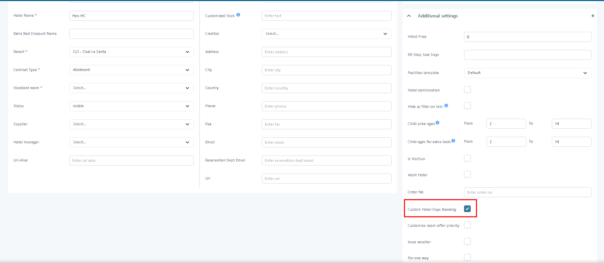
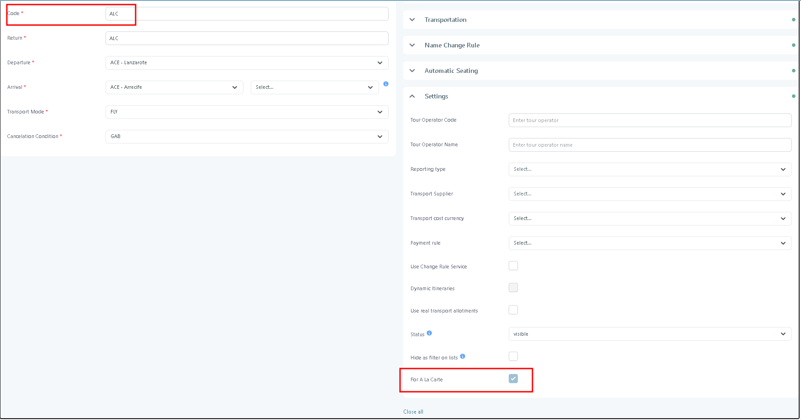
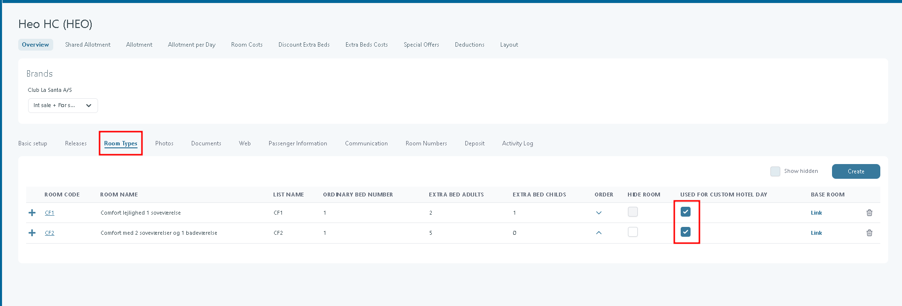
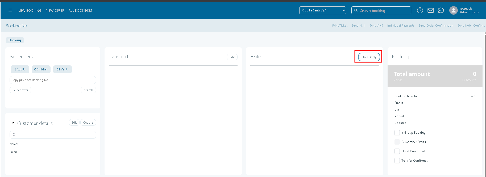
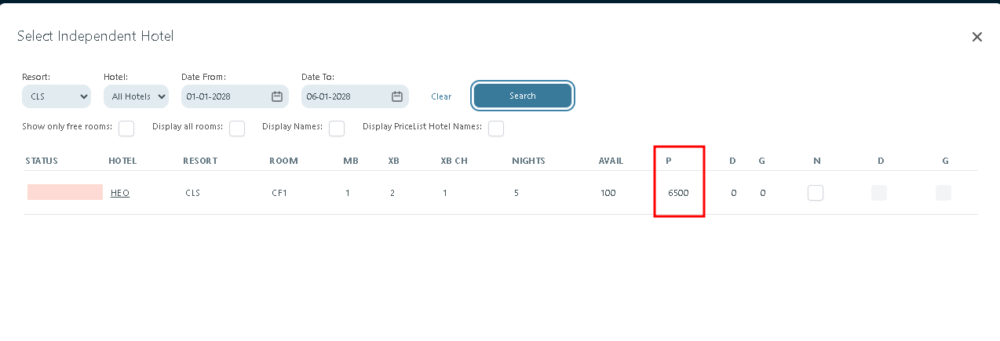
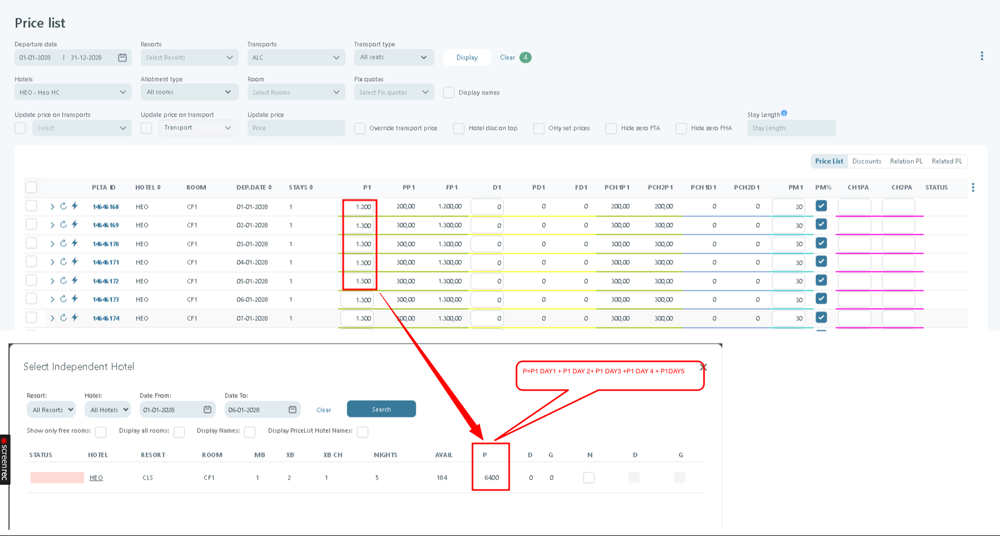

# Hotel Only Bookings

### Overview

**Hotel Only Bookings** create accommodation-only stays without a flight or bus.

This workflow uses Tourpaq's **A la Carte** setup. An **ALC transport** supports the price-list configuration. It is not selected during the booking.

The hotel must support **Custom Hotel Day booking**. Eligible room types, allotment, and a Custom Hotel Days price list determine availability and price.

### Precondition

*   It needs to have a hotel defined in the system. The hotel should have the Custom hotel day Booking checkbox marked.

    <figure><figcaption></figcaption></figure>
*   An ALC transport defined in the system. Need to have For A La Carte checkbox

    <figure><figcaption></figcaption></figure>

### Setup (recommended)



**1. Create an ALC transport**

Create a transport with the For a la carte checkbox marked

Configure it like a normal transport (interval + timetable in the period).

See [Transport creation](../../transport/transport/transport-creation/) if you need the full transport setup flow.



**Create/Use a Hotel with the checkbox Custom Hotel Day booking marked**

Configure it like a normal hotel ( define room type, allotment, allotment per day, room cost, etc)

The room types used need to be marked to be Used for custom hotel days

<figure><figcaption></figcaption></figure>



**3. Create a pricelist between the ALC transport and the hotel**

Create a pricelist hotel day for the **hotel** you want to sell as hotel-only

See [Pricelist Hotel Day](../../price-list-custom-hotel-days-service.md) if you need the pricelist workflow.

Give the transport a short, recognisable code (ALC, OWN) — it appears as the Transports filter in the price list.



### Book a hotel-only stay

Start a booking as usual in [New Booking](new-booking/).

Then:

1. In the Transport panel, you don't choose nothing
2.  In the Hotel panel, click **Hotel Only**.

    <figure><figcaption></figcaption></figure>
3.  In the **Select Independent Hotel** popup, search by resort, hotel, and dates, then select the room. The total price for the stay is shown in the **P** column.

    <figure><figcaption></figcaption></figure>
4. Complete passenger details, extras, and payments as normal.

The booking now shows the hotel-only stay with its total price.

#### Pricing

The total price shown in the **Select Independent Hotel** popup (the **P** column) is the sum of the prices **P1** from the price list for every stay day. (P=P1 DAY1 + P1 DAY 2+ P1 DAY3 +P1 DAY 4 + P1DAY5).

<figure><figcaption></figcaption></figure>

This total does not include supplements or discounts from the pricelist. Supplements and discounts are not applied on a per-night basis, so they cannot currently be summed into a single per-stay total for Hotel Only.

### Related pages

* [a-la-carte](a-la-carte/ "mention") — understand the flexible-booking framework behind hotel-only stays.
* [hotel-creation](../../hotel/hotel-creation/ "mention") and [room-types.md](../../hotel/hotel-creation/room-types.md "mention") — configure the hotel and rooms needed for Custom Hotel Day booking.
* [price-list-custom-hotel-days-service.md](../../price-list-custom-hotel-days-service.md "mention") — set daily hotel-only prices. [new-booking](new-booking/ "mention") — complete the wider booking workflow.
