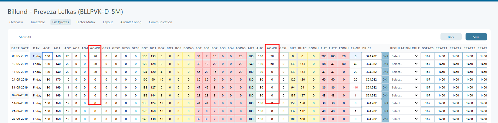
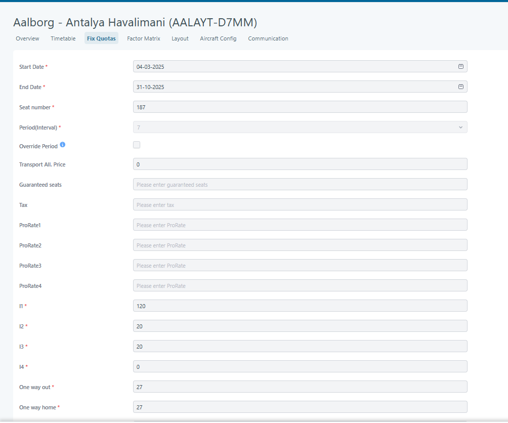

# Multiple one way flights bookings

This feature will allow users to create bookings with more than two one-way-out or one-way-home flights. Also, it will be possible to select hotels marked as "Custom Hotel Days" in combination with one-way flights to create a booking. For a transport to be booked in a multiple-flight booking, the company must have access to the "A La Carte" feature. One transport defined in Tourpaq can also be booked as one-way if it has one-way prices and allotments set for this purpose. For instance, the transport below has allotments for one-way:

<figure><figcaption></figcaption></figure>

When new transport is defined and interval definition and timetable are set, the next step is to create and generate a fixed quota by defining one-way-out and one-way-home allotments.

<figure><figcaption></figcaption></figure>

After the fix-quota was generated, allotments for one-way-out and one-way-home were available; the next step was to create the price list. A price list should be created between transport and one fictive hotel used for one-way bookings. Hotel for one way should be created for each company using the following settings:

<figure><figcaption></figcaption></figure>

There should be only one One Way Hotel for each company.

The hotel has also assigned a room type:

<figure><figcaption></figcaption></figure>

The hotel for one way does not have room costs or allotments defined. From **Create/Copy pricelist**, a pricelist between transport and hotel for one way should be created.

<figure><figcaption></figcaption></figure>

The next step will be to set prices for one-way out or one-way home flights in the PriceList by setting pricing values for POWO/POWH/DPOWO/DPOWH/GPOWO/GPOWH/CHOWO/CHOWH.

After the price list is created, the user can book transports OW.

The same transport can be used for bookings as charter but also as flight only without a hotel, so for this, a different price list should be created.
