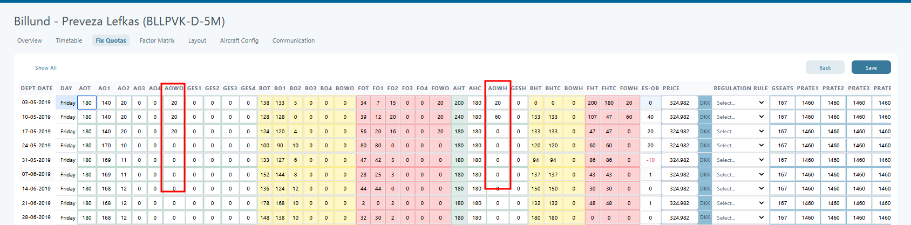
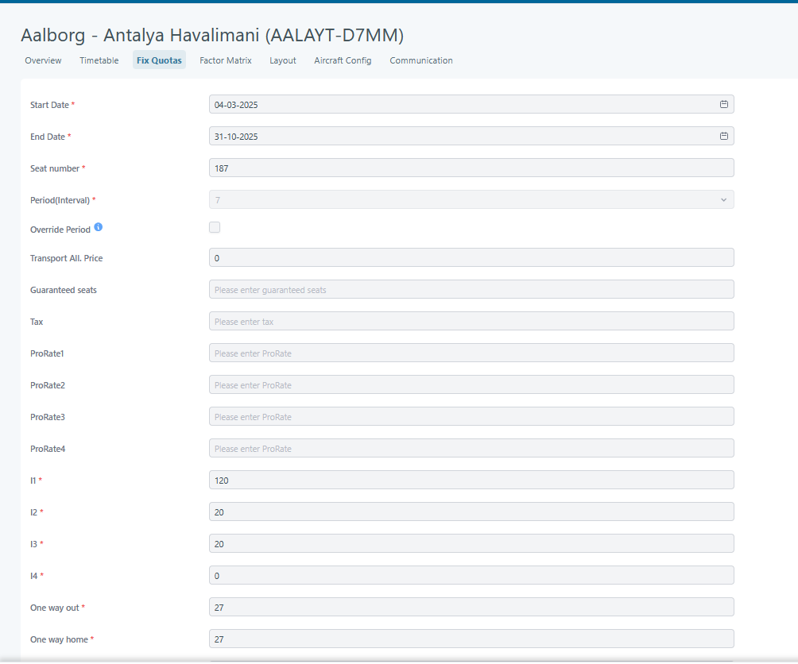

# Multiple one way flights bookings

### Overview

Use this setup when you need **multiple one-way flights** in the same booking.

Examples:

* More than one **one-way outbound** flight (**OW OUT**)
* More than one **one-way homebound** flight (**OW HOME**)
* One-way flights combined with hotels using **Custom Hotel Days**

For the simpler scenario (one OW OUT + one OW HOME), see [Booking for 2 One Ways](booking-for-2-one-ways.md).

### Preconditions

* Your company must have access to **A La Carte**.
* The transport must have **one-way allotments** and **one-way prices**.
* You must maintain a single **One Way Hotel** per company (used for pricing).


The same transport can be sold both as **charter** and as **flight-only**.

That normally means you use **separate price lists**.


### Setup: transport → Fix quota → One Way Hotel → pricelist



#### 1. Configure the transport (interval + timetable)

Set up the transport as usual.

See [Transport creation](../../transport/transport/transport-creation/) if you need the full flow.

Verify the transport supports one-way booking by having one-way allotment fields available.

<figure><figcaption>
The transport must support one-way allotments (OW OUT / OW HOME).
</figcaption></figure>



#### 2. Create and generate Fix quota with OW OUT / OW HOME allotments

In **Fix quota**, define:

* **One way out** (OW OUT)
* **One way home** (OW HOME)

Then generate the departures.

<figure><figcaption>
Define OW OUT / OW HOME allotments and generate.
</figcaption></figure>



#### 3. Create the One Way Hotel (fictive hotel)

Create a dedicated hotel used only for one-way price lists.

<figure><figcaption>
One Way Hotel example configuration.
</figcaption></figure>

Rules:

* Create **only one** One Way Hotel per company.
* Do **not** set room costs or allotments on it.



#### 4. Assign a room type to the One Way Hotel

The One Way Hotel must have at least one room type.

<figure><figcaption>
Add a room type to the One Way Hotel.
</figcaption></figure>



#### 5. Create a pricelist between transport and One Way Hotel

From **Create/Copy pricelist**, create a price list between:

* the transport
* the One Way Hotel

<figure><figcaption>
Create the one-way pricelist (transport ↔ One Way Hotel).
</figcaption></figure>

If you need general pricelist context, see [Pricelist Setup](../../price-list/pricelist-setup.md).



#### 6. Set one-way prices (POWO/POWH and related fields)

Set pricing values for one-way out vs one-way home in the pricelist:

* `POWO` / `POWH`
* `DPOWO` / `DPOWH`
* `GPOWO` / `GPOWH`
* `CHOWO` / `CHOWH`

After that, users can book one-way transports, including **multiple-leg one-way bookings**.



### Custom Hotel Days + one-way flights

You can combine one-way flights with hotels marked **Custom Hotel Days**.

That enables bookings where hotel stay length is flexible.

See [Price List Custom Hotel days Service](../../price-list-custom-hotel-days-service.md).

### FAQ

<strong>Why is A La Carte required for multiple one-way flights?</strong>

Because the booking behaves like selecting multiple standalone components (flight legs).

That flow requires **A La Carte** access.

<strong>What is the One Way Hotel used for?</strong>

It is a fictive hotel used only for pricing.

It lets you create a **transport ↔ hotel** pricelist for one-way and flight-only bookings.

<strong>Why should we keep only one One Way Hotel per company?</strong>

It avoids misconfiguration and duplicate pricelists.

It also makes the booking flow predictable for users.

<strong>Why can’t I book one-way flights even though the transport exists?</strong>

Check these first:

* Fix quota is generated and contains **OW OUT / OW HOME** allotments.
* A pricelist exists between the transport and the **One Way Hotel**.
* One-way price fields (`POWO/POWH` etc.) are filled.

<strong>Can the same transport be sold as charter and flight-only?</strong>

Yes.

Use separate price lists:

* Charter/package pricing with real hotels
* Flight-only pricing with the One Way Hotel

