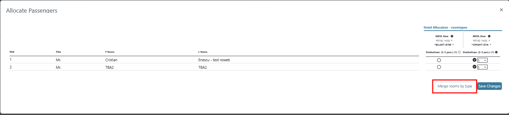

# Multiple transports one room bookings

In Tourpaq, in general, the transport and hotel are bundled into a single product, and a single price is therefore not possible to take two transport charters and to book a single room. So this feature can do just that by selecting two charters and merging the rooms with the same type and the same hotel.

In order to activate this, the "Multiple Transports" feature should be activated from SuperAdmin.

As an example, we'll choose two different transports with

* the same arrival
* on the same interval

and the **same** hotel with the **same** room type.

<figure><figcaption></figcaption></figure>

Next, on the Allocate Passengers screen, the rooms will be merged by pressing the "Merge rooms by type" button.

<figure><figcaption></figcaption></figure>

Now, the room is successfully merged, and two passengers from two different transports are able to stay in the same room.

Note: _Only one room is taken from the allotment of the hotel_

There are 3 other possible cases of configuring reservations with passengers coming with 2 different transports and wanting the same type of room.

1. We will choose 2 different transports with the same arrival, in the same interval, the hotel with the same room type (which is merged), and then save the booking

<figure><figcaption></figcaption></figure>

Next, on the Allocate Passengers screen, the rooms will be merged by pressing the "Merge rooms by type" button.

<figure><figcaption></figcaption></figure>

Now, the room is successfully merged, and two passengers from two different transports are able to stay in the same room.

Add another passenger who uses a transport with the same arrival as the 2 existing passengers, in the same interval, but the room type is different from the one in which the 2 passengers are already staying.

<figure><figcaption></figcaption></figure>

Next, on the Allocate Passengers screen, allocate the 3rd passenger and save.&#x20;

<figure><figcaption></figcaption></figure>

The 3rd passenger is corrcorrectlyect allocated and the booking can be saved.
