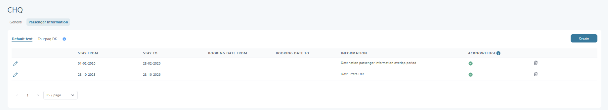

# New Booking

### Overview

The **New Booking** functionality in Tourpaq allows users to create a booking by selecting a brand, adding transport and hotel options, managing passengers, and customizing extras, discounts, and supplements. It also includes advanced tools such as **passenger import** and **package product handling**.

### Purpose

This tool is designed to:

* Create new bookings from scratch.
* Assign transport, accommodation, and optional services.
* Manage passenger data individually or via file import.
* Apply complex product logic such as packages, extras, discounts, and insurance.

### Preconditions

Before creating a booking, ensure:

* You are logged in with permission to create bookings.
* All relevant products (transport, hotels, extras) are configured and active in the system.
* You have customer data ready.

<figure><figcaption></figcaption></figure>

***

### How to create a new booking

#### Navigation

Go to **Booking → New Booking**.

***

#### Step 1 – Choose the Brand

<figure><figcaption></figcaption></figure>

Select the **Brand** under which the booking should be created.

***

#### Step 2 – Customer details

<figure><figcaption></figcaption></figure>

Insert the customer’s **mobile number** to identify an existing customer or create a new one.

***

#### Step 3 – Passengers

<figure><figcaption></figcaption></figure>

Set the **number of passengers**:

* Adults
* Children
* Infants

<figure><figcaption></figcaption></figure>

***

#### Step 4 – Add transport

The **Select Transport** dialog allows the user to search for and select a transport (flight, bus, or other transport types) for the booking. It provides flexible filtering options and a detailed table showing all matching transport departures within the selected date range.

**Filter section**

At the top of the dialog, users can refine the search using the following filters:

**Date range**

* **From** – Start date for the search period.
* **To** – End date for the search period.

The system returns all transports departing between these two dates.

**Gateways**

* **Departure Gateway** – Filters transports that depart from a specific gateway/airport.
* **Arrival Gateway** – Filters transports that arrive at a selected gateway/airport.

**Transport code**

* Input for narrowing results to a specific transport code (e.g., flight code).

**Period**

* Optional field used for searching transports based on a predefined period/interval.

**Additional options**

* **Search waitlist also** – Includes transports that have no available allotment and are in waitlist mode.
* **Clear** – Resets all filters.

**Search button**

* Executes the search based on the selected filters.

**Transport list table**

The lower section shows all matching transport departures. Each row represents a transport option and contains the following columns:

| Column               | Description                                                      |
| -------------------- | ---------------------------------------------------------------- |
| **Status**           | Visual indicator of availability (color bar).                    |
| **Date**             | Departure date of the transport.                                 |
| **Day**              | Corresponding weekday (e.g., Monday).                            |
| **Departure**        | Departure gateway/airport.                                       |
| **Arrival**          | Arrival gateway/airport.                                         |
| **Transport**        | Transport code (e.g., flight code).                              |
| **Type**             | Transport type (e.g., C, D).                                     |
| **Stay**             | Number of nights associated with that transport.                 |
| **ALI 1–ALI 4**      | Allotment capacity per allotment group.                          |
| **OW OUT / OW HOME** | One-way out and one-way home availability.                       |
| **ALL. EXT. PROD.**  | Allotment Extra Product (hover to see the number of allotments). |
| **Flight Number**    | Actual flight number (if applicable).                            |
| **Stop Sale**        | Shows if stop sale is active for this transport.                 |
| **Select**           | Button used to choose this transport for the booking.            |

The table supports vertical scrolling when many departures are available.

**Selecting a transport**

1.  Click **Edit** in the **Transport** section.

    <figure><figcaption></figcaption></figure>
2. Select the **Period** (departure/arrival range) to check availability.
3. Click **Search** to retrieve available transports.
   * Each result includes **transport allotment** and a hoverable popup showing extra quotas.
4.  Select the desired **transport**.

    <figure><figcaption></figcaption></figure>
5.  Set the **trip interval** (duration in days).

    <figure><figcaption></figcaption></figure>

***

#### Step 5 – Add hotel & room

The **Select Hotel** dialog provides the user with a filtered list of available hotels, allowing quick selection based on resort, hotel, star rating, pension type, and room availability. The interface uses a combination of dropdown filters, checkboxes, and a tabular overview to help users identify suitable hotel options efficiently.

<figure><figcaption></figcaption></figure>

**Filter options**

The top section contains multiple filters:

* **Resort** – Dropdown for selecting a specific resort or viewing _All Resorts_.
* **Hotel** – Dropdown for selecting a specific hotel or viewing _All Hotels_.
* **Stars** – Multi-select dropdown for filtering by hotel star rating.
* **Pension** – Multi-select dropdown for filtering available board types.

Additional checkboxes allow further control:

* **Show only free rooms** – Displays only rooms with availability.
* **Display all rooms** – Shows all rooms regardless of availability.
* **Display Names** – Toggles between hotel names and internal codes.
* **Display PriceList Hotel Names** – Shows the hotel names defined in the price list.

**Hotel list table**

The main table lists hotels that match the selected filter criteria. Each row represents a hotel/room combination and displays the following information:

| Column              | Description                                                                       |
| ------------------- | --------------------------------------------------------------------------------- |
| **Status**          | Indicates availability status with color-coded icons.                             |
| **Hotel**           | Code or name of the hotel, depending on filter settings.                          |
| **Stars**           | Star classification displayed visually.                                           |
| **Resort**          | Code of the resort.                                                               |
| **Room**            | Room type or board type description.                                              |
| **MB / XB / XB CH** | Capacity fields and extra bed rules (Minimum Beds, Extra Beds Adults/Children).   |
| **Avail.**          | Availability count for the selected period.                                       |
| **P1**              | Price per interval 1.                                                             |
| **D1 / G1**         | Discount or group price per interval.                                             |
| **N, D, G**         | Selection options (checkboxes) for Normal Price, Discount Price, and Group Price. |
| **Magic Stick**     | Pencil icon allowing reset of free room count.                                    |

A **Select** button in the top-right corner becomes active when a hotel/room line is chosen. The user can confirm the selection and return to the booking flow.

<figure><figcaption></figcaption></figure>

**Workflow – selecting a hotel**

1. Open the **Select Hotel** dialog by clicking **Select Hotel** in the booking.
2. (Optional) Apply filters:
   * Resort
   * Hotel
   * Stars
   * Pension
   * Availability and display options
3. Review the filtered hotel list and scroll if needed.
4. Click the desired hotel/room line to highlight it.
5. Click **Select** in the upper-right corner of the dialog.
6. Continue the booking process and proceed to **Take allotment**.

**Take allotment**

<figure><figcaption></figcaption></figure>

After the user selects **Take Allotment**, the system updates the **Total Amount** immediately. The calculation includes:

* All applicable **discounts** and **supplements**.
* **Auto-selected extras** and all extras added manually by the user for every passenger.
* **Passenger age** adjustments.

***

#### Step 6 – Passenger information

<figure><figcaption></figcaption></figure>

1. Edit **Passenger details**:
   * Gender, First Name, Last Name, Age.
2.  Add **Extras**:

    * Per passenger, or use the yellow **C** icon to apply extras to all eligible passengers.
    * If the "Order extras in the booking window" option is activated in the system setup, the extras will be sorted according to the Category Order value.

    <figure><figcaption></figcaption></figure>

    #### Sorting rules

    Categories are sorted as follows:

    1. Categories with **Category order booking < 10**\
       Displayed before TRANSPORT
    2. Categories with **Category order booking between 10 and 19**\
       Displayed before HOTEL and ROOM
    3. Categories with **Category order booking ≥ 20**\
       Displayed after HOTEL and ROOM
    4. Categories **without a Category order booking value**\
       Displayed last
    5. Categories with the **same order number**\
       Sorted alphabetically&#x20;

    \- _If the "Order extras in the booking window" option is not enabled in the system setup, the new extras will be arranged according to the old ordering :_&#x20;

    <figure><figcaption></figcaption></figure>
3. Add **Discounts/Supplements**:
   * Click **Show/Hide Discount/Supplements**.
   * Click **Add Discount/Supplement**.
   * Select available options for one or all passengers.
   * Multiple discounts or supplements can be added simultaneously.
4. Click **Save Passenger** to save changes.


The **Total Amount** updates instantly whenever the user modifies any passenger-related information:

* Selecting or unselecting **supplements** or **discounts**.
* Selecting or unselecting **extras**.
* Changing the **passenger’s age**.

All changes are reflected immediately in the price.


***

#### Step 7 – Booking totals

The **Booking panel** provides a quick summary of financial details, booking metadata, and status indicators for a reservation. It is used by staff to monitor pricing, profitability, and the confirmation state of related services (hotel, transfer, etc.).

The **Total Amount** always reflects the user’s latest selections. The price includes all eligible **discounts**, **supplements**, **auto-selected extras**, and any **age-based price adjustments**.

The system continuously recalculates the Total Amount as the user interacts with the booking. The displayed price always reflects the current state of the booking and does not wait for **Save Passenger** or **Save** to trigger updates.

<figure><figcaption></figcaption></figure>

**Field explanations**

**Financial summary (green area)**

* **Total amount** – The final selling price of the booking (after discounts).
* **Price** – Price without discounts, including extras, supplements, etc.
* **Discount** – The sum of discounts on the hotel, price list adjustments, and the discounts added to each passenger.
* **Total Profit** – The margin earned after subtracting supplier costs from the selling price.


The **Total Profit** is displayed when expanding the green area that shows the Total Amount, and it will be shown after the full booking is saved.


**Booking details**

* **Booking Number** – The unique identifier for the booking. Example: `3633 + 1` (the `+1` indicates a sub-booking).
* **Status** – The current state of the booking (e.g., _OK_, _Pending_, _Cancelled_).
* **User** – The system user or agent who created/owns the booking.
* **Added** – The date when the booking was created.
* **Updated** – The date when the booking was last modified.

**Flags (checkbox options)**

* **Is Group Booking** – Indicates if the booking is part of a group reservation.
* **Remember Extras** – Ensures that selected extras are saved for future modifications.
* **Hotel Confirmed** – Marks whether the accommodation portion of the booking has been confirmed.
* **Transfer Confirmed** – Marks whether the transport/transfer services have been confirmed.

***

#### Step 8 – Finalize booking

1. Review all booking details (transport, hotel, passengers, extras, economics).
2. Click **Save** to complete the booking.
3. Send the ticket:
   * Click **Send Email** to send manually, or
   * Let the system auto-generate and send it, depending on your setup.

***

#### Step 9 – Cancel passenger or booking

The **Cancel passenger or booking** button allows users to cancel an entire booking or remove individual passengers from a booking, depending on the situation. It is located at the bottom-right corner of the **Booking → Overview → Passengers** section.

<figure><figcaption></figcaption></figure>

**Overview**

This feature gives booking administrators full control over cancellations. Depending on the configuration of the booking and the selected passenger, the system will:

* Cancel **one or more passengers**, or
* Cancel the **entire booking**, if all passengers are selected or if cancellation rules require a full cancellation.

The function ensures that all transport, hotel, extras, and supplements connected to the passenger(s) are removed or recalculated correctly.

**Purpose**

Use this button when:

* A traveler drops out of the trip.
* A booking needs to be partially canceled.
* A booking must be fully canceled, including all passengers and services.

**How it works**

**1. Select passenger(s)**

* If one passenger is selected → the system cancels only that passenger.
* If all passengers are selected or the booking contains only one passenger → the system offers a **full booking cancellation**.

**2. Click the button**

Click **Cancel passenger or booking** in the bottom-right corner.

<figure><figcaption></figcaption></figure>

**3. Choose the cancellation type**

A dialog will appear asking you to choose between:

* **Cancel Passenger**
* **Cancel Entire Booking**

<figure><figcaption></figcaption></figure>

The available options depend on the structure of the booking.

**4. Confirm cancellation**

After confirming, Tourpaq:

* Removes all services connected to the cancelled passenger(s).
* Recalculates pricing.

<figure><figcaption></figcaption></figure>

* Updates allotment, transport seats, extras, and commissions.
  * The allotment is **not** updated automatically. If the number of passengers in the booking is not manually reduced, Tourpaq will automatically insert a **TBA passenger** to occupy the seat or room left vacant by the cancelled guest. This ensures the booking maintains its original capacity, and the cancelled space is not released back into the available allotment.
  * This step requires manual intervention by the sales user in **Edit Passenger** and then **Take Allotment** to update it.
* Marks the booking or passenger as _Cancelled_.

<figure><figcaption></figcaption></figure>

**Expected behavior**

**Cancel passenger**

The system will:

* Remove all services (transport, hotel, extras, insurance, supplements) tied to the passenger.
* Update price calculations.
* Preserve remaining passengers and services.
* Require manual allotment update:
  * In the **Passenger** box, change the number of passengers in the booking.
  * Click **Take Allotment**.
  * Save the booking.
* Keep the booking active if at least one passenger remains.

**Cancel entire booking**

The system will:

* Remove all passengers and services.
* Release all allotments.
* Update all connected modules (Transport, Hotel, GDS, Extras, etc.).
* Mark the booking as _Cancelled_.
* Trigger relevant notifications if configured.

**Warnings & notes**

* **Cancellation rules apply** – If cancellation rules or charges are configured for the brand, they will be applied automatically.
* **Manual actions may be needed** – If external systems (e.g., GDS, API) are used, check if manual cancellation is required outside Tourpaq.
* **Bonus codes/discounts** – Removing a passenger may change eligibility for discounts, supplements, or bonuses. Recalculation happens automatically.

**Cancellation rules**

When a booking is cancelled, a **cancellation fee** is set for each passenger. Cancellation rules are applied for calculating this fee. The fee is calculated taking into account the remaining days left to departure.

<figure><figcaption></figcaption></figure>

* If cancellation insurance is paid, when cancelling the passengers you can choose whether the insurance **covers** the booking or **does not cover** the booking.
* If cancellation insurance is paid and **Cover** is selected, the amount of the cancellation fee will be the cancellation insurance.
* If cancellation insurance is paid and **Does not cover** is selected, the cancellation fee will contain the price of the cancellation insurance and the amount set in cancellation rules.
* Infants do not get a cancellation fee.

You can also adjust the cancellation amount applied to the booking. This can be done by selecting **Edit Passenger** and then updating the value under **Total per passenger**. This allows you to manually modify the cancellation fee when needed.

<figure><figcaption></figcaption></figure>

***

### Live price updates (user experience)

Users always see the correct **Total Amount** without needing to save the passenger or the booking. This live update behavior ensures:

* Accurate and transparent pricing.
* Immediate feedback when modifying selections.
* A smoother and more predictable booking process.

The system provides a responsive and reliable pricing experience, matching the user’s actions in real time.

***

### Advanced features

#### Import passengers (optional)

You can import multiple passengers via an **Excel file**.

**Accepted file format**

* Only **Excel files (.xlsx)** are supported.
* Required static columns:
  * `TITLE`, `F NAME`, `L NAME`, `DATE OF BIRTH`.
* Optional static columns:
  * `CCL. INS.`, `INSURANCE`.
* Dynamic columns:
  * Each column must match the **Extras Category Name**.
  * Values must be **Extras Codes**.

**Static columns**

The columns **TITLE**, **F NAME**, **L NAME**, and **DATE OF BIRTH** must always be included in the import file and must match the exact names specified. The optional columns **CCL. INS.** and **INSURANCE** may be included if applicable but are not required.

| Column name       | Description                                                                           |
| ----------------- | ------------------------------------------------------------------------------------- |
| **TITLE**         | The title of the passenger. This must be a value selected from a dropdown list.       |
| **F NAME**        | The first name of the passenger. Any string value is acceptable.                      |
| **L NAME**        | The last name of the passenger. Any string value is acceptable.                       |
| **DATE OF BIRTH** | The passenger’s date of birth in the format `dd-mm-yyyy`.                             |
| **CCL. INS.**     | The cancellation insurance for the passenger. This should be a value from a dropdown. |
| **INSURANCE**     | The travel insurance code for the passenger. This should be a value from a dropdown.  |

**Dynamic columns (extras)**

Dynamic columns allow additional optional information about passenger extras. Each dynamic column corresponds to an **Extras Category Name** (case-insensitive) and requires the corresponding **Extras Code** value.

| Field                    | Description                                                                                   |
| ------------------------ | --------------------------------------------------------------------------------------------- |
| **Extras Category Name** | Name as in the table header (must match category name).                                       |
| **Extras Code**          | The code(s) selected from the dropdown, separated by commas (optional). It can be left empty. |

Example usage:

| Column name           | Value                        |
| --------------------- | ---------------------------- |
| **EXTRAS\_CATEGORY1** | `EXTRAS_CODE`                |
| **EXTRAS\_CATEGORY2** | `EXTRAS_CODE1, EXTRAS_CODE2` |
| **EXTRAS\_CATEGORY3** | _(empty)_                    |

**Import behavior**

1. If the import **fails**:
   * All changes to the passengers will be **reverted**.
2. If the import **succeeds with warnings**:
   * Rows with warnings are **highlighted** with a specific color.
   * An **info icon** appears for these rows, displaying all warnings as a tooltip.

Common warnings include:

* The selected category is not available for selection.
* The selected extra is not available for the category.
* Cancellation insurance is not available for selection.
* Travel insurance is not available for selection.
* This category does not support multiselect (only the first value from the list is used).

An example file for importing passengers can include columns in the following format:

|       |        |        |               |           |           |                       |                        |
| ----- | ------ | ------ | ------------- | --------- | --------- | --------------------- | ---------------------- |
| TITLE | F NAME | L NAME | DATE OF BIRTH | CCL. INS. | INSURANCE | Morgenmad på værelset | BAGGAGE                |
| MR    | TBA1   | TBA1   | 19-11-1988    | 399       |           | MESS\_EX              | BAG-20, BAG-30, BAG-40 |
| MS    | TBA2   | TBA2   | 03-01-1926    |           | AUS       |                       | BAG-20                 |

#### Package products

When selecting a product that is flagged as a **package** for a passenger, all products that are inside the package are selected (after saving the passenger) with a price of `0`. Only the package itself has the price set.

For a product to be set as **package**, you need to check the option inside **Edit Product Page → Basic Setup → Other Settings → Package Type**.

For a product to be set as a **content type of a package**, you need to check the option inside **Edit Product Page → Basic Setup → Other Settings → Content Type**.

You can modify the products that are inside the package in **Edit Product Page → Package Content** tab.

**Warning messages**

*   If you select the **package**, you cannot select the products inside the package as well. You will get a warning message like this:

    
*   All products inside the package must be **eligible** for the package to be selected. If they are not all eligible, you will get this warning message:

    

***

### FAQ

#### 1. Why can’t I find any transports or hotels for my dates?

Check the following:

* The **date range** is correct and within valid travel periods for the Brand.
* You selected the correct **departure** and **arrival gateways** (for transport).
* You did **not** filter away options with too strict **Resort/Hotel/Stars/Pension** filters.
* Valid **allotments** and **price lists** exist for the chosen period.

If nothing appears after widening the filters, the issue is usually missing setup (allotment or prices) for that Brand/period.

#### 2. What happens if I change the number of passengers after I have taken allotment?

If you change the **passenger count** after pressing **Take Allotment**:

* You must adjust passengers in **Passenger information**.
* You may need to press **Take Allotment** again so transport and hotel allotments match the new number.
* Prices and discounts will be recalculated automatically.

Always review the **Booking totals** after changing passenger numbers.

#### 3. When should I use the passenger import feature instead of adding passengers manually?

Use **Import passengers** when:

* You have many passengers (e.g. groups) and data already exists in a spreadsheet.
* You want to pre‑assign **extras**, **insurances**, or other products per passenger via dynamic columns.

For 1–3 passengers it is usually faster to add them manually.

#### 4. Why does the Total Amount differ from what the customer saw on WebBooking?

Possible reasons include:

* Different **Brand** or **sales channel** settings.
* Additional **discounts/supplements** applied in the office booking.
* Manual changes to **extras**, **room type**, or **transport** in New Booking.

Compare:

* Selected **transport, hotel, room, and board**.
* Applied **discounts/supplements** in passenger details.
* Any office‑only products or rules.

If everything matches but the price still differs, contact your internal pricing or system administrator to review the configuration.
