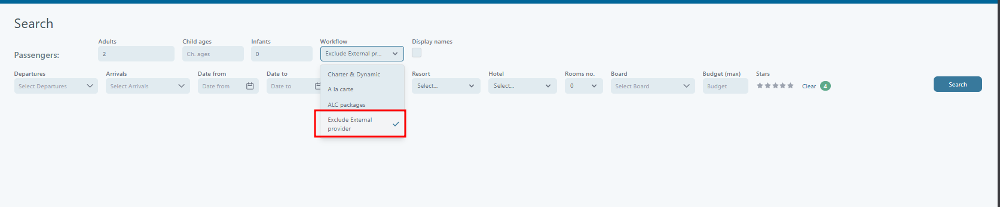
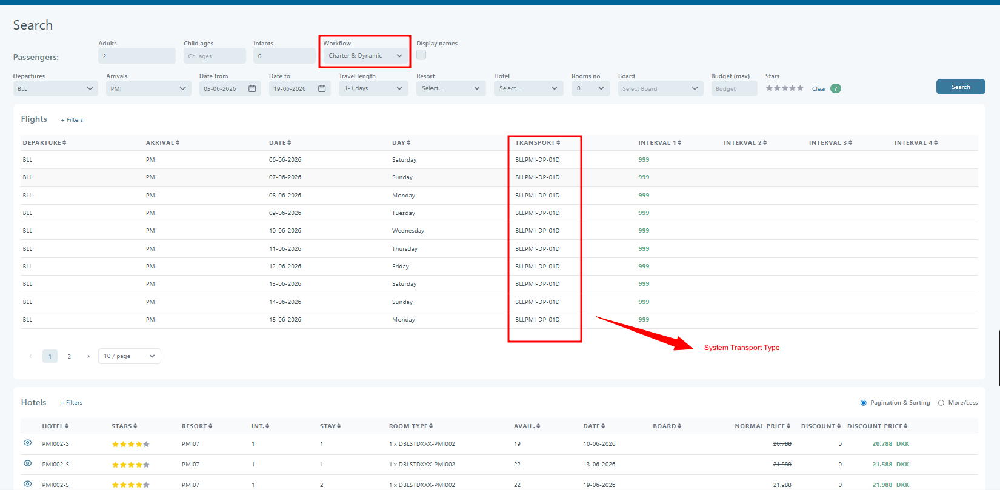
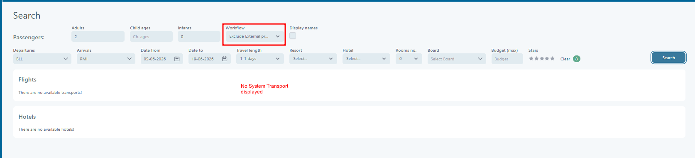

# New Booking search support

### **Overview**

The **New Booking Search** page in **Tourpaq Office** helps you find bookable **flight + hotel** combinations. Use it as an **availability search** for transports and hotels. You can filter by departure/arrival, dates, travel length, board, budget, and stars. Then create a booking from the matching results.


Use this page when you need fast **package search** support, or when a booking returns no results in the New Booking window.


***

### **Purpose**

This interface helps you:

* Provide travel package suggestions based on user-defined filters.
* Display all possible **flight + hotel** combinations.
* Enable direct booking initiation from matching hotel results.
* Compare availability, stay durations, pricing, and discounts efficiently.
* Search using the **room allocation directly.**
* Avoid manual hotel-by-hotel filtering.
* Handle **family and mixed occupancy bookings faster.**

***

### **Preconditions**

Before using this screen, the following conditions must be met:

* You must be signed in to **Tourpaq Office** with rights to create bookings.
* Price lists and allotments must exist for the hotels and transports to return **availability**.
* System dates and departure data should be up to date.
* Workflows must be configured if you want to filter by workflow (for example, **Charter & Dynamic**).

***

### Workflow and expected results



**Start a new booking**

1. Click **New Booking**.
2. Select a **Brand**.

The New Booking page is displayed.

<figure><figcaption></figcaption></figure>



**Open Search**

In the **Passengers** section, click **Search**.

The Search page can be opened without filling in the number of passengers in the booking window.



**Enter travel criteria (required)**

Required inputs:

* **Departure**
* At least one of **Arrival**, **Resort**, or **Hotel**
* **Date from** and **Date to**
* **Board**
* **Budget (max)**

If something is missing, you will see validation warnings.

<figure><figcaption></figcaption></figure>

In the **Booking Window Search** screen, a new workflow option has been introduced

**Location:** Search → Workflow

**New Value:** Exclude External Provider

<figure><figcaption></figcaption></figure>

### Behaviour

When the **Exclude External Provider** workflow is selected, the transport search shall exclude all transports where the provider type is **System**.

Only non-System transports will be returned in the search results.

#### Included

* Charter transports
* Dynamic transports managed internally
* Any other transport transport type (inclusive System Transport)

#### Excluded

* GDS flights
* Any transport with provider type **System**&#x20;

### Booking Flow

#### Standard Search

**Workflow:** Charter & Dynamic

Result:

* Internal transport options are returned.
* External provider (System/GDS) transports are returned.
* External transports are marked accordingly.

<figure><figcaption></figcaption></figure>

#### External Provider Excluded

**Workflow:** Exclude External Provider

Result:

* Internal transport options are returned.
* System/GDS transports are not returned.

<figure><figcaption></figcaption></figure>



**Run the search**

Fill the main fields (Adults, Departures, Arrivals, Date From/To), then click **Search**.

Room allocation is available even when no hotel is selected

<figure><figcaption></figcaption></figure>

Selecting the number of rooms activates room allocation and prompts you to fill it in.

<figure><figcaption></figcaption></figure>

Flights and hotels load as two result grids.

<figure><figcaption></figcaption></figure>

Filters only results that match:

* Occupancy distribution
* Room configuration

When the user clicks **Search**:

The system evaluates:

* Room allocation
* Passenger distribution
* Travel dates
* Transport
* Board

**Result:**

* Only valid combinations matching the allocation are returned



**Review flight results (top grid)**

You can sort all visible flight columns.

Common columns:

* Departure, Arrival, Date, Day
* Transport
* Interval 1–4

Select a flight row to enable **Clear selected row**.

<figure><figcaption></figcaption></figure>

Use **+ Filters** for flight filters.

<figure><figcaption></figcaption></figure>



**Review hotel results (bottom grid)**

Hotel rows show hotel, stay, availability, board, and prices.

Use **+ Filters** for advanced hotel filters.

<figure><figcaption></figcaption></figure>

You can switch the display mode:

* **Pagination & Sorting** (default)
* **More/Less** (no pagination, no sorting)

Hover the eye icon to see **View details**.

<figure><figcaption></figcaption></figure>



**Create the booking**

Select a hotel row to show actions.

You will see **Create booking** and **Clear selected row**.

<figure><figcaption></figcaption></figure>



### Search results overview

The Search page is split into two main result sections: **Flights** and **Hotels**. Both sections are driven by the criteria selected at the top of the page.


Only valid combinations matching the allocation are returned


#### Flights section

The Flights section shows available transports that match the search.

<figure><figcaption></figcaption></figure>

**Displayed information**

* Departure airport
* Arrival airport
* Date and weekday
* Transport code
* Interval 1–4

**Behavior**

* Only transports matching the selected travel dates and route are shown
* Selecting a flight limits hotel results to hotels compatible with that transport

***

#### Hotels section

The Hotels section lists available hotel rooms that match the search and selected flight.

<figure><figcaption></figcaption></figure>

**Displayed information**

* Hotel - Hotel code
* Stars - Star rating
* Resort
* Int - Interval
* Stay - Stay length (nights)
* Room type
* Avail - Available rooms
* Date - Departure date
* Board - Board type which is included in the price
* Normal price - The price without discount (P price), The price includes the price of any selected board
* Discount
* Final discounted price and currency - The price with discount (D price). The price includes the price of any selected board.

**Pricing**

* Discounted prices are highlighted
* Normal price is shown with strikethrough when a discount applies

***

#### Example Scenarios 

**Example 1**

**Input:**

* Rooms No: 2
* Room 1: 1 adult + 1 child (age 4)
* Room 2: 1 adult + 1 child (age 8)
* No hotel selected

**Result:**

* System returns:
  * All hotels matching this distribution
  * Valid transport + stay combinations

<figure><figcaption></figcaption></figure>

**Example 2:**

**Input:**

* Hotel selected: BCN\_HO
* Rooms No: 2
* Room 1 (2BR): 1 adult + 1 child (age 4)
* Room 2 (2/22): 1 adult + 1 child (age 8)

**Result:**

* System returns:
  * All rooms distribution for the specific hotel
  * Valid transport + stay combinations

<figure><figcaption></figcaption></figure>

***

### Pagination and sorting

* Both Flights and Hotels support pagination
* Results can be sorted by column headers
* “Pagination & Sorting” toggle controls how results are grouped and displayed

***

### Key behavior notes

* Flights act as a filter for Hotels
* Hotel availability and pricing update dynamically based on passenger data
* Only bookable combinations are shown


**Important:** The Search page uses an updated **Discount price** calculation. The value should match the presentation site.


#### Creating a Booking

When you click **Create booking**, a new page opens. It is pre-filled with the selected flight and hotel. From there, you complete the booking using the standard booking flow.

<figure><figcaption></figcaption></figure>

### Instructions and field descriptions

<figure><figcaption></figcaption></figure>

#### Search filters (top section)

| **Field**                 | **Description**                                                                                                                           |
| ------------------------- | ----------------------------------------------------------------------------------------------------------------------------------------- |
| **Adults / Child ages**   | Define number of adults and ages of children for accurate price and room matching.                                                        |
| **Workflow**              | Selects the type of booking workflow (e.g., "Charter & Dynamic"). Filters transport and hotel offers based on workflow-specific settings. |
| **Display Names**         | Option to show or hide internal or display-friendly hotel/transport names.                                                                |
| **Departures / Arrivals** | Define origin and destination airport codes. Multiple arrivals can be selected.                                                           |
| **Date from / Date to**   | The date range within which travel must begin.                                                                                            |
| **Travel length**         | Filters by stay duration (e.g., 1–7 days, 7–14 days).                                                                                     |
| **Resort / Hotel**        | Refines results by destination resort or specific hotel code.                                                                             |
| **Board**                 | Filters hotels that support a specific board type                                                                                         |
| **Budget (max)**          | Filters hotels based on the maximum price per person.                                                                                     |
| **Stars**                 | Filters based on hotel star rating.                                                                                                       |
| **Clear**                 | Resets all filters to default.                                                                                                            |
| **Search (Button)**       | Executes the search using the defined filters.                                                                                            |

#### UI Behavior

* Rooms No → always editable
* Room rows → dynamically generated
* Room column:
  * Disabled when no hotel is selected
  * Enabled when the hotel is selected
* Allocation fields:
  * Always visible when Rooms No ≥ 1

***

#### Validation Rules 

| Rule               | Behavior              |
| ------------------ | --------------------- |
| Rooms No not set   | Disable allocation    |
| Passenger mismatch | Show validation error |
| Missing child ages | Block search          |
| Invalid occupancy  | Exclude results       |

Validation is enforced before search execution.

***

#### Flights table (top grid)

This section lists flights that match the search criteria:

| **Column**       | **Description**                                                                                          |
| ---------------- | -------------------------------------------------------------------------------------------------------- |
| **Departure**    | Airport code where the flight departs from (e.g., BLL).                                                  |
| **Arrival**      | Airport code for the destination (e.g., BCN).                                                            |
| **Date**         | Flight departure date.                                                                                   |
| **Day**          | Weekday of the departure.                                                                                |
| **Transport**    | Internal code representing the transport offer and its duration.                                         |
| **Interval 1–4** | Allotment and capacity-related intervals, often representing available seats per week group or category. |

***

#### Hotels table (bottom grid)

This grid displays hotel options based on the search:

| **Column**                   | **Description**                                                                                                           |
| ---------------------------- | ------------------------------------------------------------------------------------------------------------------------- |
| **Hotel**                    | Internal hotel code (e.g., BCN\_HO).                                                                                      |
| **Stars**                    | Hotel rating (1 to 5 stars).                                                                                              |
| **Resort**                   | Destination resort code (e.g., BCN, ADEJ).                                                                                |
| **Int.**                     | Interval group the hotel offer belongs to (links to flight intervals).                                                    |
| **Stay**                     | Number of nights included in the hotel stay.                                                                              |
| **Room Type**                | Description of the available room(s), including bed configuration.                                                        |
| **Avail.**                   | Remaining available rooms for the selected date.                                                                          |
| **Date**                     | Departure Date                                                                                                            |
| **Board**                    | Board type which is included in the price                                                                                 |
| **Normal Price**             | The price without discount (P price), The price includes the price of any selected board                                  |
| **Discount**                 | Applied discount amount.                                                                                                  |
| **Discount Price**           | The price with discount (D price). The price includes the price of any selected board.                                    |
| **Create booking (tooltip)** | Appears on hover over a hotel row. Clicking it initiates the booking process for the selected flight + hotel combination. |

Additional UI Elements:

* **+ Filters**: Allows advanced filtering for both flights and hotels.
* **Clear selected row**: Deselects a previously selected hotel row.
* **Pagination & Sorting**: Toggle between paginated view and sorting/filtering controls.
* **More/Less**: Expands or collapses additional results for the same hotel.

***

### Next steps after the search

1. Select the preferred **flight** from the upper table.
2. Choose a suitable **hotel** row.
3. Hover over the row to reveal the **Create booking** button.
4. Click **Create booking** to proceed with booking creation using the selected transport and hotel offer.
