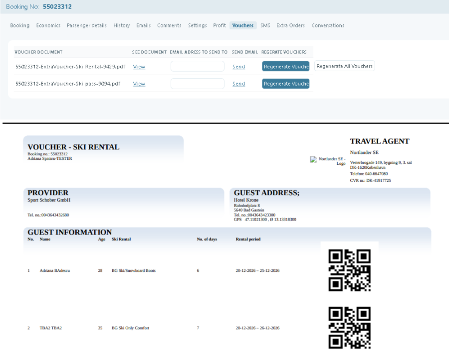
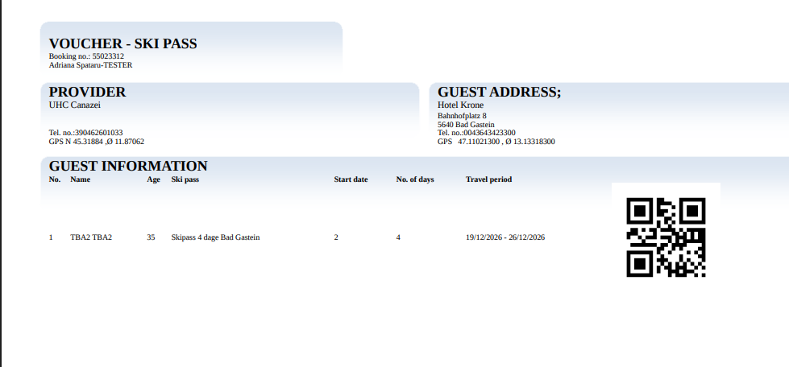
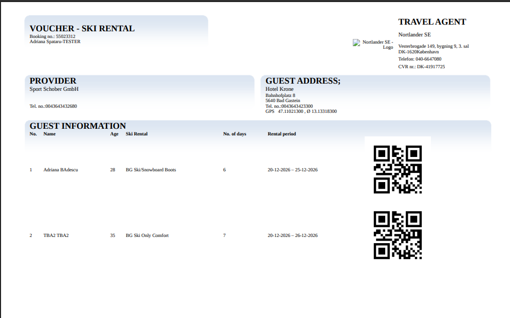

# QR code for vouchers

### **Overview**

The **QR code for vouchers** feature in **Tourpaq Office** adds a scannable **voucher QR code** to generated vouchers. This helps staff, guides, and suppliers look up vouchers faster (printed or on a guest’s phone) without manual entry of voucher references.


QR codes appear **only on vouchers that have been generated**. Voucher generation is controlled by your voucher rules and timing (see [Vouchers](../../setup/vouchers.md)).


***

### Purpose

* Make vouchers easier to use on-site by enabling quick scanning.
* Reduce manual entry errors when looking up voucher information.
* Improve operational handling at suppliers/passengers.

***

### Preconditions

* The setting **Show QR-code in vouchers** must be enabled.
* Vouchers must be generated for the booking (typically requires:
  * Booking status **OK**
  * Booking is **fully paid**
  * The relevant entity has **Issue Voucher** enabled and a **Supplier** assigned
  * Voucher generation timing is reached

For the detailed rules, see: [Vouchers](../../setup/vouchers.md).

***

### How it works

1.  **Voucher Generation** After a booking is confirmed and voucher(s) are generated, the system embeds a unique QR-code onto the voucher. That QR-code encodes the voucher reference or URL, which points to the booking and voucher details.

    <figure><figcaption></figcaption></figure>
2. **Customer Receipt** The customer receives the voucher (via email or download) with the QR-code visible. They may either print it or show it on their mobile device.
3. **Redemption / Validation** At check-in or on-site, staff or suppliers scan the QR-code with a scanner or mobile device. The system locates the corresponding booking, verifies voucher validity (unused, correct date, correct service) and marks it as redeemed.
4. **Audit & Tracking:** Each scan and redemption event is logged, allowing for reporting on voucher scans, redemptions, no-shows, and discrepancies.


What happens after scanning (for example, whether it opens a page, validates, or marks a voucher as used) depends on your organization’s scanner/app/workflow. This page documents the voucher-side QR code feature only.


***

### Setup



**1. Enable QR codes on vouchers**

1. Go to **System Setup**.
2. Enable **Show QR-code in vouchers**.

<figure><figcaption></figcaption></figure>

3. Click **Save**.



**2. Ensure vouchers will be generated**

Confirm that the booking and product setup meet the voucher generation rules (status OK, fully paid, Issue Voucher + Supplier, and correct timing).

See: [Vouchers](../../setup/vouchers.md)



**3. Verify on a voucher**

Once vouchers are generated, open/download a voucher and confirm the QR code is visible.

<figure><figcaption></figcaption></figure>

<figure><figcaption></figcaption></figure>



***

### Notes

* QR codes are shown on the **voucher PDF**.
* Vouchers can be generated per passenger/product depending on your setup. In many setups, the QR code is generated **per voucher document**.

### Related pages

* [vouchers.md](../../setup/vouchers.md "mention") — Configure voucher generation timing and resolve missing vouchers.
* [economics.md](economics.md "mention") — Register payments and verify the booking payment status.
* [e-mails.md](e-mails.md "mention") — Review voucher emails sent from a booking.
