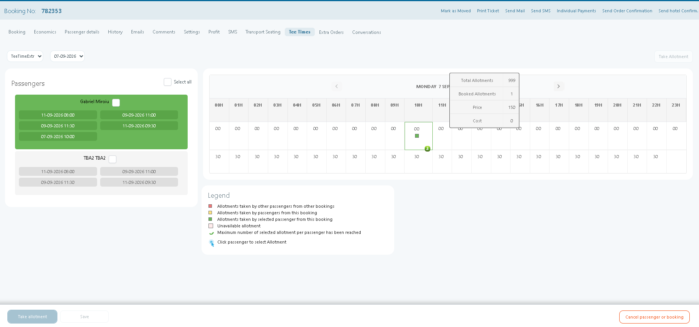
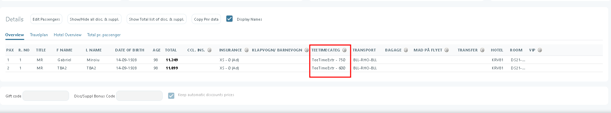
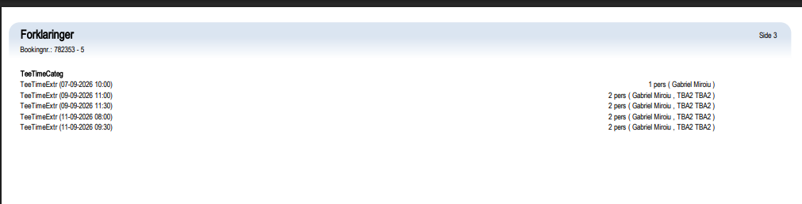

# Tee Times

### **Overview**

The **Tee Times** tab in **Tourpaq Office** is used to create a **tee time booking** (time-slot reservation) for time-based extras. Typical use cases are **golf tee times** and activities that run in fixed time slots. Assign a specific date and time per passenger, then reserve the slot using **Take Allotment**.

***

### **Purpose**

* Select a specific **date and time slot** for a time-based extra.
* Assign reservation times to individual passengers.
* Ensure that time-slot availability is used correctly for operational planning.

***

### **Preconditions**

* The booking must be created and saved with at least one passenger.
* The booking must include an **extra** that supports tee-time/time-slot reservations.
* Configure time slots for the product in the system (otherwise no available times will be shown).

<figure><figcaption></figcaption></figure>

### **Instructions**

#### **Access the Tee Times tab**

1. Open the booking.
2. Click the **Tee Times** tab.

***

#### **Select a date and time**

1. Choose the **date** for the reservation.
2. Review the **available times** displayed for that product (for example, `10:32`).

***

#### **Assign a time to passengers**

1. Click the passenger you want to assign a time to.
2. Click the desired time slot to reserve it for that passenger.
3. Repeat for the remaining passengers.

<figure><figcaption></figcaption></figure>

4. Hover over the selected allotment to view about total allotments, booked allotments, price and cost)&#x20;

***

#### **Finalize the reservation**

1. When all passengers have been assigned a time, click **Take Allotment**.
2. Click **Save** to confirm. The total amount of the booking it will be changed with the total cost af the tee times added

***

#### **Result**

* Each selected passenger is assigned to the chosen time slot.
*   In the booking page -> passenger details, the tee time extra category will be displayed with the extras calculated for each passenger&#x20;

    <figure><figcaption></figcaption></figure>
*   The assigned times will be visible in the booking and may also appear on printed documents or operational lists, depending on your setup.&#x20;

    <figure><figcaption></figcaption></figure>

***

### **Related documentation**

* [**Teetime**](../../../extras-setup/extras-general-page/teetime.md) – How tee-time products and time-slot availability are configured (Generic Allotment).
* [**Golf Course Check‑In Module**](golf-course-check-in-module.md) – Self-service and staff check-in views for tee times.
