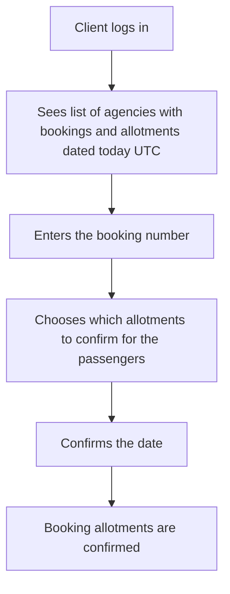
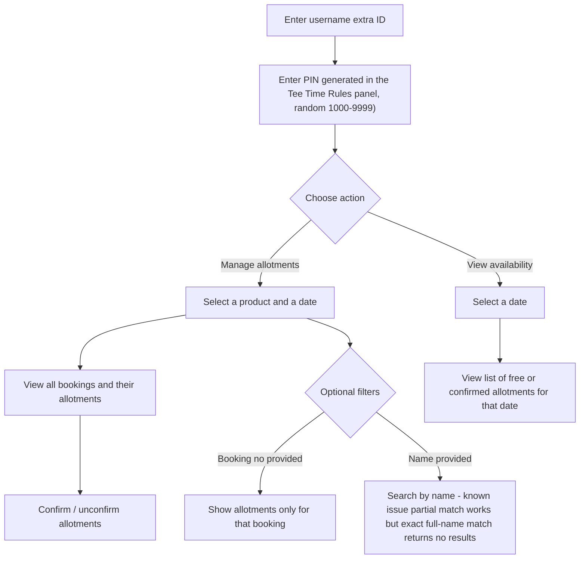

# Golf Course Check-In Module

### **Overview**

The **Golf Course Check‑In** module in **Tourpaq Office** lets guests confirm arrival for booked **tee times** using a simple on‑site **check-in kiosk** (tablet). It helps optimize tee-time usage, reduce no‑shows, and give golf-club staff a live view of attendance.

The module has two components:

1. **Customer Check‑In interface** – Touch‑screen kiosk where players register their arrival.
2. **Master Module** – Staff and guide interface used to manage check‑ins, verify tee times, and adjust registrations.

The module integrates with the Tourpaq booking database and retrieves relevant tee‑time, player, and booking information.


The system is designed to work with **parent products**, **child products**, and **standalone products**.

The only requirement is that the product uses the **Tee Time** category.


***

### Purpose

The purpose of the check‑in module is to:

* Capture guest arrivals for tee times directly at the golf course.
* Reduce no‑shows by making check‑in easy and structured.
* Provide up‑to‑date tee‑time status for staff.
* Improve guest experience through a simple, language‑aware self‑service kiosk.
* Support GDPR principles by only showing data relevant for **today’s** tee times.
* Allow staff to handle check‑ins across multiple tee times efficiently through the Master Module.

***

### Configuration: TeeTime Category Type

For the Golf Course Check-In module to work, the underlying tee-time product's Extras Category must use the TeeTime Category Type (Extras Setup → Extras → Basic setup). Setting the category to this type enables a Tee Time Rules section on the product, which is what actually drives the check-in kiosk and Master Module:&#x20;

* TeeTime Pin – the PIN used as the Master Module password (see Backend Login below).
* Product Parent ID – links this product's allotment to a parent product for shared availability.
* Pax limit – how many times a passenger can book this tee time per interval.
* Limit Per Day / Only first week(s) – caps on how often and how far ahead the tee time can be booked.
* Limit before hour – closes bookings a set number of hours before a cut-off time on the day of play.
* Requires confirmation – if enabled, a booking needs manual staff confirmation before it is valid, which affects what shows as confirmed in the Master Module.

For the full field reference and how the Generic Allotment (daily/weekly slots, block allotments) is set up, see the [Teetime page](../../../extras-setup/extras-general-page/teetime.md).

### 1. Customer Check‑In Flow (Kiosk)

<figure><figcaption></figcaption></figure>

#### Screen 1 – Booking number entry

**Purpose:** Identify the booking for today’s tee time(s).

<figure><figcaption></figcaption></figure>

**Elements**

* Numeric input field with an on‑screen keypad.
* **Next** button.

**Validation**

* Format check: must be **5–6 digits**.
* Booking must have tee times **on the current day**.

**Error messages**

*   Invalid format → “The entered booking number is not valid. Please check your ticket (5–6 digits).”

    <figure><figcaption></figcaption></figure>
*   No tee times today → “This booking number has no registered tee times on this day.”

    <figure><figcaption></figcaption></figure>

***

#### Screen 2 – Player selection

**Purpose:** Select which players from the booking are checking in.

<figure><figcaption></figcaption></figure>

**Language**

The kiosk automatically switches to the language of the booking’s Brand.


Agencies appear automatically based on whether they have a matching booking for today. No direct configuration is required — only Agencies associated with today’s qualifying Tee Time bookings are displayed.


**Displayed**

* Player names and tee times relevant for today.
* A checkbox for each player for quick selection.


- Only players from the **same tee time** can be checked in together.
-   If a user attempts to mix tee times, the following message appears:

    “Only possible to register players with the same tee-time at the same time.”


**Buttons**

*   **Next** – continues if at least one player is selected.

    <figure><figcaption></figcaption></figure>
* **Go Back / Start Over** – returns to Screen 1 and resets the session.

**Timeout**

*   After **30 seconds** of inactivity, a warning popup appears and the kiosk auto‑resets after 5 seconds.

    <figure><figcaption></figcaption></figure>

#### Screen 3 – Confirmation

**Purpose:** Confirm the selected players before finalizing.

Shows:

* Tee time (including weekday and date).
* List of all players on the tee time:
  * Checked → “Confirmed check‑in”
  * Not checked → “Not confirmed”
* Empty slots displayed as “Player X”.

Buttons:

* **Next** – saves the check‑in.
* **Go back** – returns to Screen 2 (and resets input).

#### Screen 4 – Completion

Displays:

* “Thank you and have a good round!”
* 5‑second countdown.
* Auto return to Screen 1 (full reset).

This diagram illustrates the step-by-step flow of the Customer Check-In functionality described above: the client logs in and sees the list of agencies with bookings and allotments dated today, enters the booking number, chooses which allotments to confirm for the passengers, confirms the date, and the booking allotments are then confirmed.

***

### 2. Master Module (Staff interface)

<figure><figcaption></figcaption></figure>

#### Login

Access: on any Customer Check-In screen, tap the small gear icon in the bottom-left corner of the kiosk to open the Master Module login screen.

* **Username:** Extra ProductID (for example, `3692`)
* **Password:** A 4‑digit PIN displayed in the extra configuration (the extra's TeeTime Pin field).

PIN generation: the TeeTime Pin is a system-generated identifier stored on the tee-time product's Tee Time Rules configuration (Extras Setup → Extras, product using the TeeTime Category Type). Staff can regenerate it from that page using the shuffle/refresh icon next to the field, but the new PIN only takes effect once the product is saved — leaving the page without clicking Save keeps the previous PIN active. If the product is a child of a parent product, regenerating the PIN updates the parent's PIN as well.

<figure><figcaption></figcaption></figure>

***

#### Master Module – Main screen

This is Screen 1 for staff (default view).

<figure><figcaption></figcaption></figure>

**Search options**

* Dropdown: today’s tee times
* Dropdown: today’s booking numbers
* Input: numeric booking number
* Input: name
* **Find** button

Results show all players across all tee times matching the search.

<figure><figcaption></figcaption></figure>

**Columns**

* Check‑in status
* Tee time
* Booking number
* Name
* Handicap

***

#### Master Module – “Today” screen

A live operational overview similar to the Tee Time Extras PDF.

<figure><figcaption></figcaption></figure>

Displays all tee times for today:

<figure><figcaption></figcaption></figure>

* Status: Available / Blocked / Occupied
* Player names
* Handicap

This diagram illustrates the step-by-step flow of the Master Module functionality described above: staff log in with the extra ID and PIN, then choose to either manage allotments (selecting a product and date, viewing or confirming/unconfirming bookings, and optionally filtering by booking number or name) or view availability for a selected date.

***

### Related documentation

* [**Tee Times**](./) – How agents assign tee times to passengers in a booking.
* [**Teetime**](../../../extras-setup/extras-general-page/teetime.md) – How tee-time products and time-slot availability are configured.
* [**Tee Time extras list**](../../../tee-time-extras-list/) – Export/reporting for tee time bookings.
