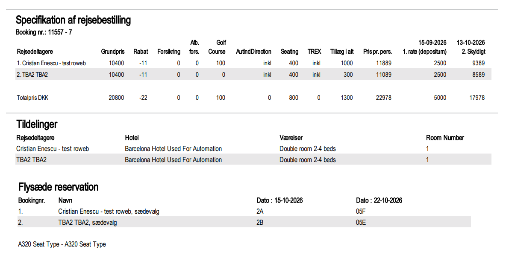
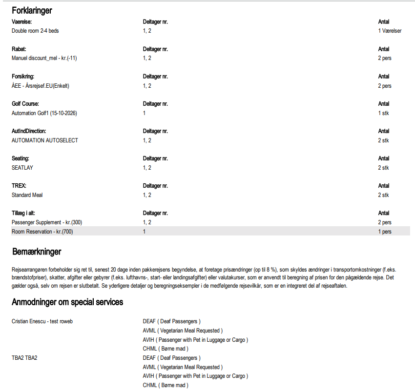
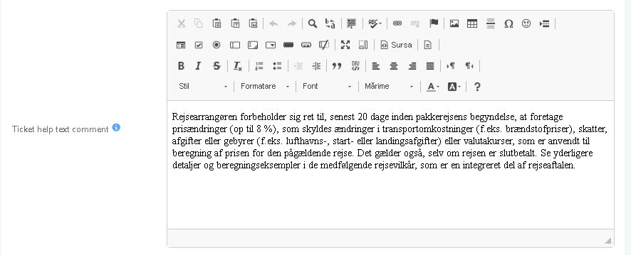
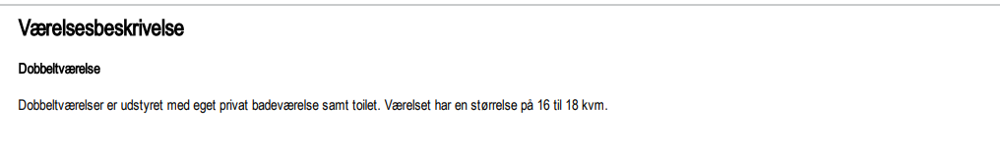
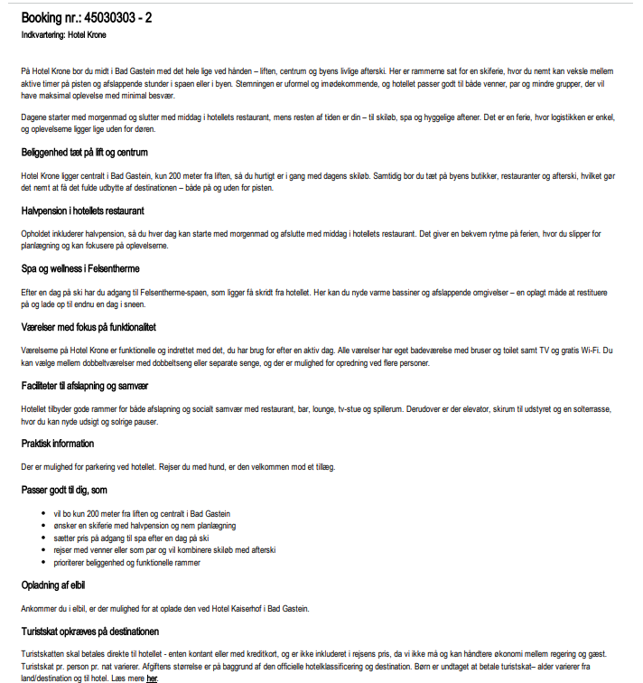

# Ticket V2 - Structure

### Overview

Ticket Version 2 (BILLET) is one of three selectable e-ticket layouts, configured on the Brands General Settings page, under Ticket → Version.

<figure><figcaption>
Version selection
</figcaption></figure>

It is generated from the same booking data — transport (flights, buses, and trains), accommodation, passengers, pricing, payment plan and hotel information.

Version 2 presents this data as a sequence of plain tables under section headings in the brand's configured language — Danish (Rejseplan, Opholdet, Rejsedeltagere, Betalingsplan, Specifikation af rejsebestilling, Forklaringer) or Swedish for a brand configured that way.

### Purpose

Use this page to:

* Confirm what a customer will see on their printed or emailed ticket before departure.
* Check where a configured price component, discount, or special service request will print, when troubleshooting a customer query about their ticket.

### Preconditions

* The booking exists and contains at least one product (hotel, transport, or similar).
* The brand's ticket layout is set to Version 2 on the General Settings page, under Ticket → Version.
* You know which Extras and discounts are configured on the booking, so you can locate them on the printed ticket.
* For Bus or Train segments, you know the pickup point configured on the transport's route, since it determines the ticket's Fra / Från value.

### How-to



Set the ticket version

Go to System Setup → Brands → General, open the brand, expand Ticket, and set Version to Version 2. Click Save.



Generate the ticket

Go to Booking → Open Booking → Click Print Ticket ->Save



Tourpaq generates a PDF in the structure described under Field Reference below, using the booking's current data.


Ticket Customization is not available on this layout. Brand colours, fonts, star icons, and decorative images cannot be configured for it. A Version 2 ticket always prints in the plain black-and-white table layout shown below, regardless of any customisation saved for the brand.


### Field Reference

### Page 1 — Booking summary, itinerary and payment plan

<figure><figcaption>
Page 1 combines the booking summary, itinerary, accommodation, passenger details, and payment plan.
</figcaption></figure>

#### Booking header

<figure><figcaption>
Booking header showing customer, booking, travel consultant, and brand company information.
</figcaption></figure>

Left column:

* Shows Booking nr.,
* the customer's name and address,
* Bestillingsdato (booking date),
* Udskriftsdato (print date),
* Ferierådgiver (travel consultant),

Right column:

* The brand's company details (name, address, phone, CVR No.). The company details come from General Settings → Ticket
* Company logo / banner - Displays the brand's Logo and Banner images from General Settings

<figure><figcaption>
Set the Logo and Banner in Brands -> Ticket
</figcaption></figure>

\
Min billet - login:

A boxed callout with the Bookingnr. and Adgangskode Internet (web password) the customer uses to log in to Customer Center

#### Rejseplan (itinerary)

One row per transport segment in the booking. Flight segments show:

* Afrejsedato (departure date),
* Afgang (departure time),
* From (departure airport),
* Flyselskab (airline),
* Fly nr. (flight number),
* Ankomstdato,
* Ankomst (arrival time),
* Flytid (flight duration),
* Til (arrival airport).

Bus and Train segments use the same table structure as Flight, with brand-specific column names matching the brand's language.

<figure><figcaption>
Rejseplan lists each transport segment with its schedule, route, and transport details.
</figcaption></figure>

* The `Fra` / `Från` (From) value is the pickup point configured on the transport's route (also shown elsewhere as `Opsamlingssted`). Pickup points, and meeting, departure and return times, all come from that route setup.
* When no pickup point is selected on the booking, the field shows a fallback message instead of being left blank.
* The arrival-date column is labelled `Ankomstdato` (Danish brands) or `Ankomstdatum` (Swedish brand), matching the Flight table's naming.
* No summary block appears above the table — the departure date, arrival date, and passenger count are shown only in the detailed rows.
* No `Kørselsvejledning` (driving/collection instructions) line prints for Bus and Train segments.

#### Opholdet (accommodation)

<figure><figcaption>
Opholdet lists every booked stay, including hotel, dates, quantity, and Værelser.
</figcaption></figure>

One row per stay:

* Rejsemål (destination),
* Hotel (hotel name),
* a custom star-rating text,
* Ankomst (arrival day),
* Afrejse (departure day),
* Antal (number of units),
* Værelser (room type).

#### Rejsedeltagere (passengers)

<figure><figcaption>
Rejsedeltagere lists passenger details, booked services, and payment amounts.
</figcaption></figure>

One row per traveller:

* Bookingnr.,
* Navn (passenger name),
* Fødselsdato (date of birth),
* Værelser (room type),
* Transport,
* Pension (Board Type),
* Price. Followed by Total Price, Deposit, and Skyldigt (amount due).

#### Betalingsplan (payment plan)

<figure><figcaption>
Betalingsplan shows each instalment, its due date, and payment account details.
</figcaption></figure>

One row per rate (deposit, balance) with amount and due date, followed by IBAN-number and BIC-kode/SWIFT-adresse.

This part can be hidden when **Hide Payment Details** is enabled in General Settings

### Page 2 — Price specification and seat/room assignment

<figure><figcaption>
Page 2 contains price specifications, Tildelinger, and Flysæde reservation.
</figcaption></figure>

#### Field Description

Specifikation af rejsebestilling (Travel booking specifications)

* A single table listing every passenger in one row, with columns Grundpris (base price), Rabat (discount), Forsikring (insurance), Afb.fors. (cancellation insurance), Golf Course, AutIndDirection, Seating, TREX, Tillæg i alt (supplements total), Pris pr. pers., and one column per instalment due date. A Totalpris DKK row sums every column.
* Tildelinger (room assignments) - One row per passenger:
  * Rejsedeltagere (passenger name),
  * Hotel,
  * Værelser (room type),
  * Room Number — shows how passengers are allocated to rooms (how they are grouped by room)
* Flysæde reservation (seat reservation)- One row per passenger, showing the seat chosen (sædevalg) for each flight date, followed by the aircraft seat-map type (for example A320 Seat Type). It is shown when seating is selected as an Extra Category

### Page 3 — Explanations and special service requests

#### Field Description

<figure><figcaption>
Page 3
</figcaption></figure>

#### Forklaringer (explanations)

* A legend that expands every extras, discounts/supplemnets used on page 2 — Vaerelse, Rabat, Forsikring, Golf Course, AutIndDirection, Seating, TREX, Tillæg i alt — each with the passenger number(s) it applies to and a quantity (Antal).
* Bemærkninger (remarks) - Ticket help text comment - it can be configured under the Brands -> General settings-> Ticket -> Ticket help text comments

<figure><figcaption>
Ticket help text comment
</figcaption></figure>

* List of special services (SSR) - One entry per participant, listing every requested SSR code with its plain-language description (for example AVML ( Vegetarian Meal Requested )) — shown when Show SSR On Ticket is enabled in General Settings Show SSR On Ticket is a general Ticket setting.

### Pages 4–5 — Room/Hotel information

#### Field Description

* Værelsesbeskrivelse (room description) - The booked room's name in bold, followed by its description text on the next line. It is shown when Show room info is enabled and the room type has a description Uses the Brand Description if one exists, otherwise the Default Description; rooms with no description at all are skipped with no placeholder shown.

<figure><figcaption>
Værelsesbeskrivelse shows the booked room name and available room description.
</figcaption></figure>

* Hotelfaciliteter (hotel facilities) - shows the hotel facilities — shown when the hotel has facility data configured

<figure><figcaption>
Hotelfaciliteter lists facilities configured for the booked hotel.
</figcaption></figure>

### Related pages

* [.](./ "mention") configures the brand's **Ticket** settings and ticket version.
* [print-tickets.md](../../tickets/print-tickets.md "mention") explains how to generate, print, and email ticket PDFs.
* [customer-information-displayed-on-the-ticket.md](../../customer-information-errata/customer-information-displayed-on-the-ticket.md "mention") explains where customer information appears in ticket versions 1–3.
* [e-tickets-overview.md](../../e-tickets-overview.md "mention") explains how to verify e-ticket email delivery.
