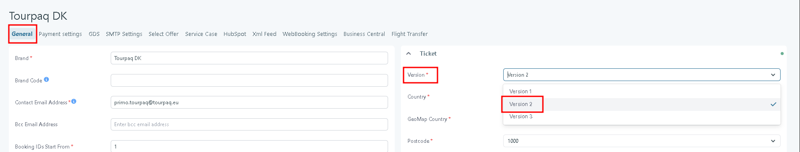
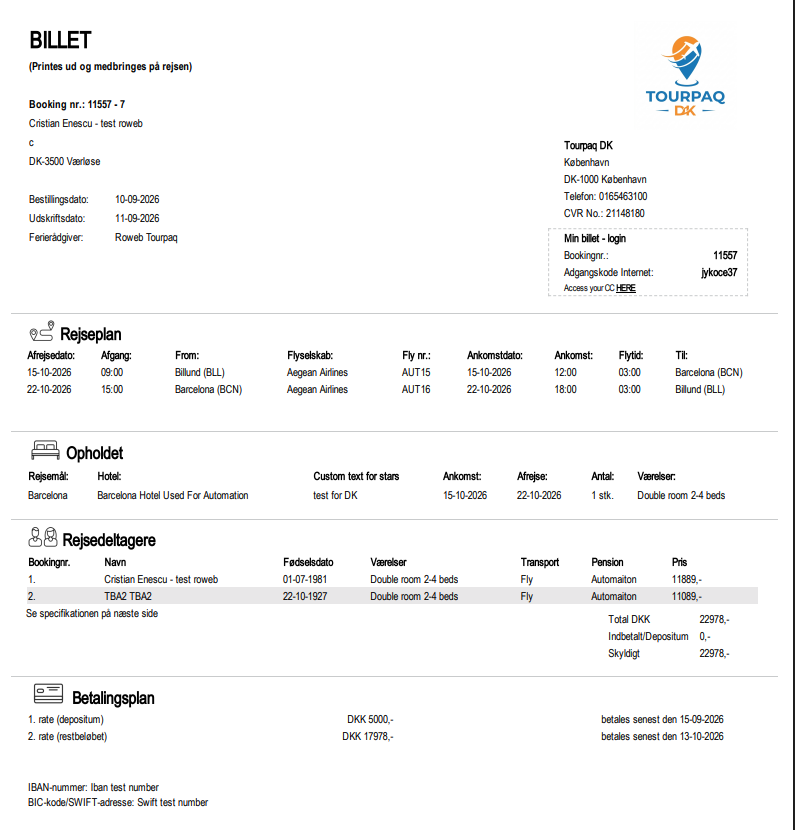
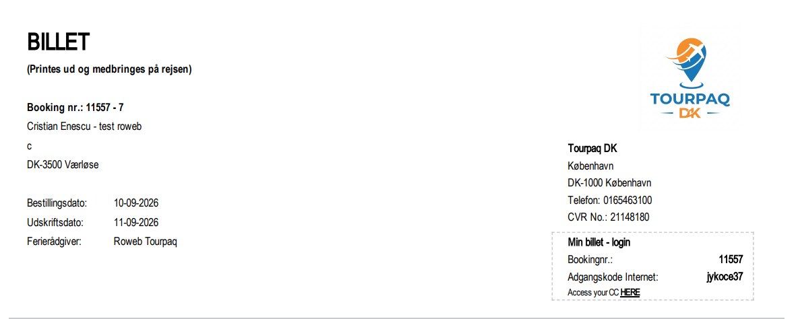
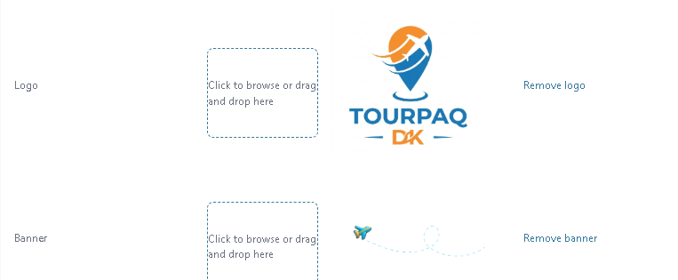
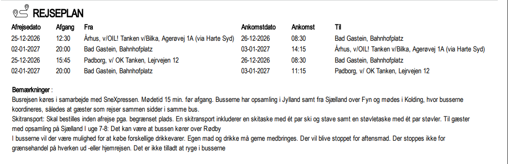
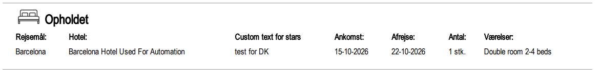
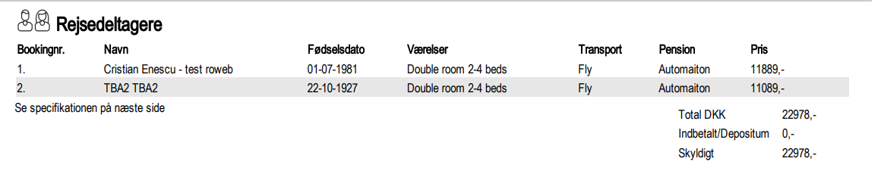
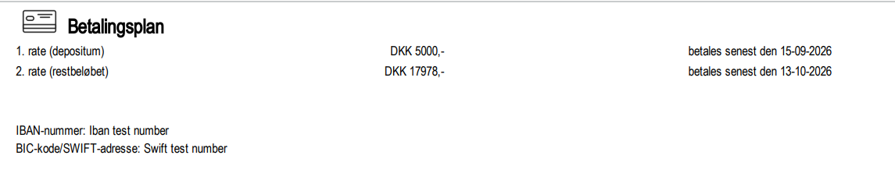

# Ticket V2 - Structure

### Overview

Ticket Version 2 (BILLET) is one of three selectable e-ticket layouts, configured on the General Settings page, under Ticket → Version.&#x20;

<figure><figcaption></figcaption></figure>

It is generated from the same booking data — transport (flights, buses, and trains), accommodation, passengers, pricing, payment plan and hotel information.

Version 2 presents this data as a sequence of plain tables under section headings in the brand's configured language — Danish (Rejseplan, Opholdet, Rejsedeltagere, Betalingsplan, Specifikation af rejsebestilling, Forklaringer) or Swedish for a brand configured that way.

### Purpose

Use this page to:

* Confirm what a customer will see on their printed or emailed ticket before departure.
* Check where a configured price component, discount, or special service request will print, when troubleshooting a customer query about their ticket.

### Preconditions

* The booking exists and contains at least one product (hotel, transport, or similar) — see Print Tickets.
* The brand's ticket layout is set to Version 2 on the General Settings page, under Ticket → Version.
* You know which Extras and discounts are configured on the booking, so you can locate them on the printed ticket.
* For Bus or Train segments, you know the pickup point configured on the transport's route, since it determines the ticket's Fra / Från value.

### How-to



Set the ticket version

Go to System Setup → Brands → General, open the brand, expand Ticket, and set Version to Version 2. Click Save.



Generate the ticket

Go to Booking → Open Booking → Tickets / Print, enter the Booking No, and use Print One Ticket or Send E-Ticket as described in Print Tickets.



Tourpaq generates a PDF in the structure described under Field Reference below, using the booking's current data.


Ticket Customization is not available on this layout. Brand colours, fonts, star icons, and decorative images cannot be configured for it. A Version 2 ticket always prints in the plain black-and-white table layout shown below, regardless of any customisation saved for the brand.


### Field Reference

#### Page 1 — Booking summary, itinerary and payment plan

<figure><figcaption></figcaption></figure>

#### Booking header &#x20;

<figure><figcaption></figcaption></figure>

Left column:

* Shows Booking nr.,&#x20;
* the customer's name and address,
* Bestillingsdato (booking date),&#x20;
* Udskriftsdato (print date),&#x20;
* Ferierådgiver (travel consultant),&#x20;

Right column:

* The brand's company details (name, address, phone, CVR No.).  The company details come from General Settings → Ticket&#x20;
* Company logo / banner - Displays the brand's Logo and Banner images from General Settings

<figure><figcaption></figcaption></figure>

\
Min billet - login:&#x20;

A boxed callout with the Bookingnr. and Adgangskode Internet (web password) the customer uses to log in to Customer Center

#### Rejseplan (itinerary)&#x20;

One row per transport segment in the booking. Flight segments show:

* Afrejsedato (departure date),&#x20;
* Afgang (departure time),&#x20;
* From (departure airport),
* Flyselskab (airline),&#x20;
* Fly nr. (flight number),&#x20;
* Ankomstdato,&#x20;
* Ankomst (arrival time),&#x20;
* Flytid (flight duration),&#x20;
* Til (arrival airport).

&#x20;Bus and Train segments use the same table structure as Flight, with brand-specific column names matching the brand's language.

<figure><figcaption></figcaption></figure>

* The `Fra` / `Från` (From) value is the pickup point configured on the transport's route (also shown elsewhere as `Opsamlingssted`). Pickup points, and meeting, departure and return times, all come from that route setup.
* When no pickup point is selected on the booking, the field shows a fallback message instead of being left blank.
* The arrival-date column is labelled `Ankomstdato` (Danish brands) or `Ankomstdatum` (Swedish brand), matching the Flight table's naming.
* No summary block appears above the table — the departure date, arrival date, and passenger count are shown only in the detailed rows.
* No `Kørselsvejledning` (driving/collection instructions) line prints for Bus and Train segments.

#### Opholdet (accommodation)&#x20;

<figure><figcaption></figcaption></figure>

One row per stay:&#x20;

* Rejsemål (destination),&#x20;
* Hotel (hotel name),&#x20;
* a custom star-rating text,&#x20;
* Ankomst (arrival day),&#x20;
* Afrejse (departure day),&#x20;
* Antal (number of units),&#x20;
* Værelser (room type).&#x20;

#### Rejsedeltagere (passengers)&#x20;

<figure><figcaption></figcaption></figure>

One row per traveller:&#x20;

* Bookingnr.,&#x20;
* Navn (passenger name),&#x20;
* Fødselsdato (date of birth),&#x20;
* Værelser (room type),&#x20;
* Transport,&#x20;
* Pension (Board Type),&#x20;
* Price. Followed by Total Price, Deposit, and Skyldigt (amount due).&#x20;

#### Betalingsplan (payment plan)&#x20;

<figure><figcaption></figcaption></figure>

One row per rate (deposit, balance) with amount and due date, followed by IBAN-number and BIC-kode/SWIFT-adresse.&#x20;

This part can be hidden when Hide Payment Details is enabled in General Settings

Page 2 — Price specification and seat/room assignment\
Field Description Required Notes\
Specifikation af rejsebestilling A single table listing every participant in one row, with columns Grundpris (base price), Rabat (discount), Forsikring (insurance), Afb.fors. (cancellation insurance), Golf Course, AutIndDirection, Seating, TREX, Tillæg i alt (supplements total), Pris pr. pers., and one column per instalment due date. A Totalpris DKK row sums every column. Yes —\
Tildelinger (room assignments) One row per participant: Rejsedeltagere, Hotel, Værelser, Room Number. Conditional — shown when room numbers are assigned Printed as a separate table from Flysæde reservation (seat reservation) below.\
Flysæde reservation (seat reservation) One row per participant, showing the seat chosen (sædevalg) for each flight date, followed by the aircraft seat-map type (for example A320 Seat Type). Conditional — shown when seating is selected as an Extra Category Printed as a separate table from Tildelinger (room assignments) above.


TO VERIFY — AutIndDirection and TREX are column headings taken directly from the sample ticket's Specifikation af rejsebestilling and Forklaringer tables; in that booking they corresponded to an AUTOMATION AUTOSELECT extra and a Standard Meal extra respectively. Neither term appears in the glossary or elsewhere in the manual. What do AutIndDirection and TREX represent, and should they be added to the glossary?


Page 3 — Explanations and special service requests\
Field Description Required Notes\
Forklaringer (explanations) A legend that expands every price code used on page 2 — Vaerelse, Rabat, Forsikring, Golf Course, AutIndDirection, Seating, TREX, Tillæg i alt — each with the participant number(s) it applies to and a quantity (Antal). Yes —\
Bemærkninger (remarks) Standard legal text on the tour operator's right to adjust prices up to 20 days before departure. Yes Fixed text; not booking-specific.\
Anmodninger om special services (SSR) One entry per participant, listing every requested SSR code with its plain-language description (for example AVML ( Vegetarian Meal Requested )). Conditional — shown when Show SSR On Ticket is enabled in General Settings Show SSR On Ticket is a general Ticket setting, not specific to this layout.\
Pages 4–5 — Hotel information\
Field Description Required Notes\
Værelsesbeskrivelse (room description) The booked room's name in bold, followed by its description text on the next line. Conditional — shown when Show room info is enabled and the room type has a description Uses the Brand Description if one exists, otherwise the Default Description; rooms with no description at all are skipped with no placeholder shown.\
Hotelfaciliteter (hotel facilities) A Pension table showing the board option's Numerical option and Time (for example Dag, meaning per day). Conditional — shown when the hotel has facility data configured The sample ticket's hotel had minimal facility data, so only the Pension table appeared. See TO VERIFY below.


TO VERIFY — The sample Version 2 ticket's hotel had very little facility content configured, and only a Pension table printed. Does Version 2 print a fuller hotel description, facilities, and distances when a hotel has that content configured, or is Hotelfaciliteter on Version 2 always limited to the Pension table shown here?



TO VERIFY — The sample ticket had no cancelled participants and no GDS/dynamic-flight or golf-voucher content, so the following could not be confirmed on Version 2: how a cancelled passenger is shown (status text, price treatment, any cancellation-fee line), whether a dedicated page appears for System Transport bookings (PNR, e-ticket number, baggage table), and whether a Golf Voucher page (tee-time tables) is produced when golf products are booked. Does Version 2 include these, and if so, what do they show?


Related pages
\
General Settings
\
Print Tickets
\
Customer Information displayed on the Ticket
\
E-tickets Overview
