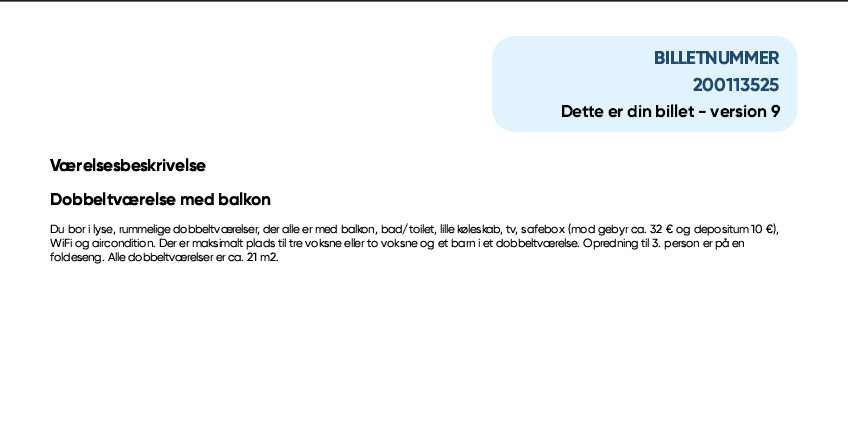
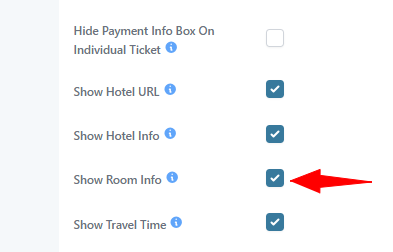
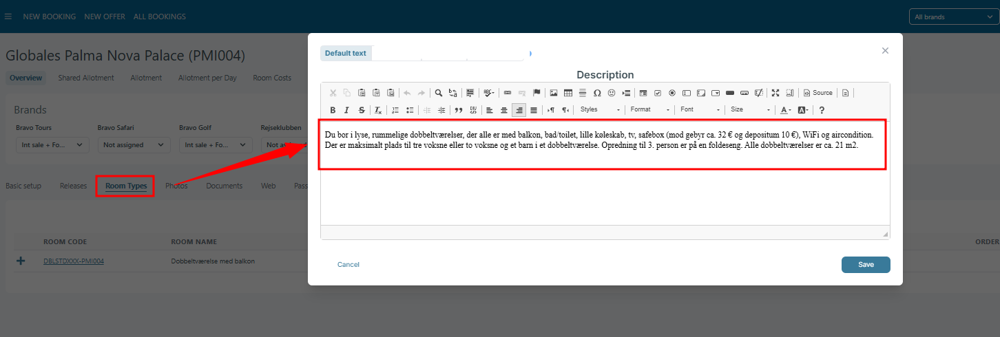

# Ticket V3 - Structure

### Overview

The E-ticket is a multi-page document that contains all booking-related information: flights, passengers, accommodation, pricing, and hotel details.


Each page has a specific role and the header (ticket number + version) is repeated on every page for traceability.


***

## Page 1 – Booking Overview & Flight Information

<figure><figcaption></figcaption></figure>

### Booking Header

Contains core booking details:

* Ticket number
* Ticket version
* Login credentials for “My Page” (username + password)
* Booking owner (customer name)
* Email and phone
* Booking date
* Last update date
* Travel consultant


Login credentials allow the customer to access their booking and manage payments or details.


***

### Flight Information

Displays all flight segments:

* Departure date and time
* Departure airport
* Arrival airport
* Arrival time
* Flight duration
* Flight number
* Airline

Includes:

* Outbound flights
* Return flights
* Possible multiple departure airports

***

### GDS Additional Text

Enhanced usage:

* Displays dynamic content from GDS configuration
* Can include:
  * Airline-specific instructions
  * Operational messages
* Free text field
* Used for:
  * Dynamic flights
  * System messages


This field is especially important for dynamic/GDS bookings where extra flight-related information may be required.


***

### Passengers (Partial List)

Displays first passengers:

* First name
* Last name
* Date of birth / age


If the number of passengers exceeds the page limit, the list continues on the next page.


***

## Page 2 – Passenger List (Continuation)

<figure><figcaption></figcaption></figure>

### Passenger List

Continuation of all travelers:

* First name
* Last name
* Date of birth / age


This page only appears when there are more passengers than can fit on Page 1.


***

## Page 3 – Accommodation & Payment

<figure><figcaption></figcaption></figure>

### Accommodation

* Hotel name
* Destination (region/city)
* Room type
* Board type (e.g. without meals)
* Number of nights
* Check-in date
* Check-out date

***

### Payment Information

#### Card Payment

* Instructions to log into “My Page”

#### Bank Transfer

* FI payment code

***

### Financial Summary

* Deposit amount + due date
* Paid amount
* Remaining balance + due date
* Total price


Missing payment deadlines may impact the validity of the booking.


***

## Page 4 – Price Specification (Passengers 1–3)

<figure><figcaption></figcaption></figure>

### Price Breakdown per Passenger

For each traveler:

* Passenger name
* Base price (e.g. adult price)
* Departure airport - Applies when multiple departure airports are used in the same booking.
* Selected options:
  * Travel insurance
  * Cancellation insurance
  * Baggage
  * Board type
  * Extra Bed Discount
  * Discounts & Supplements
  * Seatlay

***

### Total per Passenger

* Total price per traveler


Only selected services are displayed. If extras (e.g. transfer or checked baggage) are not purchased, they will not appear.


***

## Page 5 – Price Specification (Summary & Remaining Passengers)

<figure><figcaption></figcaption></figure>

### Included in Base Price

Aggregated services:

* Flights (all segments)
* Accommodation
* Board
* Baggage

***

### Remaining Passenger Pricing

Same structure as previous page:

* Base price
* Add-ons
* Discounts (e.g. extra bed)
* Total price

***

## Page 6 – Hotel Information (Part 1)

<figure><figcaption></figcaption></figure>

### Hotel Details

* Hotel name
* Address
* Country
* Phone number

***

### Description

* General presentation
* Location overview
* Nearby attractions
* Experience highlights

***

### Facilities

Examples include:

* Air conditioning
* Pools (indoor/outdoor/children)
* Restaurant / bar
* WiFi
* Fitness / tennis
* Elevator
* Reception

***

### Distances

* Airport
* Beach
* City center
* Bus stop
* Shops


Distances help customers understand accessibility and location convenience.


***

## Page 7 – Hotel Information (Part 2)

<figure><figcaption></figcaption></figure>

### Board Options

* Available upgrades:
  * Breakfast
  * Half board
* Description of meal services (buffet / restaurant)

***

### Additional Services

* Access to facilities in nearby/sister hotels
* Extra amenities (may require payment)

***

### Practical Information

* WiFi availability
* Late check-out options
* Luggage storage
* Shower facilities

***

### Suitability Notes

* Family friendliness
* Accessibility limitations


Some hotels may not be suitable for guests with reduced mobility.


***

## Room Description

<figure><figcaption></figcaption></figure>

### Overview

The e-ticket can display room descriptions for booked accommodation when the **Show room info** option is enabled for the brand.

This functionality allows guests to see additional details about their booked room types directly on the ticket.

The feature is supported for all ticket versions:

* Ticket Version 1
* Ticket Version 2
* Ticket Version 3

***

### Functionality

When **Show room info** is enabled from the Brand:&#x20;

<figure><figcaption></figcaption></figure>

* The system checks the booked room types included in the booking
* For each used room type, the system retrieves the room description from:
  * **Hotel → Room Types**
  *   The description available behind the **PLUS (+)** icon next to the Room Code/Description&#x20;

      <figure><figcaption></figcaption></figure>
* If a **Brand Description** exists, it is used
* If no Brand Description exists, the system uses the **Default Description**

Only room types that are actually used in the booking are included on the ticket.

***

### Ticket Display Rules

For every room that has a room description:

* Display the **Room Name** in bold
* Add the room description on the next line

Example:

**Double Room with Balcony**\
Spacious double room with private balcony, sea view, air conditioning, and minibar.

***

### Important Rules

### Room Without Description

If a room type does not contain a room description:

* Nothing is added to the ticket for that room
* No empty section or placeholder is displayed

This supports the current situation where many hotels still do not have room descriptions configured.

***

### Description Priority

The system uses descriptions in the following order:

1. Brand Description
2. Default Description

If no description exists at all, the room is skipped.

## Seating & Room Allocation (TILVALG)

<figure><figcaption></figcaption></figure>

### Display Conditions

The page is displayed only if:

* Seating is selected as Extra Category
* OR room number is selected in booking

***

### Table Structure

#### Columns

| Field             | Header             |
| ----------------- | ------------------ |
| Pax number        | —                  |
| First name        | Fornavn            |
| Outbound seating  | Sæde ved udrejse   |
| Homebound seating | Sæde ved hjemrejse |
| Room number       | Valg af værelse    |

***

### Behavior

* Seating:
  * Show number if selected
  * Otherwise: ❌
* Room number:
  * Only displayed for passenger 1

***

### Static Text

```
Der vil kun stå et nummer ud for dit navn, hvis du har valgt et specifikt sæde...
```

***

## Key Notes


* Header is repeated on every page
* Passenger and pricing sections are dynamically split across pages
* Hotel information is divided due to content length
* GDS text supports dynamic flight scenarios

