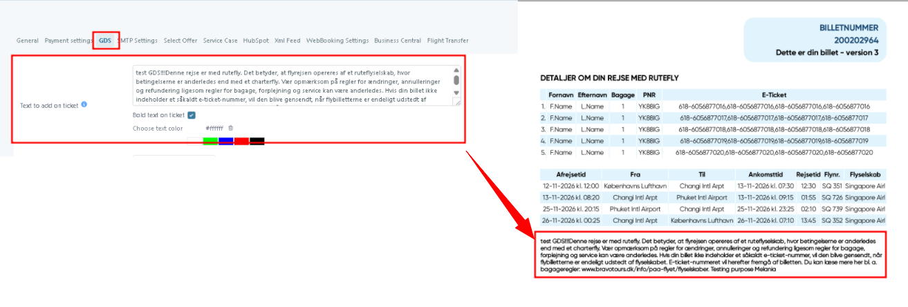
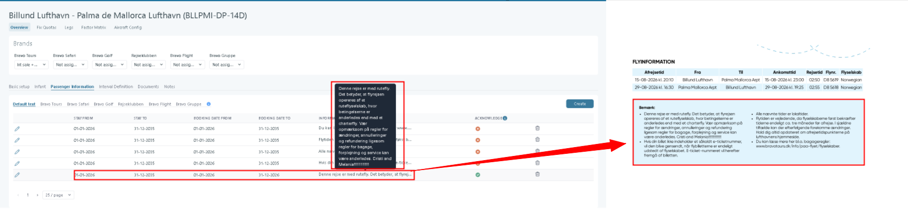
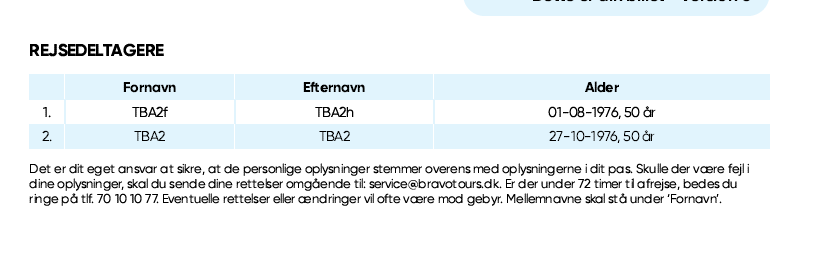
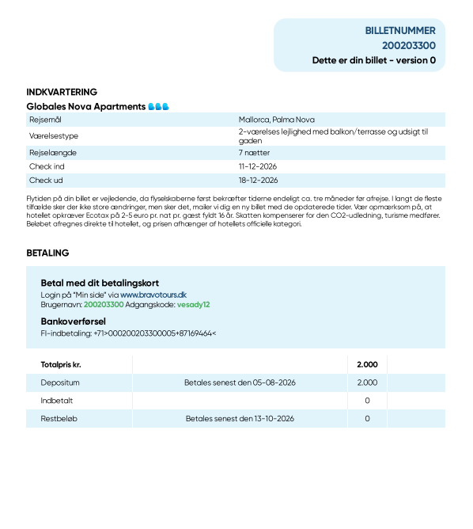
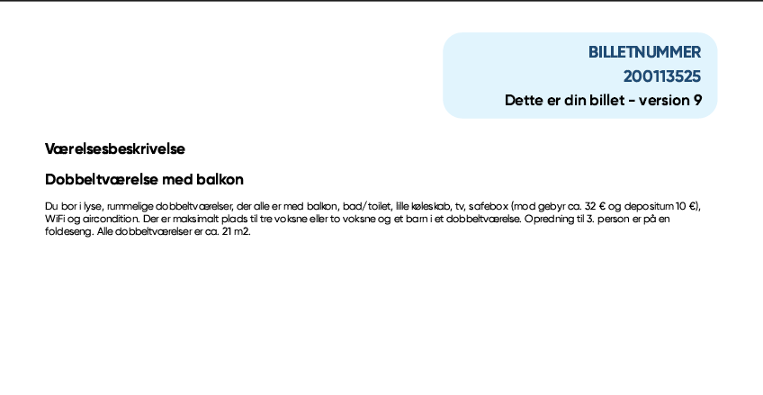
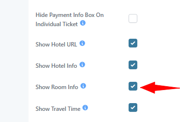
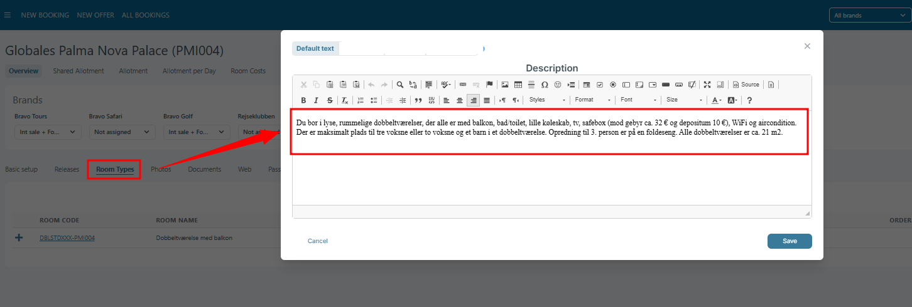

# Ticket V3 - Structure

### Overview

The E-ticket is a multi-page document that contains all booking-related information: flights, passengers, accommodation, pricing, and hotel details.


Each page has a specific role and the header (ticket number + version) is repeated on every page for traceability.


***

## Booking Overview & Flight Information Section

<div data-with-frame="true"><figure><figcaption></figcaption></figure></div>

### Booking Header

Contains core booking details:

* Ticket number
* Ticket version
* Login credentials for “My Page” (username + password)
* Booking owner (customer name)
* Email and phone
* Booking date
* Last update date
* Travel consultant


Login credentials allow the customer to access their booking and manage payments or details.


***

### Flight Information

Displays all flight segments:

* Departure date and time
* Departure airport
* Arrival airport
* Arrival time
* Flight duration
* Flight number
* Airline

Includes:

* Outbound flights
* Return flights
* Possible multiple departure airports

***

### GDS Additional Text

Enhanced usage:

* Displays dynamic content from GDS configuration
* Can include:
  * Airline-specific instructions
  * Operational messages
* Free text field
* Used for:
  * Dynamic flights
  * System messages


This field is especially important for dynamic/GDS bookings where extra flight-related information may be required.


For bookings with GDS transport, the GDS text configured under **User > Brands > GDS** is displayed only on the dedicated **GDS** page of the e-ticket.

<div data-with-frame="true"><figure><figcaption></figcaption></figure></div>

***

### Passengers (Partial List)

Displays first passengers:

* First name
* Last name
* Date of birth / age


If the number of passengers exceeds the page limit, the list continues on the next page.


***

## Passenger List (Continuation)

<div data-with-frame="true"><figure><figcaption></figcaption></figure></div>

### Passenger List

Continuation of all travelers:

* First name
* Last name
* Date of birth / age

Passenger information is displayed in the blue information box on the e-ticket.

<div data-with-frame="true"><figure><figcaption></figcaption></figure></div>

The layout automatically:

* Uses consistent spacing between bullet points.
* Removes unnecessary blank lines when passenger information is added, updated, or removed.
* Maintains a consistent appearance across all system transport types.

### REJSEDELTAGERE

The **REJSEDELTAGERE** section automatically adapts to page breaks to ensure the content remains readable.

<div data-with-frame="true"><figure><figcaption></figcaption></figure></div>

When the participant table continues onto a new page:

* The **REJSEDELTAGERE** heading is displayed together with the start of the table and is never separated from it.
* The participant table is split correctly across pages without rows being cut off.
* The standard text displayed below the participant list is positioned correctly above the page number when a page break occurs.


This page only appears when there are more passengers than can fit on Page 1.


#### Cancelled Passengers

Passenger details remain visible in the **REJSEDELTAGERE** section even when the booking is fully cancelled.

For cancelled passengers:

* Passenger details remain displayed.
* The status text after the passenger's first name is displayed as **Annulleret** instead of **ANNULLERET**.

***

## Accommodation & Payment Section

<div data-with-frame="true"><figure><figcaption></figcaption></figure></div>

### Accommodation

* Hotel name
* Destination (region/city)
* Room type
* Board type (e.g. without meals)
* Number of nights
* Check-in date
* Check-out date

***

### Payment Information

The **BETALING** element is always displayed, including when the booking is fully cancelled.

**Card Payment**

* Instructions to log into “My Page”

**Bank Transfer**

* FI payment code

***

#### Financial Summary

Payment lines are displayed in the following order:

1. **Totalpris kr.**
2. Depositum
3. Indbetalt
4. Restbeløb
5. Tilbagebetaling kr. (only when applicable)

**Totalpris kr.**

* **Totalpris kr.** is displayed as the first payment line.
* If the booking is fully paid, a green tick is displayed next to **Totalpris kr.**.

**Depositum**

* If the deposit is fully paid:
  * The payment due date text is removed.
  * A green tick is displayed.
  * The text is not displayed with strikethrough.
* If the deposit is not fully paid:
  * The payment due date remains displayed.
  * If the payment due date is overdue, a red cross in a circle is displayed after the remaining deposit amount.

**Indbetalt**

* The amount always reflects the total amount paid for the booking.

**Restbeløb**

* The amount always reflects the total unpaid amount, including any remaining deposit and/or remaining rest payment.
* If the rest payment is fully paid:
  * The payment due date text is removed.
  * The text is not displayed with strikethrough.
  * No green tick is displayed.
* If the rest payment is not fully paid:
  * The payment due date remains displayed.
  * If the payment due date is overdue, a red cross in a circle is displayed after the remaining amount.

**Tilbagebetaling**

If the booking contains an overpayment, an additional payment line is displayed after **Restbeløb**.

* The amount is taken from the booking economic tab **Sum - Rest**.
* The line is displayed only when the booking contains an overpayment of the full amount.
* The line is displayed for both active and cancelled bookings.


Payment due dates and payment status indicators are dynamically displayed based on the current payment status of the booking.


***

## Price Specification (Passengers 1–3) Section

<div data-with-frame="true"><figure><figcaption></figcaption></figure></div>

### Price Breakdown per Passenger

For each traveler:

* Passenger name
* Base price (e.g. adult price)
* Departure airport - Applies when multiple departure airports are used in the same booking.
* Selected options:
  * Travel insurance
  * Cancellation insurance
  * Baggage
  * Board type
  * Extra Bed Discount
  * Discounts & Supplements
  * Seatlay

#### Travel Insurance

When travel insurance is booked:

* The **Rejseforsikring** line uses the brand-specific name configured for the travel insurance instead of the generic **Rejseforsikring** wording.
* The price of the travel insurance is displayed in the right-hand price column.

***

### Total per Passenger

* Total price per traveler


Only selected services are displayed. If extras (e.g. transfer or checked baggage) are not purchased, they will not appear.


### Cancelled Passenger Pricing

When a passenger is cancelled:

* The amount for **Grundpris** is replaced with a red cross.
* If the passenger has purchased cancellation insurance, the cancellation insurance remains displayed with its price.
* The cancellation insurance must not be replaced with **Ønsker ikke** when it was purchased.

If a cancellation fee exists, an additional line is displayed before **Total kr.**:

**Annulleringsgebyr kr**

* The amount is taken from the passenger grid **CLL. FEE**.
* The line is displayed only when the cancellation fee is greater than 0.
* If **CLL. FEE** is 0, the **Annulleringsgebyr kr** line is not displayed.

***

## Price Specification (Summary & Remaining Passengers) Section

<div data-with-frame="true"><figure><figcaption></figcaption></figure></div>

### Included in Base Price

Aggregated services:

* Flights (all segments)
* Accommodation
* Board
* Baggage

The flight description uses the wording:

**X x Flyrejse inkl. håndbagage tur/retur**

***

### Remaining Passenger Pricing

Same structure as previous page:

* Base price
* Add-ons
* Discounts (e.g. extra bed)
* Total price

***

## Hotel Information Section (Part 1)

<div data-with-frame="true"><figure><figcaption></figcaption></figure></div>

### Hotel Details

* Hotel name
* Address
* Country
* Phone number

***

### Description

* General presentation
* Location overview
* Nearby attractions
* Experience highlights

***

### Facilities

Examples include:

* Air conditioning
* Pools (indoor/outdoor/children)
* Restaurant / bar
* WiFi
* Fitness / tennis
* Elevator
* Reception

***

### Distances

* Airport
* Beach
* City center
* Bus stop
* Shops


Distances help customers understand accessibility and location convenience.


***

## Hotel Information Section (Part 2)

<div data-with-frame="true"><figure><figcaption></figcaption></figure></div>

### Board Options

* Available upgrades:
  * Breakfast
  * Half board
* Description of meal services (buffet/restaurant)

***

### Additional Services

* Access to facilities in nearby/sister hotels
* Extra amenities (may require payment)

***

### Practical Information

* WiFi availability
* Late check-out options
* Luggage storage
* Shower facilities

***

## Room Description Section

<div data-with-frame="true"><figure><figcaption></figcaption></figure></div>

### Overview

The e-ticket can display room descriptions for booked accommodation when the **Show room info** option is enabled for the brand.

This functionality allows guests to see additional details about their booked room types directly on the ticket.

The feature is supported for all ticket versions:

* Ticket Version 1
* Ticket Version 2
* Ticket Version 3

***

### Functionality

When **Show room info** is enabled from the Brand:

<div data-with-frame="true"><figure><figcaption></figcaption></figure></div>

* The system checks the booked room types included in the booking
*   For each used room type, the system retrieves the room description from:

    * **Hotel → Room Types**
    * The description available behind the **PLUS (+)** icon next to the Room Code/Description


    <div data-with-frame="true"><figure><figcaption></figcaption></figure></div>
* If a **Brand Description** exists, it is used
* If no Brand Description exists, the system uses the **Default Description**

Only room types that are actually used in the booking are included on the ticket.

***

### Ticket Display Rules

For every room that has a room description:

* Display the **Room Name** in bold
* Add the room description on the next line

Example:

**Double Room with Balcony**\
Spacious double room with private balcony, sea view, air conditioning, and minibar.

***

### Important Rules

### Room Without Description

If a room type does not contain a room description:

* Nothing is added to the ticket for that room
* No empty section or placeholder is displayed

This supports the current situation where many hotels still do not have room descriptions configured.

***

### Description Priority

The system uses descriptions in the following order:

1. Brand Description
2. Default Description

If no description exists at all, the room is skipped.

## Seating & Room Allocation Section (TILVALG)

<div data-with-frame="true"><figure><figcaption></figcaption></figure></div>

### Display Conditions

The page is displayed only if:

* Seating is selected as Extra Category
* OR room number is selected in booking

***

### Table Structure

#### Columns

| Field             | Header             |
| ----------------- | ------------------ |
| Pax number        | —                  |
| First name        | Fornavn            |
| Outbound seating  | Sæde ved udrejse   |
| Homebound seating | Sæde ved hjemrejse |
| Room number       | Valg af værelse    |

***

### Behavior

* Seating:
  * Show number if selected
  * Otherwise: ❌
* Room number:
  * Only displayed for passenger 1

***

### Static Text

```
Der vil kun stå et nummer ud for dit navn, hvis du har valgt et specifikt sæde...
```

***

### Golf Voucher

The Golf Voucher contains information about golf players and their tee times.

#### GOLFSPILLERE

The **GOLFSPILLERE** table displays the following information:

| Field    | Description     |
| -------- | --------------- |
| Navn     | Player name     |
| Handicap | Player handicap |
| Klub     | Player club     |

#### GOLF

The **GOLF** section displays tee-time information in separate tables according to the tee-time status.

The following columns are displayed:

| Column            | Description             |
| ----------------- | ----------------------- |
| Bekræftet teetime | Confirmed date and time |
| Spiller           | Player name             |
| Golfbane          | Golf course             |
| Ønsket teetime    | Requested date and time |

#### Tee-Time Formatting

Both **Bekræftet teetime** and **Ønsket teetime** use the same date and time format:

* Date: **DD-MM-YYYY**
* Time: **HH.MM**

Example:

**01-03-2026 09.13**

#### Confirmed Tee Time

When a tee time has been confirmed:

* The confirmed date is displayed under **Bekræftet teetime**.
* The confirmed time is displayed using the **HH.MM** format.
* The requested tee time remains displayed under **Ønsket teetime**.

#### Pending Confirmation

When a tee time has not yet been confirmed:

* **Bekræftet teetime** displays **Afventer bekræftelse**.
* The requested date and time remain displayed under **Ønsket teetime**.

#### Column Alignment

* **Spiller** is left-aligned within the column.
* **Golfbane** is left-aligned within the column.

#### Price Display

The Golf Voucher does not display a price column.

The voucher only displays the golf player and tee-time information relevant to the golf booking.

#### Additional Information

The Golf Voucher may display an explanatory text below the tee-time tables informing the customer that requested tee times are subject to confirmation by the golf course.

## Key Notes


* Header is repeated on every page
* Passenger and pricing sections are dynamically split across pages
* Hotel information is divided due to content length
* GDS text supports dynamic flight scenarios
* Payment information is displayed according to the current payment status
* Cancelled passenger details remain visible on the e-ticket
* Cancellation fees are displayed only when a cancellation fee exists
* Golf Voucher pricing and date/time formatting follow the current Version 3 display rules

