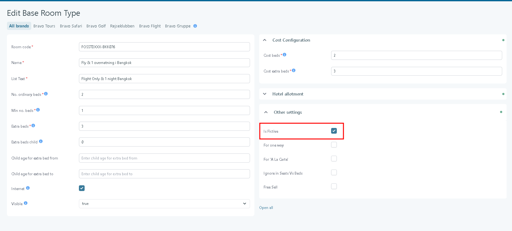
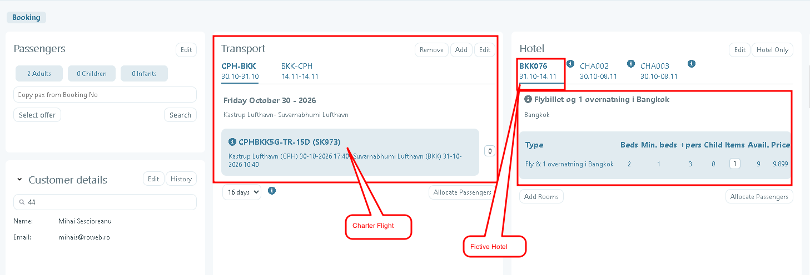

# Hide Fictive Rooms on Ticket v3

### Overview

Ticket v3 can now automatically hide hotels and rooms that are configured as **Fictive**. This makes it possible to combine charter flights with custom hotel days without displaying placeholder accommodation information on the customer's ticket.

When the **Is Fictive** option is enabled for the **Base Room Type**, the associated hotel and room information is excluded from Ticket v3.

### Purpose

This feature ensures that fictive accommodation, which is used only for operational purposes, is not visible to customers on their travel documents.

Typical use cases include:

* Combining charter flights with custom hotel days.
* Using placeholder hotels or rooms that should not appear on the final ticket.

### Configuration

1. Open the required **Base Room Type**.
2.  Enable the **Is Fictive** option.&#x20;

    <figure><figcaption></figcaption></figure>
3. Save the changes.

No additional configuration is required in Ticket v3.

### How it works

When **Is Fictive = true** for the Base Room Type used by a booking, Ticket v3 automatically hides all accommodation-related information for that hotel.

The following changes are applied:

* The hotel is removed from the **Accommodation (Indkvartering)** section.
* The room is removed from the **Included in the Base Price (Grundprisen inkluderer)** section.
* The entire hotel page is omitted, including:
  * Hotel images
  * Hotel description
  * Facilities
  * Any other hotel-related content

All other booking information remains unchanged.

### Example

A booking contains:

* Charter flights
* A fictive hotel used to represent custom hotel days

<figure><figcaption></figcaption></figure>

Since the Base Room Type is configured with **Is Fictive = true**, the generated Ticket v3:

* Does not display the hotel in the **Accommodation** **(Indkvartering)** section.
* Does not list the room under **Included in the Base Price (Grundprisen inkluderer)**.
* Does not include the hotel information page.

The customer receives a ticket containing only the relevant travel information, without any placeholder accommodation details.
