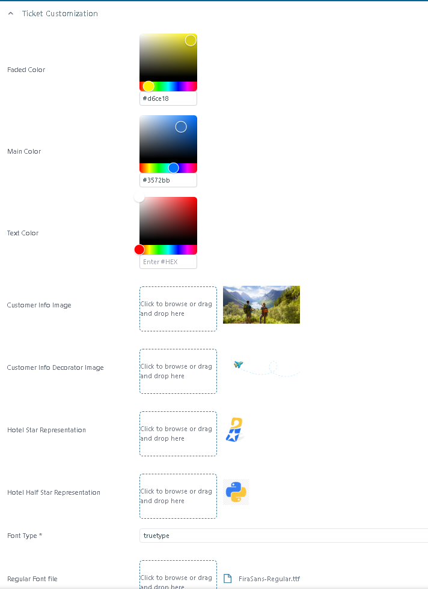

# Ticket V3 - Ticket Customization

## Overview

Ticket Customization is available only when the user selects **Ticket Version 3**.\
For other ticket versions, this section is not displayed and no visual customization can be applied.

This functionality allows configuration of the visual identity of the generated ticket. The settings defined here control colors, images, icons and typography used in the final ticket output. All changes apply to newly generated tickets after saving the configuration.

## Purpose

The purpose of Ticket Customization is to:

* Align the ticket design with the customer’s branding guidelines
* Provide flexibility for different client templates

Improper configuration may lead to unreadable tickets or inconsistent brand presentation. Always validate changes in a test booking before deploying to production.

## Field-by-Field Explanation

<figure><figcaption></figcaption></figure>

### **1. Faded Color**

Secondary gradient color used in the ticket background. It works together with the Main Color to create the gradient effect in Version 3.\
Used for visual depth and background transitions. It usually represents a lighter tone of the primary brand color.

<figure><figcaption></figcaption></figure>

### 2. Main Color

Primary brand color used in headers, highlight areas, buttons and key visual sections of the ticket. Defines the dominant visual identity of the ticket.

<figure><figcaption></figcaption></figure>

Important: The Main Color directly impacts visibility of headings and structural blocks.

### 3. Text Color

Brand-specific text color used for selected words displayed on the Version 3 ticket.

The **Text Color** field is displayed directly below **Main Color** in the Ticket Customization settings.

When a color is selected, it is applied to the following words on the ticket:

* **Brugernavn**
* **Adgangskode**
* **Annulleret**

The selected color allows the brand to apply a specific text color to these elements without changing the **Main Color** used for the rest of the ticket.

<figure><figcaption></figcaption></figure>


The Text Color setting applies only to the supported words: **Brugernavn**, **Adgangskode**, and **Annulleret**.


### 4. Customer Info Image

Main decorative image displayed in the Customer Information section of the ticket.

<figure><figcaption></figcaption></figure>

**Instructions**

1. Click “Click to browse or drag and drop here”.
2. Upload a high-resolution image.
3. Recommended format: PNG or JPG.
4. Recommended orientation: landscape.
5. Avoid text-heavy images, as text may overlap.

Best practice: Use compressed images optimized for PDF output to avoid large file size.

### 5. Customer Info Decorator Image

Small decorative graphical element displayed near the Customer Information section. Enhances visual appearance without affecting core content.

<figure><figcaption></figcaption></figure>

**Instructions**

1. Upload a transparent PNG for best results.
2. Keep the design minimal.
3. Avoid large images that dominate layout.

Typical usage: lines, abstract shapes, light branding accents.

### 6. Hotel Star Representation

Icon used to represent full hotel star classification. Defines how hotel rating stars appear visually on the ticket.

<figure><figcaption></figcaption></figure>

**Instructions**

1. Upload the icon that represents one full star.
2. Prefer SVG or high-quality PNG with transparent background.
3. Maintain small dimensions to ensure clean repetition.

Note: The system repeats this icon based on the hotel’s star rating.

### 7. Hotel Half Star Representation

Icon used when hotel rating includes a half star (e.g. 3.5 stars). Ensures accurate graphical representation of non-integer ratings.

<figure><figcaption></figcaption></figure>

**Instructions**

1. Upload a half-star version consistent with the full star design.
2. Ensure visual alignment with the full star icon.
3. Use transparent background.

Consistency between full and half star icons is mandatory.

### 8. Font Type

Defines the font file format used in the ticket.

**Available Option:**

* opentype
* truetype
* woff
* woff 2

Controls typography rendering in the generated document.

<figure><figcaption></figcaption></figure>

**Instructions**

1. Select the correct font format from dropdown.
2. Ensure uploaded font files match the selected format.
3. Confirm licensing rights before using commercial fonts.

### 9. Regular Font File

Font file used for standard text (paragraphs, passenger names, descriptions).\
Defines readability and base typography of the ticket.

<figure><figcaption></figcaption></figure>

**Instructions**

1. Upload the regular font file
2. Ensure file format matches selected Font Type.
3. Test special characters and multilingual support.

Important: If the font lacks character support, some languages may render incorrectly.

### 10. Bold Font File

Font file used for headings and emphasized text.

<figure><figcaption></figcaption></figure>

**Instructions**

1. Upload the bold version of the same font family
2. Ensure font family consistency with the Regular font.
3. Avoid mixing different font families unless approved by design guidelines.

## Validation Procedure (Mandatory)

After making any changes:

1. Save configuration.
2. Generate a test booking.
3. Export the ticket.
4. Validate:
   * Color contrast
   * Main Color and Text Color
   * Text Color applied to **Brugernavn**
   * Text Color applied to **Adgangskode**
   * Text Color applied to **Annulleret**
   * Image scaling
   * Star alignment
   * Font rendering
   * File size
5. Confirm no layout breaks occur.

Never deploy branding changes directly in production without validation.

## Operational Notes

* Ticket Customization is exclusive to Version 3.
* Changes do not retroactively modify already generated tickets.
* High-resolution images increase PDF size and processing time.
* Text Color is displayed below Main Color in Ticket Customization.
* Text Color applies to Brugernavn, Adgangskode and Annulleret.
