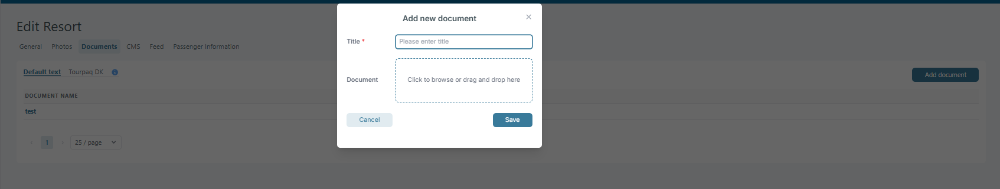

# Hubspot

### **Overview**

The **HubSpot** section under _Brands Settings_ is used to connect Tourpaq with a company’s HubSpot account.\
This integration allows automatic synchronization of customer and booking data between the Tourpaq system and HubSpot CRM for marketing, reporting, or customer management purposes.

***

### **Purpose**

The purpose of this page is to:

* Establish the link between Tourpaq and HubSpot using an **API License Key**.
* Manage HubSpot **subscriptions** related to specific data sync processes (e.g., contact updates, booking imports, or campaign tracking).

A correct setup ensures that all customer information from Tourpaq is accessible and updated in HubSpot without manual export/import work.

***

### **Instructions**

#### **Access**

1. Navigate to **Users → Brands → Select an agency -> HubSpot**.
2. The HubSpot tab appears next to other configuration areas (e.g., _GDS, XML Feed, Business Central_).

***

#### **Fields Description**

<figure><figcaption></figcaption></figure>

| **Field**         | **Description**                                                                                                                                                                                                                                                                                                                              |
| ----------------- | -------------------------------------------------------------------------------------------------------------------------------------------------------------------------------------------------------------------------------------------------------------------------------------------------------------------------------------------- |
| **License Key**   | 
Enter the API key provided by HubSpot. This key authorizes Tourpaq to send and receive data securely. 🔹 <em>Format</em>: A long alphanumeric string (e.g., <code>f9d3e4b2-xxxx-xxxx-xxxx-9c14c62e1a10</code>). 🔹 <em>Required</em>: Yes — the integration won’t work without it.
                                              |
| **Subscriptions** | 
HubSpot subscription name splitted by ; where the customer will be added.                             Enter the specific HubSpot subscription(s) used for synchronization. These define which events or data sets will be synced (for example: <em>Customer Creation</em>, <em>Booking Update</em>, or <em>Lead Conversion</em>). 
 |
|                   |                                                                                                                                                                                                                                                                                                                                              |

***

#### **How to Set Up**

First, we make a request to HubSpot to retrieve all eligible subscriptions for a given email address:

`https://api.hubapi.com/communication-preferences/v3/status/email/tcaspilot@gmail.com`\
Response JSON: _"hubspot all Subscription by email.txt"_



Next, the system checks if any subscriptions listed under the **HubSpot** tab in Brand match the subscriptions returned by HubSpot.

If a match is found, the system verifies whether the customer should be subscribed, and if so, it makes the following request:

`https://api.hubapi.com/communication-preferences/v3/subscribe`\
Request body: _"hubspot subscribe customer.txt"_



Once connected, data synchronization will occur automatically according to the system’s scheduled sync jobs or configured triggers.

***

### **Tips**

* Keep your **License Key** private — it grants full API access to your HubSpot account.
* If you encounter sync issues, verify that the key has not expired or been revoked in HubSpot.
