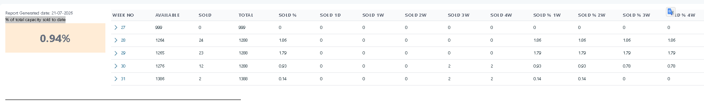
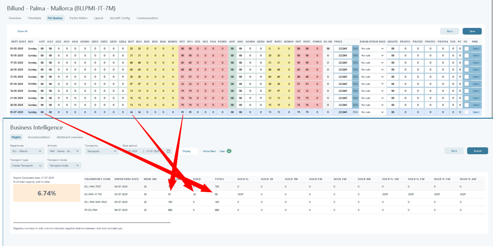

# Business Intelligence – Flights

### **Overview**

The _Business Intelligence – Flights_ report shows flight capacity and sales by week for a travel period.\
Use it to track sold seats, remaining capacity, and sales pace over time.\
This helps you spot slow-selling routes early and react faster.

You can filter by **departure**, **arrival**, **transport**, and **date period**.\
Results show how much of the total capacity is sold per week.

***

### **Purpose**

The purpose of this page is to:

* Offer insights into flight seat utilization and sales dynamics.
* Track weekly sales performance versus total flight capacity.
* Identify underperforming or oversold flights.
* Support data-driven decisions for capacity adjustments, pricing, or marketing strategies.

***

### **Preconditions**

Before using the _Flights_ Business Intelligence report, make sure:

1. [Departure stat weeks](../setup/departure-stat-weeks.md) are defined for the selected year(s).\
   They are required to aggregate and display weekly sales data correctly.
2. The selected **departure and arrival airports** must have valid flight data for the chosen period.
3. The user must have access to the **Business Intelligence** module.


**Tip:** If results don’t match your filters, check **departure stat weeks** first.\
Setup guide: [Departure stat weeks](../setup/departure-stat-weeks.md)


***

### **Field Descriptions and Sections**

<figure><figcaption></figcaption></figure>

**1. Filters (Top Section)**

* **Departures:** Select the departure airport for the flight data to be displayed.\
  Example: `BLL – Billund`.
* **Arrivals:** Choose the destination airport.\
  Example: `CHQ – Chania (Crete)`.
* **Transports:** Select the transport code.\
  Example: `All transports`.
* **Date Period:** Defines the time range of flights being analyzed. Select a start and end date.\
  Example: `01-04-2024 → 01-08-2024`.
* **Display / More Filters / Clear:**
  * **Display:** Refreshes the report with the selected filters.
  * **More filters:** Opens additional filtering options (Transport mode, Transport type).
  * **Clear:** Resets all filters to their default state.

***

**2. Report Summary (Left Panel)**

<figure><figcaption></figcaption></figure>

* **Report Generated Date:** Displays the date on which the report was generated.\
  Example: `21-10-2025`.
  * **% of Total Capacity Sold to Date:** Shows the overall percentage of sold capacity across all listed weeks.\
    Formula:   % of Total Capacity Sold to Date=(P1​+P2​+P3​+⋯+Px)/n                                                         where:                                                                                 \
    **n** = Total number of weeks in the selected period.\
    P1,P2.....Px = Capacity sold percentage for week "x" (stored as a numeric value, e.g. 75 for 75%).\
    Example:\
    n = 5\
    P1 = 0, P2 = 1.86, P3 = 1.79, P4 = 0.93, P5 = 0.14\
    % of total capacity sold to date = (P1+P2+P3+P4+P5)/5 =(0+1.86+1.79+0.93+0.14)/5= 0.94%

&#x20;**3. Weekly Data Table**

| **Column**                           | **Description**                                                                                                                                                                                                                                                                                                                                                                                                                                       |
| ------------------------------------ | ----------------------------------------------------------------------------------------------------------------------------------------------------------------------------------------------------------------------------------------------------------------------------------------------------------------------------------------------------------------------------------------------------------------------------------------------------- |
| **Week No**                          | The calendar week number for the displayed travel period. The arrow (›) allows expanding to view detailed data for that week.                                                                                                                                                                                                                                                                                                                         |
| **Available**                        | 
Number of remaining unsold seats for that week  Formula: Available=SeatsTotal − SeatsSold
                                                                                                                                                                                                                                                                                                                         |
| **Sold**                             | 
Number of sold seats. Negative values can appear if cancellations exceed sold seats in the selected scope. BOT=BO1+BO2+BO3+BO4
                                                                                                                                                                                                                                                                                    |
| **Total**                            | 
The total number of seats available for that week (Available + Sold). AOT=AO1+AO2+AO3+AO4
                                                                                                                                                                                                                                                                                                                         |
| **Sold %**                           | 
Percentage of total seats sold. = (100 × SeatsSold) / SeatsTotal
                                                                                                                                                                                                                                                                                                                                                  |
| **Sold 1D / 1W / 2W / 3W / 4W**      | 
Represents additional seats sold compared to previous days or weeks(1 day, 1 week, 2–4 weeks).  • <strong>Sold 1D</strong> – The number of seats sold on the last day before departure.

• <strong>Sold 1W</strong> – The number of seats sold 1 week before departure.

• <strong>Sold 2W–4W</strong> – The number of seats sold 2 to 4 weeks before departure.

These columns show booking velocity and sales progression.
 |
| **% of total capacity sold to date** | The **average weekly percentage of total capacity sold** over the selected period.                                                                                                                                                                                                                                                                                                                                                                    |


### The Available and Sold seat values represent the number of seats allocated in the transport's fixed quota for the corresponding week.&#x20;


<figure><figcaption></figcaption></figure>

***

### **How to use this report**



**Set your filters**

Pick **Departures**, **Arrivals**, and a **Date Period**.\
Use **More filters** if you need **Transport mode** or **Transport type**.



**Generate results**

Click **Display** to refresh the report.



**Drill down by week**

Use the arrow (›) on a **Week No** row to expand details.


