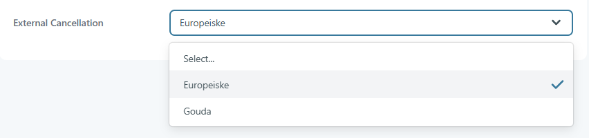

# Cancellation Insurance

Cancellation insurance is the amount a customer pays to be able to receive back a portion of the booking total paid amount in case he is forced to cancel his trip.

There are 4 ways to set the price for the cancellation insurance:

* The first method would take into account the price that a passenger pays for the trip. It should be possible to insert 4 different ranges for the price. For instance: if the passenger’s price will fit in the first range, the cancellation insurance will have a value; if it fits in the second range, it will have another value and so on.
* The second method would take into account the duration of trip. It should also be possible to insert 4 different rages for the duration.
* The third method would set the fee using a given percentage. In this case, the fee will be the percentage of the passenger’s price.
* The forth method would take into account the transport mode.

<figure><figcaption></figcaption></figure>

#### External Cancellation 

There are two main providers:

* Gouda
* Europeiske

<figure><figcaption></figcaption></figure>

**Gouda configuration:**

* Product Code - a code used internally by Tourpaq, displayed in the web booking interface.
* Gouda ID - maps the cancellation insurance provider's product to the Tourpaq system.
* Name - text displayed in the web booking interface.

**Europeiske Configuration:**

* Product Code - a code used internally by Tourpaq, displayed in the web booking interface.
* Europe ID - maps the cancellation insurance provider's product to the Tourpaq system.
* Name - text displayed in the web booking interface.
* Trip type - specifies the type of trip for which the cancellation insurance applies.
