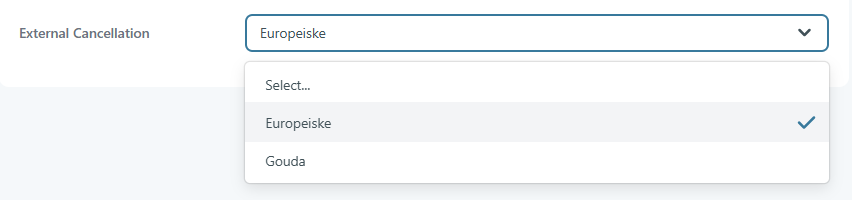

# Cancellation Insurance

#### Overview

**Cancellation Insurance** represents the fee a customer pays to ensure they can recover part of the total booking amount if they are forced to cancel their trip.

The insurance amount can be calculated in several ways, depending on the company’s configuration and business logic.

#### Purpose

This feature allows travel companies to offer financial protection to customers while maintaining flexibility in how the insurance price is determined. It ensures that the cancellation insurance is tailored to factors such as trip cost, duration, or transport type.

#### General Settings

<figure><figcaption></figcaption></figure>

**Brand**\* - Select the brand to which this cancellation insurance rule will apply. Mandatory field.

**Arr. dest**\* - Choose the arrival destination (e.g., Dubai). This is the location where the customer is traveling to. Mandatory field.

**Booking start**\* - Set the start date when the cancellation insurance becomes valid. Only bookings made after this date will be covered.

**Booking to**\* - Set the end date after which the cancellation insurance will no longer apply.

**Type of rule -** Determines how the cancellation insurance is calculated.&#x20;

Options may include:&#x20;

\- **Related to basic price**&#x20;

\- **Related to transport type**&#x20;

\- **Related to length of travel**&#x20;

**- Percentage of basic price**

**Commision -** The commission is the percentage of the price that is used to calculate the cost (what is paid to the insurance company).

If the **commission percentage** is changed after bookings have already been created, the system will:

* Recalculate the cancellation insurance cost
* Update the cost on all existing bookings that use this insurance

This behavior ensures that the insurance cost reflects the correct commission configuration.

**Currency -** Defines the currency used in all related price inputs (e.g., DKK - Danish Krone).

**External Cancellation -** Allows linking to an external cancellation policy or provider (if integrated). - Gouda - Europieske

#### Instructions

There are **four methods** available for setting the price of the cancellation insurance:

1.  **Related to basic price**&#x20;

    <figure><figcaption></figcaption></figure>

    * The insurance fee is determined by the total amount the passenger pays for the trip.
    * Up to **four price ranges** can be defined.
    * Example:
      * If the passenger’s trip price fits within the first range, a specific fee is applied.
      * If it falls into the second range, a different fee is used, and so on.
2.  **Related to lenght of travel**&#x20;

    <figure><figcaption></figcaption></figure>

* The insurance fee is determined by the length of the trip.
* Up to **four duration ranges** can be defined, each with its own insurance fee.

3.  **Based on Percentage of Basic Price**&#x20;

    <figure><figcaption></figcaption></figure>

* The fee is calculated as a **percentage** of the passenger’s total trip price.
* Example: If the percentage is 5% and the trip price is €1000, the insurance fee will be €50.

4. **Related to transport type**&#x20;

<figure><figcaption></figcaption></figure>

* The insurance fee is determined by the **type of transport** selected for the booking (e.g., flight, bus, train).

#### External Cancellation 

The **External Cancellation** setup allows integration with third-party insurance providers, enabling automatic mapping and management of external cancellation insurance products within Tourpaq.

Currently, Tourpaq supports two main providers:

* **Gouda**
* **Europeiske**

<figure><figcaption></figcaption></figure>

**Gouda Configuration**

To configure a Gouda external cancellation insurance:

* **Product Code** – A code used internally by Tourpaq, displayed in the web booking interface.
* **Gouda ID** – Identifies and maps the cancellation insurance product from Gouda to the corresponding entry in Tourpaq.
* **Name** – The name of the product as displayed in the web booking interface.

**Europeiske Configuration**

To configure a Europeiske external cancellation insurance:

* **Product Code** – A code used internally by Tourpaq, displayed in the web booking interface.
* **Europe ID** – Identifies and maps the cancellation insurance product from Europeiske to the Tourpaq system.
* **Name** – The name of the product as displayed in the web booking interface.
* **Trip Type** – Specifies the type of trip (e.g., charter, dynamic package, or scheduled transport) for which the cancellation insurance applies.


In order to be able to track the data sent via the API, there is a log for the data sent to Gouda and Europæiske (travel insurance and cancellation), These logs can be checked in the [Internal Logs](../setup/internal-logs/insurance-payload-log-gouda-and-europaeiske.md) page of Setup

