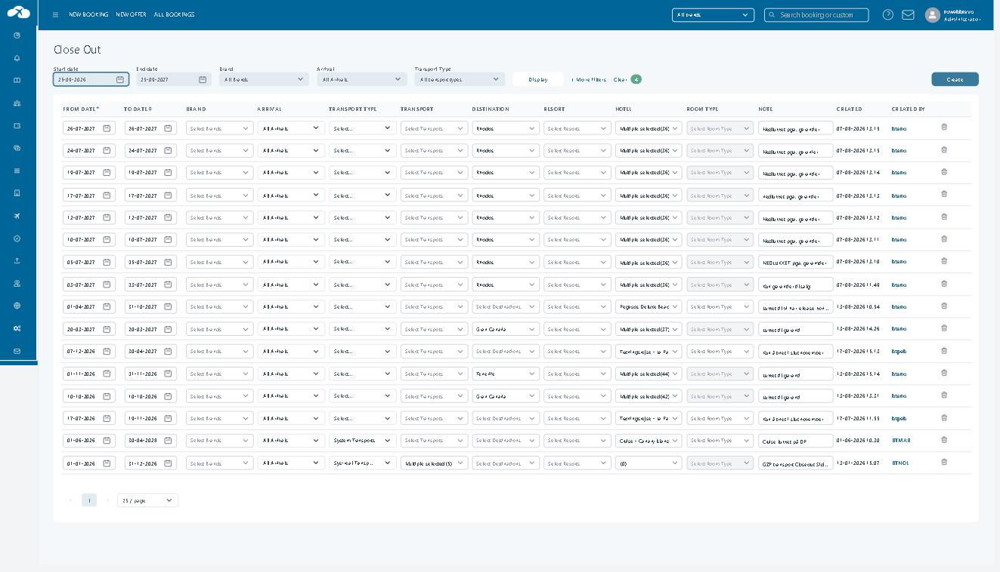

# Close Out

**Applies to:** Tourpaq Office · **Available from:** Tourpaq v15.5 · **Last reviewed:** 2026-09-25

Close Out is the tour operator's own tool for stopping sales during daily office work — for example, while a hotel contract is still being negotiated, or when a charter flight to one airport is full. When the hotel itself asks you to stop selling rooms, use [Stop Sales](../stop-sales.md) instead.

### Overview

A **Close Out** rule blocks new bookings for the hotels and room types it matches, on the arrival dates it covers. Tourpaq does this by setting **Free Hotel Allotment (FHA)** to `0` in the matching price lists.

A rule is always limited by dates, and can be narrowed further by:

* **Brand** — only the selected [brands](../brands/README.md) are closed.
* **Arrival** — only packages arriving at the selected [arrival gateway](../setup/arrival-gateways/README.md) are closed.
* **Transport type**, **Transport**, **Destination**, **Resort**, **Hotel** and **Room Type**.

The **Close Out** screen lists all rules. You filter the list, edit rules directly in the table, and delete rules you no longer need. New rules are created on a separate page — see [Create a Close Out rule](create-edit-rule.md).


A Close Out blocks **arrivals** on the dates in the rule. It does not block bookings that arrive earlier and stay over those dates. A Close Out on Monday `12-10-2026` does not prevent a 14-day booking arriving on `05-10-2026`.


### Purpose

Use the Close Out screen to:

* Stop sales for part of your programme as part of daily operations — one brand, one arrival airport, one destination or a list of hotels.
* Correct a rule after it is created — dates, brands, arrival, transports, destinations, resorts, hotels or note.
* Remove a rule completely when the reason for it is gone, for example when a hotel contract is signed.

### Preconditions

* Your user has access to **Hotel → Close Out** — see [Users](../users/users/README.md).
* The brands, arrival gateways, transports and hotels you want to filter by or close already exist.
* You know whether the stop comes from your own operation (use Close Out) or from the hotel (use [Stop Sales](../stop-sales.md)).

### How-to



**Find a rule**

1. Go to **Hotel → Close Out**.
2. Set **Start date** and **End date**.
3. Optionally select a **Brand**, an **Arrival** or a **Transport Type**.
4. To filter by transport, destination, resort, hotel or room type, click **+ More filters** and click **Edit** above the filter you need.
5. Click **Display**.

To sort the list, click the **FROM DATE** or **TO DATE** column header. Click **Clear** to reset all filters.



**Edit a rule**

1. Change the values directly in the row. All rows are open for editing.
2. To change a note, click the **NOTE** cell. Edit the text in the **Edit Note** window and click **Save** in that window.
3. Click **Save** at the bottom of the screen to store all changes. Click **Cancel** to discard them.

Tourpaq updates the affected price lists for the changed part of the rule only. If you extend a rule by a week, only that extra week is recalculated.



**Delete a rule**

1. Click the bin icon at the end of the row.
2. In **Delete Close Out**, click **Delete** to confirm, or **Cancel** to keep the rule.

When a rule is deleted, Tourpaq recalculates FHA on the affected price lists from the current hotel setup. Any other Close Out rule or stop sale that still covers the same dates stays in force.



The list shows the rules that match your filters. Changes reach the price lists in the background, so allow a few minutes before you check availability.


**Edit** and **Delete** change availability for every price list the rule matches — for a rule on a whole destination this can be many thousands of price lists. Deleting a rule cannot be undone: to restore it, create it again.



**TO VERIFY** — Is a deletion applied as soon as you click **Delete** in the prompt, or only after clicking **Save** at the bottom of the screen?


### Field Reference

<div data-with-frame="true"><figure><figcaption><p>The Close Out list under Hotel → Close Out.</p></figcaption></figure></div>

#### Filters

| Field | Description | Required | Notes |
| --- | --- | --- | --- |
| **Start date** | First date of the period you want to see rules for. | Yes | Defaults to today. |
| **End date** | Last date of the period you want to see rules for. | Yes | Defaults to one year from today. |
| **Brand** | Shows only rules that close sales for the selected brand. | No | Default `All Brands`. Rules that apply to all brands are also shown, because they affect the selected brand too. Brands are listed in the same order as in the brand selector at the top of Tourpaq Office. |
| **Arrival** | Shows only rules that are limited to the selected arrival gateway. | No | Default `All Arrivals`. Rules set to **All Arrivals** are **not** shown when you pick an arrival. Only active arrivals are listed, as `CODE - Name`, in alphabetical order, for example `CHQ - Chania Lufthavn`. |
| **Transport Type** | Shows only rules for the selected type of transport. | No | Default `All transport types`. |
| **+ More filters** | Opens the **Transports**, **Destinations**, **Resorts**, **Hotels** and **Room Type** filters. | No | Click **Edit** above a filter to choose values. Click **- More filters** to hide them again. |
| **Display** | Runs the search with the current filters. | — | |
| **Clear** | Resets all filters to their defaults. | — | |
| **Create** | Opens **New Close Out**. | — | See [Create a Close Out rule](create-edit-rule.md). |

#### Table

| Field | Description | Required | Notes |
| --- | --- | --- | --- |
| **FROM DATE** | First arrival date the rule closes. | Yes | Editable. Sortable. |
| **TO DATE** | Last arrival date the rule closes. | Yes | Editable. Sortable. Must not be before **FROM DATE**. |
| **BRAND** | The brands the rule closes sales for. | No | Editable. Empty (`Select Brands`) means all brands. Hover over the column header to see its tooltip. |
| **ARRIVAL** | The arrival gateway the rule is limited to. | No | Editable. `All Arrivals` means every arrival. Hover over the column header to see its tooltip. |
| **TRANSPORT TYPE** | The type of transport the rule is limited to. | No | Narrows the list in **TRANSPORT**. |
| **TRANSPORT** | The transports the rule is limited to. | No | Editable. |
| **DESTINATION** | The destinations the rule closes. | No | Editable. |
| **RESORT** | The resorts the rule closes. | No | Editable. |
| **HOTEL** | The hotels the rule closes. | No | Editable. You can add and remove hotels in the same edit. |
| **ROOM TYPE** | The room types the rule closes. | No | Only available when the rule has exactly one hotel. |
| **NOTE** | Why the rule exists. | No | Shows the start of the note. Click it to read or edit the full text in **Edit Note**. |
| **CREATED** | Date and time the rule was created. | — | Read-only. |
| **CREATED BY** | User who created the rule. | — | Read-only. The user name links to the user's details. |
| Bin icon | Deletes the rule after confirmation. | — | See the warning under How-to. |
| **Save** / **Cancel** | Store or discard all changes made in the table. | — | At the bottom of the screen, below the pagination. |

The list shows 25 rules per page by default. Change this in the page-size selector next to the page numbers.

The **BRAND** and **ARRIVAL** column headers show these tooltips:

```
BRAND: If one or more brands are selected, the Close Out will only take effect for the selected brands
ARRIVAL: When an arrival is selected, the Close Out will only take effect for the selected Arrival. This is relevant when a Close Out is needed for all arrivals to a single airport.
```


Close Out rules have no **Enabled** setting. A rule is active from the moment it is saved until it is deleted. To stop a rule, delete it.

Rules that were disabled before the **Enabled** setting was removed were deleted when the change was installed. They no longer appear in the list and do not affect sales.



Tourpaq processes each change to a rule as a background job. If you change a rule again while the previous change is still waiting to be processed, Tourpaq shows a warning. Wait a few minutes for the first change to finish, then make the next one.



**TO VERIFY** — What is the exact text of the warning shown when a rule is edited while an earlier change to it is still being processed?


#### Close Out in the price list

In **Price List → Price list**, a line whose room type is blocked by an active Close Out shows a yellow warning icon right after the lightning icon, and **FHA** on the line is `0`. The icon's tooltip reads:

```
The room type has sales blocked due to an active Close Out
```

See [Price List](../price-list/pricelist.md) for the rest of the price list screen.

### Related pages

* [Create a Close Out rule](create-edit-rule.md)
* [Stop Sales](../stop-sales.md)
* [Price List](../price-list/pricelist.md)
* [Brands](../brands/README.md)
* [Arrival Gateways](../setup/arrival-gateways/README.md)
* [Glossary](../integration/glossary.md)
