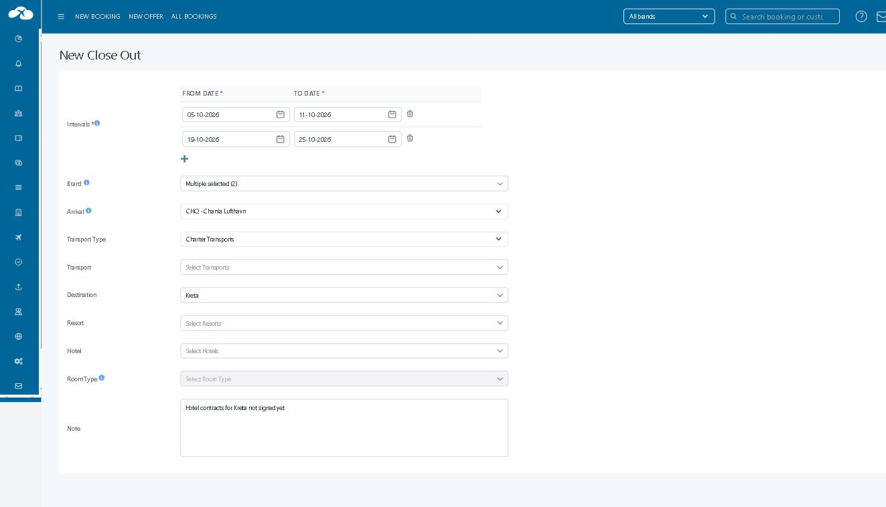

# Create a Close Out rule

**Applies to:** Tourpaq Office · **Available from:** Tourpaq v15.5 · **Last reviewed:** 2026-09-25

### Overview

**New Close Out** is the page where you create a [Close Out](./) rule. One rule can cover several date periods, called **intervals**. The rule takes effect for every interval you add.

The fields on this page are the same as the columns in the Close Out list, in the same order. After you save, you edit or delete the rule from the list.

### Purpose

Use New Close Out to:

* Close sales while a hotel contract is not yet in place — for example, all hotels on Kreta for two weeks in October.
* Close sales for one arrival airport only, for example when the charter flight to `CHQ - Chania Lufthavn` is full.
* Close sales for selected brands only, for example **Bravo Tours** and **Bravo Golf**, while the other brands keep selling.

### Preconditions

* Your user has access to **Hotel → Close Out** — see [Users](../users/users/).
* The [brands](../brands/), [arrival gateways](../setup/arrival-gateways/), transports and hotels you want to close already exist.
* You know the arrival dates to close. A Close Out blocks arrivals on those dates only — bookings that arrive earlier and stay over the dates are not blocked.

### How-to



**Open New Close Out**

Go to **Hotel → Close Out** and click **Create**.



**Add the intervals**

1. Enter **FROM DATE** and **TO DATE** for the first period, for example `05-10-2026` to `11-10-2026`.
2. To add another period, click the plus icon under the intervals and fill in the new row, for example `19-10-2026` to `25-10-2026`.
3. To remove a period, click the bin icon at the end of its row.



**Limit the rule**

1. Select **Brand** to close sales for some brands only. Leave it empty to close all brands.
2. Select **Arrival** to close sales for one arrival gateway only. Leave `All Arrivals` to close every arrival.
3. Select **Transport Type**, **Transport**, **Destination**, **Resort** and **Hotel** as needed.
4. To close specific room types, select exactly one hotel, then select the **Room Type**.



**Describe and save**

1. Enter a **Note** explaining why the rule exists, for example `Hotel contracts for Kreta not signed yet`.
2. Click **Save**. Click **Cancel** to return to the list without creating a rule.



Tourpaq returns to the Close Out list, where the new rule is shown. Sales stop in the matching price lists once the background update has run — allow a few minutes before you check availability.


Saving a rule sets FHA to 0 for every price list the rule matches. A rule on a whole destination can close sales across many thousands of price lists. Start with a narrow scope and widen it only when needed.


The whole page works from the keyboard. Press **Tab** to move between fields.

### Field Reference

<figure><figcaption>
New Close Out with two intervals.
</figcaption></figure>

| Field                                       | Description                                 | Notes                                                                                                                                                |
| ------------------------------------------- | ------------------------------------------- | ---------------------------------------------------------------------------------------------------------------------------------------------------- |
| **Intervals** — **FROM DATE** / **TO DATE** | The arrival periods the rule closes.        | At least one interval is required. Intervals in the same rule must not overlap. Use the plus icon to add an interval and the bin icon to remove one. |
| **Brand**                                   | Limits the rule to the selected brands.     | Opens a **Brands** window with **Select all**. Leave empty to close all brands.                                                                      |
| **Arrival**                                 | Limits the rule to one arrival gateway.     | Default `All Arrivals`. Only active arrivals are listed, as `CODE - Name` in alphabetical order.                                                     |
| **Transport Type**                          | Limits the rule to one type of transport.   | Options: `Charter Transports`, `Dynamic Transports`, `System Transports`, `Sys-real Transports`. Narrows the list in **Transport**.                  |
| **Transport**                               | Limits the rule to the selected transports. | Filtered by **Transport Type**.                                                                                                                      |
| **Destination**                             | The destinations to close.                  | Filtered by the selected transports.                                                                                                                 |
| **Resort**                                  | The resorts to close.                       | Filtered by the selected destinations and transports.                                                                                                |
| **Hotel**                                   | The hotels to close.                        | Filtered by the selected resorts.                                                                                                                    |
| **Room Type**                               | The room types to close.                    | Available only when exactly one hotel is selected.                                                                                                   |
| **Note**                                    | Why the rule exists.                        | Shown in the Close Out list. Write a note you will understand later — it is the only description the rule has.                                       |

The fields with a blue info icon show these tooltips:

Intervals: The Close Out takes effect for every interval added here.
\
Brand: If one or more brands are selected, the Close Out will only take effect for the selected brands
\
Arrival: When an arrival is selected, the Close Out will only take effect for the selected Arrival. This is relevant when a Close Out is needed for all arrivals to a single airport.
\
Room Type: Room types can only be selected for a single hotel.

### Related pages

* [Close Out](./)
* [Stop Sales](../stop-sales.md)
* [Brands](../brands/)
* [Arrival Gateways](../setup/arrival-gateways/)
* [Price List](../price-list/pricelist.md)
