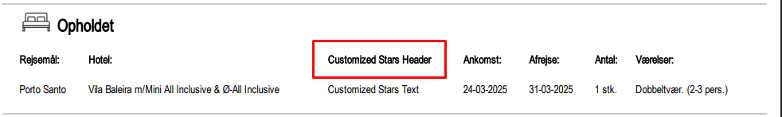

# Company Setup

### **Overview / Purpose**

This section explains how companies, brands, and users are created and configured within Tourpaq. Proper setup ensures smooth booking operations, financial management, and role-based access control. Only Superadministrator users can create new companies, after which administrators and other roles manage brands and users for their company.

***

### **How It Works**

#### **Company Creation**

* **Superadministrator only:** Only a Superadministrator can create a new company. Users who need a new company should contact Tourpaq Support.
* **Manual Setup:**
  * Fill in basic company details: Name, Address, Country, Postcode, IBAN, CVR, Phone, Fax.
  * After the company is created, a **Brand** and an **Admin user** must be created first.
* **Automated Setup:**
  * Minimal company and user info can be entered via API.
  * At least one agency must be created, which automatically creates a WebUser and Windows Service user.
* **Editing Company Info:** Once created, an Administrator can update company details (Name, Address, Country, Postcode, IBAN, CVR, Phone, Fax).

***

## **Manual Setup**

#### **Brand Creation**

Each brand requires specific metadata for proper booking, ticketing, insurance, and web functionality.

**General Tab:**

* Brand Name & Code
* Contact Email
* Booking IDs (Start / End)
* Offer IDs (Start / End)
* Gift Card IDs (Start / End)
* WebBooking link
* Booking restrictions (Cancel/Insurance changes, Stop Web changes)
* Other: Bcc email, Terms & Conditions link, Voucher ID range, Hide included extras prices, Custom text per brand, Currency, Autocomplete passenger names from previous bookings

**Ticket Tab:**

* Brand Name, Country, Postcode, Address, CVR, Phone, Fax, Bank, Creditor number
* IBAN, BIC/Swift, Hide Payment Plan
* Customized Star (replaces default “Stars” header when filled)

**Insurance Tab:**

* Insurance Type, Agent Username, Password, Codes
* Days before/after departure for reporting
* Creditor number

> Note: Insurance information is provided by the insurance company.

*

    <figure><figcaption></figcaption></figure>

#### **User Creation**

Users are assigned roles with permissions tailored to their responsibilities.

**Mandatory Fields:**

* Username, Password, First Name, Last Name
* Seller ID in booking
* User Role

**Optional / Advanced Fields:**

* Status
* Enable Password Validity Days (forces password change after a set number of days)
* Phone & Email (used for 2FA)
* One Time Password feature
* WebUser access (for WebBooking)
* VisitSun user
* Profile picture for Select Offer
* Exclude personal contact data from Select Offer
* Disable 2FA

**Additional Permissions (Role-Dependent):**

* Booking controls: stop sale transport, overbook transport/hotels, override seating rules, add special offers/costs
* Customer & financial data: merge customers, financial exports, view personal data in bookings, show Profit Tab
* System access: login on multiple PCs, set LMS limit, see unpaid bookings, ignore export departure date limit
* Administrative: hide user from lists, view internal logs, unapprove extra order refunds

***

### **Key Features / Functions**

* **Role-Based Access:** Users have permissions according to their roles (Admin, Sales, Financial, etc.)
* **Booking & Web Integration:** Brands and users control booking IDs, WebBooking access, and ticket settings
* **Financial & Insurance Management:** Each brand can manage insurance reporting, creditor numbers, and voucher IDs
* **Security:** Password validity, 2FA, and user visibility settings maintain compliance and security

<figure><figcaption></figcaption></figure>

### **Notes / Best Practices**

* Ensure **ID ranges for bookings, offers, gift cards, and vouchers** do not overlap across brands.
* First brand and admin must be created by a Superadmin; afterward, admins can manage additional brands and users.
* Regularly review user permissions and brand settings to ensure GDPR compliance and operational accuracy.
* Use password validity and 2FA settings to enhance security.
* Update contact details, financial, and insurance info as needed to avoid operational issues.

## Automated Setup 

### **Overview / Purpose**

The Automated Setup feature allows for quick creation of a new company, along with its initial user and agency, through a streamlined API process. This reduces manual entry and ensures that necessary default users (WebUser and Windows Service) are created automatically.

<figure><figcaption></figcaption></figure>

### **How It Works**

1. Navigate to: **USERS → Company → New API**.
2. Fill in the required **Company Information**:
   * **Company Name**
   * **Company Type**
   * **Country**
   * **Currency**
   * **PostCode**
3. Fill in the **User Details** for the first user:
   * **First Name**
   * **Last Name**
   * **User Name**
   * **Email**
   * **Password**
4. Once the company information is completed, at least **one agency** must be created for the company.
5. Provide the **Agency Information**:
   * **Agency Name**
   * **Phone**
   * **Email**
   * **Address**
   * **Theme** (website theme)
6. Specify **Web Setup Options**:
   * **Staging WebBooking & Web** – creates both a webbooking and presentation site
   * **Staging WebBooking** – creates only a webbooking site
7. After saving, the system automatically creates:
   * A **WebUser**
   * A **Windows Service user**

These default users are ready for use and linked to the newly created company.

<figure><figcaption></figcaption></figure>

### **Key Features / Functions**

* Fully automated company, agency, and user creation.
* Automatic creation of essential users (WebUser & Windows Service) without extra steps.
* Supports initial web setup for WebBooking and presentation sites.
* Reduces manual data entry and ensures consistency.

***

### **Examples / Scenarios**

1. **New Travel Agency Setup:**
   * Fill company details: “Torpak DK” type “Tour Operator,” currency “EUR,” country “Denmark.”
   * Add first user: John Doe, username “jdoe,” email “jdoe@tpq.com.”
   * Add agency: “Tourpaq Agency,” phone +45 12345678, theme “Modern.”
   * Select **Staging WebBooking & Web** to set up both sites.
   * Result: WebUser and Windows Service accounts are automatically created.
2. **Only WebBooking Setup:**
   * Follow the same steps but select **Staging WebBooking**.
   * Result: Only WebBooking site is created; the presentation site is not generated.
