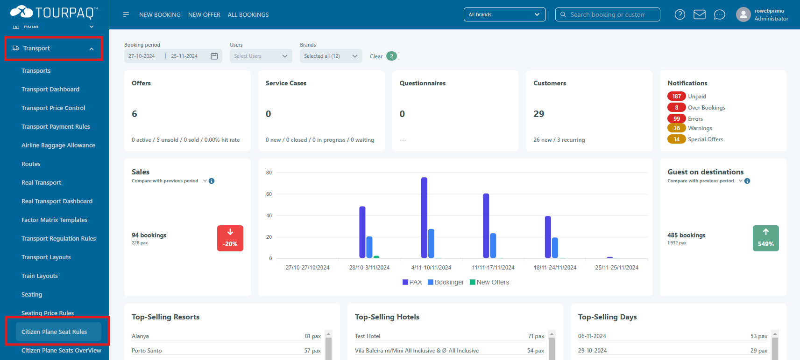
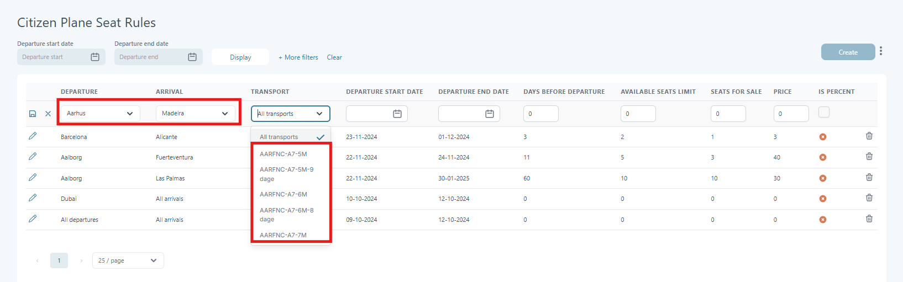

# Create citizen plane rules

The Tourpaq customers have leftover seats and CitizenPlane provides a service allowing the Tourpaq customers to sell the leftover seats.

Go to Transport menu and click Citizen Plane Seat Rules

<figure><figcaption></figcaption></figure>

Click on Create

* Fill all the details
* Click the save icon

_Note: The Transport dropdown options are filtered based on the selected Departure and Arrival_

<figure><figcaption></figcaption></figure>

**Fields - only seats matching these conditions are booked**

| **Name**                  | **Description**                      | **Mandatory** | **Validation**                                      |
| ------------------------- | ------------------------------------ | ------------- | --------------------------------------------------- |
| **DEPARTURE**             | The departure location.              | No\*          | This must be a value selected from a dropdown list. |
| **ARRIVAL**               | The arrival location.                | No\*          | This must be a value selected from a dropdown list. |
| **TRANSPORT**             | The transport used.                  | No\*          | This must be a value selected from a dropdown list. |
| **DEPARTURE START DATE**  | Departure date the same or later.    | Yes           | Not earlier than today.                             |
| **DEPARTURE END DATE**    | Departure date the same or earlier.  | Yes           | Not earlier than Departure start date.              |
| **DAYS BEFORE DEPARTURE** | Equal or fewer days until departure. | Yes           | Must be greater than zero.                          |
| **AVAILABLE SEATS LIMIT** | Equal or more seats available.       | Yes           | Must be greater than zero.                          |

**Fields - booking details**

| **Name**           | **Description**                           | **Mandatory** | **Validation**                                                     |
| ------------------ | ----------------------------------------- | ------------- | ------------------------------------------------------------------ |
| **SEATS FOR SALE** | Number of seats to book.                  | Yes           | Must be greater than zero.                                         |
| **PRICE**          | Price for a seat.                         | Yes           | If fixed (Is Percent not checked), then must be greater than zero. |
| **IS PERCENT**     | If Price is a fixed value percentage.\*\* | Yes           |                                                                    |

**\*** **Departure, Arrival** and **Transport**: at least one of them must be selected\
&#xNAN;**\*\*** If **Is Percent** is checked, the new booking price is: OriginalPrice + (Price % of OriginalPrice)

**Schema**

* The same combination (schema) of Departure, Arrival and Transport must not already exist. For rules where the Departure periods intersect, they can't have the same:
  * Transport (does not matter if Departure and Arrival are specified or not)
  * Departure and Arrival, when the Transport is not specified
  * Departure, when the Transport and Arrival are not specified
  * Arrival, when the Transport and Departure are not specified

**Filtering** existing rules is possible through the following:

* Departure period start date
* Departure period end date
* Transports
* Departures
* Arrivals

**Editing** can be done by cliking the edit icon for an individual rule or by opening the three dots menu next to the Create button and clicking **Edit all** to edit multiple rules at once.

**Workflow**

Every day/hour a service will run (CPSS) and will check every rule. All seats matching a rule will be marked to be published to Citizen Plane for booking.\
The marked seats can be viewed in the page Citizne Plane Seats Overview.

Every day/hour a service will run (CPGS) and will check every marked seat, validate it against Citizen Plane requirements and export it to a .csv file. The resulting .csv file will then be published to Citizn Plane. Marked seats will have their status updated accordingly:

* Created
* Exported
* Published
* Invalid

**Citizen Plane .csv requirements**

_When one or more optional parameters are not available (such as segment\_1\_origin\_terminal\_airport or segment\_1\_via\_airport), just leave them empty but don't change the structure of the file, otherwise your file won't be processed._

| Aa name                        | required/optional | format                                           | checks                                                                                                                            |
| ------------------------------ | ----------------- | ------------------------------------------------ | --------------------------------------------------------------------------------------------------------------------------------- |
| origin\_airport                | required          | three-letters IATA code                          | Must exist in our database                                                                                                        |
| origin\_terminal\_airport      | optional          | terminal code (e.g "2B" for CDG)                 | Must follow [IATA official denomination](https://s3-eu-west-1.amazonaws.com/citizenplane/public/documentation/iata_terminals.pdf) |
| date\_local\_takeoff           | required          | YYYY-MM-DD                                       | 
Should be prior to arrival date and more than three hours from current time
                                             |
| hours\_local\_takeoff          | required          | HH:mm                                            | local time                                                                                                                        |
| destination\_airport           | required          | three-letters IATA code                          | Must exist in our database                                                                                                        |
| destination\_terminal\_airport | optional          | terminal code                                    | Must follow [IATA official denomination](https://s3-eu-west-1.amazonaws.com/citizenplane/public/documentation/iata_terminals.pdf) |
| date\_local\_landing           | required          | YYYY-MM-DD                                       | local time                                                                                                                        |
| hours\_local\_landing          | required          | HH:mm                                            | local time                                                                                                                        |
| via\_airport                   | optional          | three-letters IATA code                          | Must exist in our database                                                                                                        |
| airline                        | required          | two-letters IATA code or three-letters ICAO code | Must exist in our database                                                                                                        |
| flight\_number                 | required          | between two and four digits                      |                                                                                                                                   |
| luggage\_options               | required          | quantity-weight-price                            | - `quantity` must be set to 1.                                                                                                    |
|                                |                   |                                                  | - `price` must be inferior to 150 euros.                                                                                          |
|                                |                   |                                                  | - `weight` is in kg.                                                                                                              |
|                                |                   |                                                  | - If luggage is included, set `price` to 0.                                                                                       |
|                                |                   |                                                  | Example: `1-15-22.5`                                                                                                              |
| available\_seats               | required          | integer                                          | If empty, default value will be 0                                                                                                 |
| price                          | required          | floating-point number (in euros)                 | - Cannot be set to 0                                                                                                              |
|                                |                   |                                                  | - Must be less than or equal to 899 euros                                                                                         |
| need\_apis                     | required          | boolean                                          | If passengers are required to send passport information                                                                           |
| end\_selling\_date             | optional          | integer (in hours)                               | departure\_date minus end\_selling\_date must be at least two hours prior to current time.                                        |
|                                |                   |                                                  | You can send an empty field; default value will be 24 hours.                                                                      |
| infant\_price                  | optional          | floating-point number (in euros)                 |                                                                                                                                   |

_Source:_ [_https://citizenplane.notion.site/Mirroring-instant-cache-file-upload-5052b0406a614b94ae200265f337ac00_](https://citizenplane.notion.site/Mirroring-instant-cache-file-upload-5052b0406a614b94ae200265f337ac00)

**Validation technical details**

**Flight number**

* Internal Flight numbers are concatenated with Airline IATA code.
* On retrieval, first try to substract the IATA code from the Flight number. This requires that all Airline IATA codes are populated.
* The resulting Flight number is then validated against the Citizen Plane requirements
