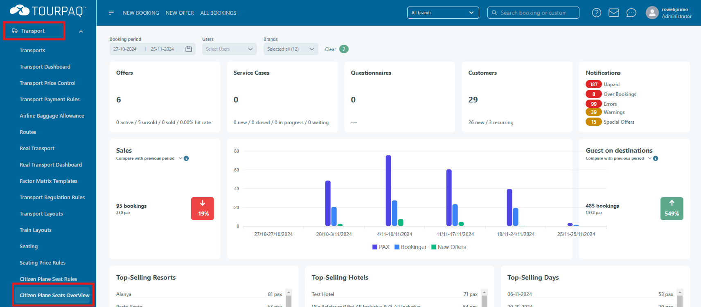

# Create citizen plane seats overview

Go to Transport menu and click Citizen Plane Seats Overview

<figure><figcaption></figcaption></figure>

**Fields**

| **Name**               | **Description**                             |
| ---------------------- | ------------------------------------------- |
| **TRANSPORT**          | The transport used.                         |
| **DEPARTURE**          | The departure location.                     |
| **SEATS**              | Number of seats booked.                     |
| **PRICE**              | Booking price per seat.                     |
| **SEATS TO CTZ**       | Number of seats published to Citizen Plane. |
| **SOLD BY CTZ**        | Number of seats booked by Citizen Plane.    |
| **STATUS**             | Current status of seats marked for booking. |
| **STATUS DESCRIPTION** | Status description.\*                       |

**\*** When the seats are invalidated, the reason will be displayed in the **Status Description** column.

**Filtering** existing Citizen Plane seats is possible through the following:

* Departures
* Arrivals
* Transports
* Status
