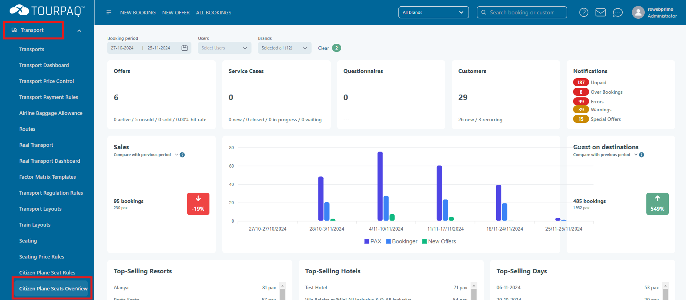

# Create citizen plane seats overview

### Overview

Citizen Plane Seats Overview monitors transport seats prepared for Citizen Plane.

Each row shows a departure's seat quantity, price, publication status, and validation outcome. Seats appear here after matching a [Citizen Plane Seat Rule](create-citizen-plane-rules.md).

### Purpose

Use this overview to confirm which seats are available for Citizen Plane publication.

Review the seats offered, the seats sold, and any invalidation reason. Use the status information to identify exports requiring investigation or rule changes.

Go to Transport menu and click Citizen Plane Seats Overview

<figure><figcaption></figcaption></figure>

### **Fields**

| **Name**               | **Description**                             |
| ---------------------- | ------------------------------------------- |
| **TRANSPORT**          | The transport used.                         |
| **DEPARTURE**          | The departure location.                     |
| **SEATS**              | Number of seats booked.                     |
| **PRICE**              | Booking price per seat.                     |
| **SEATS TO CTZ**       | Number of seats published to Citizen Plane. |
| **SOLD BY CTZ**        | Number of seats booked by Citizen Plane.    |
| **STATUS**             | Current status of seats marked for booking. |
| **STATUS DESCRIPTION** | Status description.\*                       |

**\*** When the seats are invalidated, the reason will be displayed in the **Status Description** column.

**Filtering** existing Citizen Plane seats is possible through the following:

* Departures
* Arrivals
* Transports
* Status
