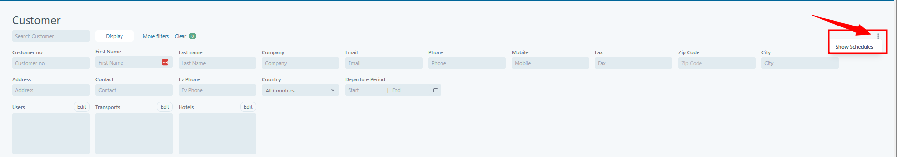
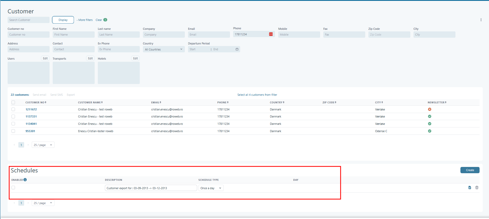

# Customers


**Permissions:** This module is typically available to **Administrators** (or users with equivalent customer-management rights).


### Overview

The **Customers** page is your starting point for finding and working with customer records in Tourpaq.

From here you can:

* Search and filter the customer database
* Open a customer profile to view or update details
* Select one or more customers to **send email/SMS** or **export** a list
* Check whether a customer is subscribed to your newsletter

***

### Typical workflow



### Find the customer

Use **Search Customer** for a quick lookup, or use filters (name, email, phone, city, etc.) to narrow the results.



### Open the customer profile

Click **Customer No** to open the customer’s full profile (contact details, bookings, totals, and history).



### Take action (optional)

Select customers using the checkbox column, then choose an action such as **Send Email**, **Send SMS**, or **Export**.



***

### Search and filter customers

<figure><figcaption></figcaption></figure>

#### Quick search

* **Search Customer** searches across customer records (for example name, email, or phone — depending on your configuration).

#### Common filters

Use these when you know a specific detail:

* **Customer No** (fastest when you have the customer ID)
* **First Name / Last Name**
* **Company**
* **Email / Phone / Mobile / Fax**
* **Contact** (filters by a registered contact person, if used by your organization)
* **Ev Phone** (often used as an _evening_ or _alternative_ phone number)

#### Address and location filters

Use these when you only know where the customer lives:

* **Address**
* **City**
* **Zip Code**
* **Country**

#### Booking-related filter

* **Departure Period (Start / End)**: filters customers based on the departure period connected to their bookings.

Advanced filters

Depending on your setup, you may also see additional filter areas such as **Users**, **Transports**, and **Hotels**.

* If an area has an **Edit** option, it usually means the filter can be configured (for example, selecting which users or items to include).

#### Filter controls

* **More filters**: shows additional filter fields.
* **Clear**: resets all filters back to default.
* **Display**: switches how results are displayed (for example list view), depending on your configuration.


If you get too many results, add **one more filter** (for example Country + Last Name) instead of scrolling through the full list.


***

### Customer list (results)

After you search, the results appear in a table.

#### Key columns

* **Customer No**: the customer’s unique ID. Click it to open the customer profile.
* **Customer Name**: full name.
* **Email / Phone**: primary contact information.
* **Country / Zip Code / City**: location details.
* **Newsletter**: indicates whether the customer is subscribed (the icon shown depends on your configuration).

#### Selecting customers

Use the checkbox on the left side of each row to select customers for bulk actions (email, SMS, export). Available actions depend on your permissions.

***

### Customer actions

Once you have results (and have selected one or more customers), you may have access to these actions:

* **Send Email**: send a message to the selected customers.
* **Send SMS**: send a text message to the selected customers.
* **Export**: export the current list (usually to Excel; available formats depend on your configuration).
* **Show Schedules**: generate a list based on predefined schedules/filters (if your organization uses scheduled customer lists).

<figure><figcaption></figcaption></figure>

<figure><figcaption></figcaption></figure>

<figure><figcaption></figcaption></figure>

***

### Tips

* **Sort the list:** click a column header (for example _Customer Name_ or _City_) to sort.
* **No results:** click **Clear** and try again with fewer filters.
* **Newsletter segmentation:** use the **Newsletter** column/filter to build a list for campaigns.
* **Data quality:** if you find duplicates, use the **Merge customers** tool (if available to your role) to keep your customer database clean.

***

### FAQ

<strong>I can’t find a customer. What should I try?</strong>

1. Click **Clear** to remove all filters.
2. Try searching by **Email** or **Phone** (these are usually more reliable than names).
3. If the name might be misspelled, try a shorter search (for example only the last name).
4. If the customer still doesn’t appear, they may not exist in your database yet, or your permissions may limit what you can see.

<strong>What’s the difference between “Search Customer” and the other filters?</strong>

* **Search Customer** is a quick, broad search.
* The other fields (like **Customer No**, **Email**, **City**) are more specific and usually help you narrow results faster.

<strong>What is “Customer No”, and why should I use it?</strong>

**Customer No** is the customer’s unique ID in Tourpaq. If you have it, it’s typically the fastest and most precise way to find the correct customer.

<strong>Where do I see more information about a customer?</strong>

Click **Customer No** in the results list to open the customer profile.

See: [Customer Details](customer-details.md)

<strong>Why can’t I see “Send Email”, “Send SMS”, or “Export”?</strong>

These actions depend on:

* Your **user permissions/role**
* Your organization’s **system configuration**

If you believe you should have access, contact your administrator.

<strong>What does “Newsletter” mean in the list?</strong>

The **Newsletter** column shows whether the customer is subscribed to your newsletter. The exact icon/indicator may vary by configuration.

<strong>What are “Contact” and “Ev Phone” used for?</strong>

* **Contact**: filters by a specific contact person (commonly used for B2B customers or when a company has multiple contacts).
* **Ev Phone**: often used as an _evening_ or _alternative_ phone number.

<strong>I see the same person multiple times. How do I fix duplicates?</strong>

Duplicates can happen when customers are created from different channels (manual entry, imports, web bookings, etc.). If you have access, you can use the merge tool:

* [Merge customers](../../merge-customers.md)

<strong>Does export include all customers or just my filtered list?</strong>

Exports normally follow your **current filters and search results**. If you need a broader list, clear filters or adjust them before exporting.

