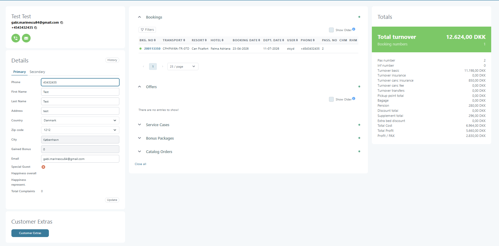
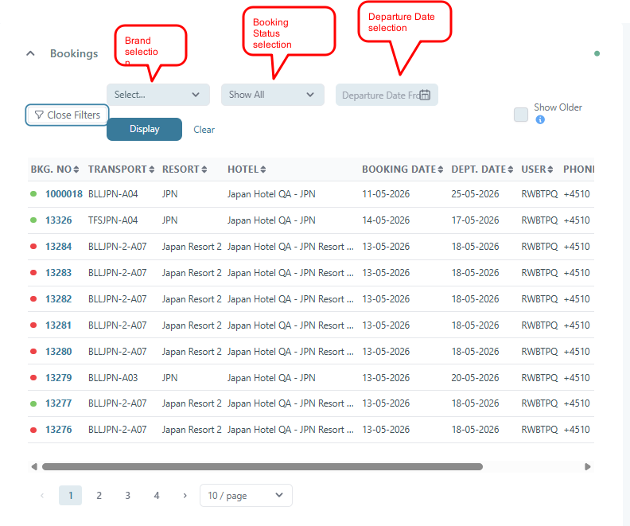
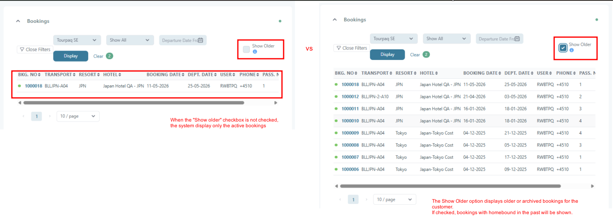
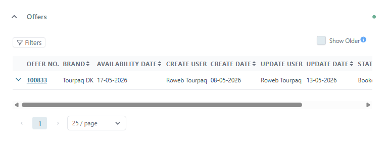
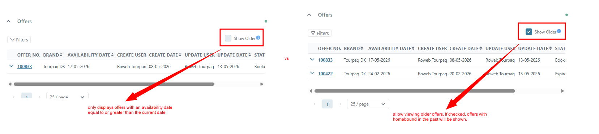

# Customer Details

The Customer Details page is the main profile page for managing customer-related information in Tourpaq.

It centralizes:

* Customer contact information
* Bookings and offers
* Service cases
* Financial totals
* Internal customer indicators

> The available fields and sections may vary depending on permissions and company configuration.


**How to access:** Open a customer profile by going to [Customers](./) and clicking the customer’s **Customer No**.

**Permissions:** Editing fields and seeing all panels depends on your user role and your organization’s setup.


### Overview

The **Customer Details** page is the customer profile (customer card) in Tourpaq Office. It shows everything Tourpaq knows about one customer in one place:

* Contact details (name, email, phone, address)
* Activity and history (bookings, offers, service cases, and more)
* Totals metrics (turnover, profit, pax counts, and breakdowns)

Use this page to verify customer data, update contact details, and understand booking history and customer value.


The Customer Details page is typically used by sales agents, customer service teams, operations staff, and administrators.


***

### Page layout

<figure><figcaption></figcaption></figure>

The page is typically split into three areas:

1. **Customer information** (left)
2. **Customer activity & history** (center)
3. **Totals summary** (right)

***

### Typical workflow



**Confirm you’re looking at the right person**

Check the **name**, **email**, and **phone** first. If anything looks wrong, verify the customer number from the booking or from the [Customers](./) list.



**Update contact details (if needed)**

Edit the fields in the **Customer information** panel and click **Update** to save.



**Review bookings and related history**

Expand **Bookings** (and other panels like **Service Cases**) to see what is connected to the customer.



**Check totals**

Use the **Totals summary** panel to understand turnover/profit and booking counts.



***

## Customer Details Page (left panel)

This panel contains the customer’s contact details and internal indicators. It commonly has two tabs:

* **Primary**: the customer’s main contact details
* **Secondary**: alternative contact details (if your organization uses them)

The Customer Details page provides an overview of a customer profile, including contact information, bookings, offers, financial totals, service-related information, and customer extras.

### Customer Information Panel

Located on the left side of the page.

Displays the main customer details:

* Customer name
* Email address
* Phone number
* Quick action buttons:
  * Phone call contact
  * Email contact

### Details Section

The Details section contains customer profile information and is divided into two tabs:

#### Primary Tab

Contains the main customer information fields:

| Field             | Description                           |
| ----------------- | ------------------------------------- |
| **Phone**         | Customer phone number                 |
| **First Name**    | Customer first name                   |
| **Last Name**     | Customer last name                    |
| **Address**       | Street address                        |
| **Country**       | Customer country                      |
| **Zip code**      | Postal code                           |
| **City**          | City name                             |
| **Gained Bonus**  | Registered customer bonus amount      |
| **Email**         | Customer email address                |
| **Special Guest** | Marks the customer as a special guest |

Additional information displayed below the fields:

* Happiness overall
* Happiness represent.
* Total Complaints

#### Behaviour

* Changes are not saved automatically
* Click **Update** to save changes
* Some fields may be read-only depending on permissions
* Certain fields may be synchronized with external integrations


Avoid storing sensitive personal information in free-text note fields unless required by company policy.


#### Secondary Tab

The **Secondary** tab in the **Customer Details** section stores additional customer information that complements the primary contact details.\
This information can be used for communication, reporting, integrations, customer identification, and operational follow-up.

The fields in this section are mostly optional and can be updated whenever new information becomes available.

## Field Descriptions

| Field                     | Description                                                                                                           |
| ------------------------- | --------------------------------------------------------------------------------------------------------------------- |
| **Contact**               | Additional contact person connected to the customer account.                                                          |
| **Cust. no**              | Unique customer number generated by the system.                                                                       |
| **Newsletter**            | Indicates whether the customer is subscribed to newsletters or marketing communication.                               |
| **Mobile**                | Customer mobile phone number.                                                                                         |
| **Ev. phone**             | Evening phone number or alternative contact number.                                                                   |
| **Company**               | Company name associated with the customer.                                                                            |
| **CPR**                   | Personal identification number. Commonly used in certain countries for registration or invoicing purposes.            |
| **Fax**                   | Fax number associated with the customer or company.                                                                   |
| **App last login**        | Displays the last login activity in the customer application.                                                         |
| **Was initially offeree** | Indicates whether the customer was originally registered as an offeree/prospect before becoming a confirmed customer. |

***

## Buttons

| Button      | Purpose                                                                    |
| ----------- | -------------------------------------------------------------------------- |
| **Update**  | Saves all modifications made in the Secondary tab.                         |
| **History** | Opens the history log related to customer information changes and updates. |


**Remember to save:** changes are not stored until you click **Update**.


***

## Customer activity & history (center panel)

The center panel contains expandable sections. What you see here depends on your setup.

#### Bookings

Shows the customer’s bookings in a list/table.

* **BKG. No** is usually clickable and opens the booking
* Use the available **filters** to narrow the booking list (for example, to find upcoming departures)

#### Other sections you may see

* **Offers**: offers linked to the customer (if used)
* **Service Cases**: complaints, requests, or support-related records linked to the customer
* **Old Bookings**: historical bookings
* **Bonus Packages**: bonus programs linked to the customer (if used)
* **Catalog Orders**: customer orders (if used)

You can expand/collapse sections individually. If available, use **Close all** to collapse everything and reduce clutter.

### Booking Features

<figure><figcaption></figcaption></figure>

**Filters** - The `Filters` button allows filtering the booking list.

**Show Older** - The `Show Older` option displays older or archived bookings for the customer. If checked, bookings with homebound in the past will be shown.

<figure><figcaption></figcaption></figure>

**Pagination** - Pagination controls allow navigation between booking pages and selection of the number of entries displayed per page.

***

### Offers Section

<figure><figcaption></figcaption></figure>

Displays customer-related offers.

If no offers are available, the system displays:

> There are no entries to show!

The section also supports the `Show Older` option for viewing older offers. If checked, offers with homebound in the past will be shown.

<figure><figcaption></figcaption></figure>


When the "Show Older" is checked, offers with homebound in the past will be shown. The homebound date represents the return date from the offer basket. (availability date)


***

### Service Cases Section

Displays service cases associated with the customer.

This section can contain:

* Open service cases
* Closed service cases
* Customer support-related records

***

### Bonus Packages Section

Displays bonus packages assigned to the customer.

Examples may include:

* Loyalty packages
* Campaign bonuses
* Promotional packages

***

### Catalog Orders Section

Displays catalog orders related to the customer.

This section may contain:

* Printed catalog requests
* Marketing material orders
* Campaign catalog distributions

***

## Totals summary (right panel)

This panel is a financial and volume overview based on the customer’s bookings.

You’ll typically find:

* **Total Turnover** (often shown in EUR, depending on configuration)
* **Booking Numbers** (how many bookings are linked to the customer)
* **Pax Number / Inf Number** (passenger and infant counts)
* Breakdown totals (for example **Insurance**, **Transfers**, **Discounts/Supplements**, and other categories)
* Profit metrics (for example **Total Profit** and **Profit per PAX**) if enabled

Use this area to quickly understand the customer’s overall value and what makes up the totals.

#### Totals Behaviour

* Totals are calculated from bookings linked to the customer profile
* Calculation rules may vary depending on company setup
* Cancelled bookings may or may not be included
* Financial visibility may depend on permissions

## Customer Updates

### Updating Customer Information

To update customer information:

1. Open the customer profile
2. Modify the required fields
3. Click **Update**

#### Important

* Unsaved changes are lost when leaving the page
* Email and phone formatting should follow company standards
* Updating customer information may affect exports, reports, and integrations

***

## Booking Linkage

Bookings are linked to customer profiles during the booking workflow.

### Behaviour

* A booking connected to a customer automatically appears in Customer Details
* Multiple bookings can be linked to the same customer
* Customer totals update based on linked bookings

#### Common Scenarios

| Scenario          | Behaviour                                         |
| ----------------- | ------------------------------------------------- |
| Booking cancelled | May still affect totals depending on setup        |
| Booking deleted   | May be removed from customer history              |
| Customer merged   | Bookings are reassigned to the remaining customer |

***

## Merge Customers

The Merge Customers functionality is used to combine duplicate customer profiles.

### Typical Use Cases

Duplicate profiles may occur when:

* A customer is created multiple times
* Different agents create separate profiles
* Customer data is imported externally

***

### Merge Workflow

1. Open the **Merge Customers** page
2. Select the source customer
3. Select the target customer
4. Review the merge information
5. Confirm the merge

***

### Merge Behaviour

| Data Type        | Behaviour                                 |
| ---------------- | ----------------------------------------- |
| Bookings         | Reassigned to the remaining customer      |
| Offers           | Reassigned                                |
| Notes            | Preserved                                 |
| Service Cases    | Preserved                                 |
| Removed customer | Deleted or deactivated depending on setup |


Merge operations is not reversible.


***

## Search Behaviour

Customers can typically be searched using:

* Name
* Email address
* Phone number
* Customer ID

***

## Common Workflows

### Update Customer Contact Information

1. Open the customer profile
2. Edit the contact fields
3. Click **Update**
4. Verify the changes

***

### Mark a Customer as Special Guest

1. Open the customer profile
2. Enable the **Special Guest** option
3. Save the changes

#### Typical Use Cases

* VIP customers
* Priority handling
* Internal customer categorization

***

### Merge Duplicate Customers

1. Search for duplicate profiles
2. Verify the correct target profile
3. Open Merge Customers
4. Complete the merge process


Always verify bookings and contact information before merging profiles.


***

## Best Practices

* Always search before creating a new customer
* Use consistent phone number formatting
* Verify email addresses before saving
* Merge duplicate customers regularly
* Avoid storing sensitive personal information in notes
* Review customer totals after major booking updates

***

## Related Pages

* Customers
* Merge Customers
* Bookings
* Offers
* Service Cases
* Users & Roles

***

### FAQ

<strong>I updated a field, but it didn’t change. Why?</strong>

Most updates require clicking **Update** in the customer information panel. If you navigated away without saving, the changes will be lost.

If you clicked **Update** and it still doesn’t save, you may not have permission to edit that field.

<strong>Why can’t I edit the customer details?</strong>

Editing depends on your user role. Some users can view customer data but not change it.

<strong>I don’t see bookings for this customer. What should I check?</strong>

* Ensure you opened the correct customer (verify **email/phone**).
* Check whether a filter is hiding results.
* The booking may be linked to a different (duplicate) customer profile.

If you suspect duplicates, use [Merge customers](../../merge-customers.md).

<strong>What does “Special Guest” mean?</strong>

This is an internal flag. The exact meaning (and how it should be used) is defined by your organization’s workflow.

<strong>What are “Happiness” fields used for?</strong>

If enabled, these are internal customer-satisfaction indicators used for quality tracking and reporting.

<strong>Why do totals look wrong (turnover/profit/pax)?</strong>

Totals depend on what bookings are linked to the customer and how your system calculates turnover/profit.

Common causes:

* The customer has no bookings (or bookings are linked to a different profile)
* A booking was recently edited and the page hasn’t been refreshed
* Profit fields may be hidden/disabled depending on permissions and configuration

<strong>How do I get back to the customer list?</strong>

Go back to [Customers](./).

