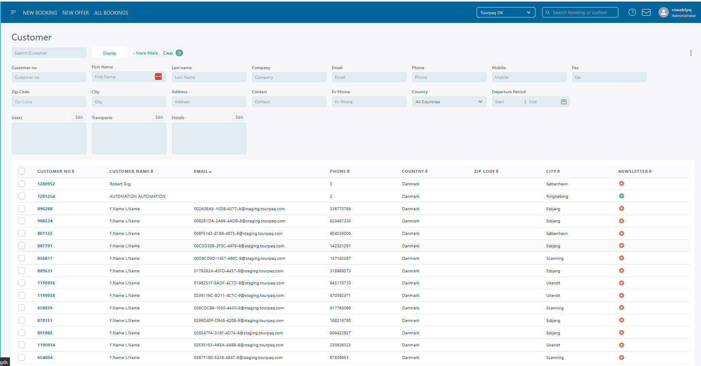

---
layout:
  title:
    visible: true
  description:
    visible: false
  tableOfContents:
    visible: true
  outline:
    visible: true
  pagination:
    visible: true
---

# Customers

Applies for Administrator

The customer center module allows the user to search for customers, see the bonus packages, see the customer dashboard and catalog order.

### **Find customer**

Can search for one or more customers using the filters:

* Customer no
* First name
* Last name
* Company
* Email
* Phone
* Mobile
* Fax
* Zip Code
* City
* Address
* Contact
* Ev Phone
* Country
* Departure Period
* Users
* Transport
* Hotels

<figure><figcaption></figcaption></figure>

Also, from this page, you have the possibilities to:

* Send email - Allows the user to send custom e-mails to the displayed customers.
* Send SMS - Allows the user to send custom SMS to displayed customers.
* Export — Allows the user to export a generated list in an external document, usually Microsoft Excell. But other document types are also supported.

<figure><figcaption></figcaption></figure>

**Show Schedules -** Allows the user to automatically generate a list at a certain date and time, using predefined filters and settings.

<figure><figcaption></figcaption></figure>

<figure><figcaption></figcaption></figure>
