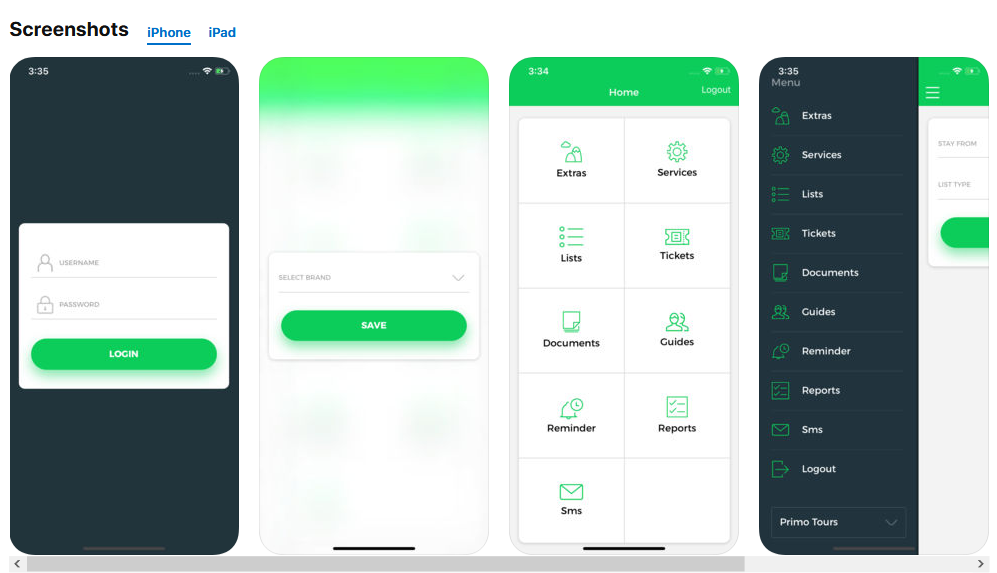
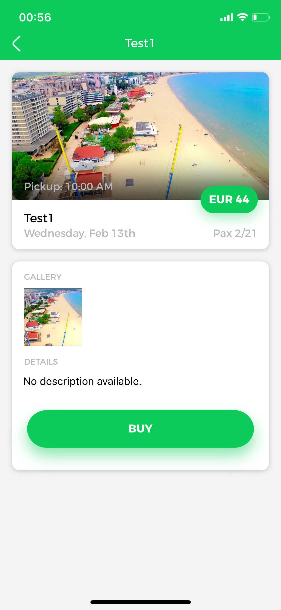

# Destination - Mobile Guide App

<figure><figcaption></figcaption></figure>

Destination Mobile App is a new feature used to track down guides activity, help them coordinate with each other, create complaints regarding the local environment, support the customer directly through the chat, export passengers lists in multiple formats and so on.

### **Login Screen**

<figure><figcaption></figcaption></figure>

This is the first screen the guide will encounter when using the app. As shown in the picture, the login is quite basic, requiring the username and password used in Tourpaq.

### **User Session**

The user session expires by default in 30 minutes from the last user action. In order to change this value the admin must change the "Destination API Token" value from the Edit Brand General tab. The newly set value will be used in order to make the session expire and stop notification from sending after the set value from the last user action. The sending of notifications will be stopped by a service, a slight delay might occur.

**The unit of measure for the value is minutes.**

<figure><figcaption></figcaption></figure>

### **Available menus**

The list of available menus is available right after the login request succeeds. You can access the menu either directly from the screen that pops up after the log in, or from the side-menu after clicking the top-left burger icon.

#### **Extras**

**Configuring an extra**

<mark style="background-color:red;">**IMPORTANT NOTE:**</mark> <mark style="background-color:red;"></mark><mark style="background-color:red;">Only guides can add products and make them available in the application.</mark>

<figure><figcaption></figcaption></figure>

In order to be made available in the application, the extra must have selected a category of type **Tours** (General info).

#### **Customize the excursion for the apps**

The first information that appears to the guest is the description - which can be easily customized under the main tab of the extra, specifically the **Description in customer center** box. This can also be customized per brand for a wider variety of descriptions. Another thing to mention when customizing an excursion is the possibility to add one or more representative pictures. That can be easily done through the **Photos** tab of the extra (see the picture below).

<figure><figcaption></figcaption></figure>

#### **Extra currency**

By default, the price of the sold extra will represent either the currency of the agency (if it has one) or the currency of the company. However, you can customize this by creating a creditor with the desired currency and assign it to the required extra under the "Automatic billing" box (see the picture below).

<figure><figcaption></figcaption></figure>

#### **Assign the excursion to a resort**

An essential aspect of selling an excursion is that even if Tourpaq supports adding multiples resources to a product - such as transports, hotels and so on, the application will only take into considerations the resort field. One can assign the desired resort or resorts for where they want to sell the excursion Adding a resort is quite simple - you navigate under the **Resurser** tab of the product, click on the **New filter type**, select the desired resort and click on **Save filter type** to save your desired settings (see the picture below).

<figure><figcaption></figcaption></figure>

**Assign the excursion to a brand**

An essential to-do in the process of setting up the excursion is assigning it to a brand so it will be available for sale for it. That can be done really simple under the **Brands** tab under the specific extra One must select the **Guide Sale** option for the desired brand and click on **Save Options** to save the desired configuration (see picture below).

<figure><figcaption></figcaption></figure>

**Generate allotments for the excursion**

Another essential step in setting up the excursion is creating the allotments. That can easily be done by going on the desired extra, under the **Generic Allotment** tab. To start defining the desired allotments, click on the **Generate New Allotments** button in the left corner of the page. The allotments can be generated either on a daily basis or on a weekly basis (see picture below).

<figure><figcaption></figcaption></figure>

**Detailed description for each option:**

* **Daily** - the tool will generate allotments each day or from n to n days (e.g. from 2 to 2 days) in a given date interval (**Duration**). In here we also have the possibility to make new allotments each n minutes (**Daily Frequency**) between a time interval (this is applying for each day) or to set up the **Specific time** of the allotments (see the picture below),
* **Weekly** - the tool will generate allotments for one or more days of the week. We will also be able to specify the allotments frequency (each week or from n to n weeks). We will also have to define the desired time or set the allotment to be available every n minutes, exactly like in the **Daily** basis option. From this point, the steps are similar.

<figure><figcaption></figcaption></figure>

After selecting the desired time, click outside the popup window in order for the setting to be saved.

After filling in the settings we wanted we proceed to the next step - saving them. We will fill the number of available allotments for this rule set and click on **Generate**. Immediately after we will be able to see the newly created allotments.

**Have the excursion(product) still listed in the app as read only mode**

If allotment is generated with 0 availability, or after the allotment runs out, the product can still be listed in the VisitSun mobile app if it is set as bellow:

<figure><figcaption></figcaption></figure>

In the VisitSun mobile app, the effect will be that the excursion/product will continue to be listed, but no buy button will be available.

#### **Setting the selling price(s) for an excursion**

Another really important step in the process of setting up the excursion for the app is defining one or more price rules. That can be done per periods - meaning that you can have different adult or child prices for different periods. In order to do that one has to navigate to the **Extras -> Generic Product Price Rule** menu item (see the picture below).

<figure><figcaption></figcaption></figure>

**Creating a new price rule for an excursion**

In order to create a new price rule, one has to click on the **New** button in the right corner of the page mentioned previously. Pressing the **New** button will generate a new entry to the **Price Rules** table and we will have to configure it properly (see picture below).

<figure><figcaption></figcaption></figure>

In order to properly understand how the price rules work in the process of setting up an excursion, we will provide a summary description of each field seen above:

* **Name** - this field represents the name of the desired price rule (customization purpose),
* **Product** - in here we select the excursion for which we will generate the price rule,
* **Bkg Date Start** - representing the start date interval of the **bookings** for whom this rule will apply,
* **Bkg Date End** - representing the end date interval of the **bookings** for whom this rule will apply,
* **All Date Start** - representing the start date interval of the **allotments** for whom this rule will apply,
* **All Date End** - representing the end date interval of the **allotments** for whom this rule will apply,
* **Agency** - representing the agency for whom this rule will be available,
* **Price** - representing the default price (or adult price if child price is higher than 0),
* **Child price** - representing the child price for the given price rule,
* **Cost** - there is no need to fill this one out for the excursion (we will just leave it 0),
* **Enabled** - representing the availability trigger of a price rule (unchecking it will disable the price rule).

Once we finish completing all the fields mentioned above, we click on **Save** and the rule will be generated. Also, the existing rules can also be modified by clicking the **Edit** button on them.

**Creating a new route for an excursion**

In order to do that, we will have to navigate under the **Extras -> Routes** page (see the picture below).

<figure><figcaption></figcaption></figure>

After you click insert, a route will be generated and you will be able to add **pickup points** (see picture below).

<figure><figcaption></figcaption></figure>

In here, you will have to fill the following fields:

* **Code** - the code of the pickup point,
* **Description** - a summarized description of the pickup point,
* **List name** - a name for the pickup point as it should be displayed on the export files,
* **Price** - **for this type of routes, we do not need to fill this one up**,
* **Cost** - **for this type of routes, we do not need to fill this one up**,
* **Price tag** - **for this type of routes, we do not need to fill this one up**,
* **Meeting hour** - the hour when the guests should start grouping up,
* **Departure hour** - the hour when the guests will move on with their excursion,
* **Return hour** - the hour when the guests will finish the excursion

<mark style="color:red;">IMPORTANT:</mark> There are also some more tabs under the Route, but for this type of extras, we should not take all of them into consideration. The remaining one that should be taken into consideration is the "Brands" tab. In here, we assign an agency to the currently defined route and mark it as for sale.

**Set up guide payment**

In order to take further steps in the process of booking the excursions, we must create two new guide payment types. One for debit (cash in) and one for credit (cash out). These payment types can be created in the backoffice on an Administrator account under Finance -> Method of payment (see below).

Once we got here, we can proceed with creating a new method of payment for the guide excursions by clicking on the "New" button in the right corner of the listing page.

<figure><figcaption></figcaption></figure>

In here, the user will encounter the following fields:

* **Code** - the code of the payment type,
* **Plaintext** - a summarized description of the payment type,
* **Debit/Credit** - if Debit, it will be used for buying the excursion (cash in), if Credit for refunds (cash out),
* **Is Dankort** - by checking this the user is setting up this payment type only for Dankort credit cards,
* **Guide payment** - this is mandatory, as all the excursions are being sold through the guides,
* **Active Y/N** - this is mandatory, settings the payment type as active or not,
* **Cash payment** - by checking this the user is setting up this payment type available only for Cash payments.
* **Agent Machine Payment** - this is similar to cash payment, the only difference being that while proceeding with the order in the app, a transaction code (usually generated by a machine) will have to be provided.,
* **'Pay from home' Payment** - by checking this the user is setting up method of payment as 'Paid from home' (it works similar to cash payment, the only difference being that it will show as 'Paid from home' on the Excursion list),

Above are all the required fields to properly set up a method of payment for the guide.

* \*\* Agencies\*\* - This set up allows the user to assign specific brands for the method of payment (Note! This section will be active only if "Guide Payment" is checked.)

<figure><figcaption></figcaption></figure>

Usage examples:

* If a guide has two methods of payment assigned, both on different brands, the system will take the one according to the selected agency.
* If a guide has two methods of payment assigned, both on the same brands, the system will take the first according to the selected agency.

After finishing with the creation of the payment types, we can proceed even further and assign the payment types to a guide. We can do that by entering the Edit Guide page in Users -> Guides and click edit on the desired guide to assign the payment types (see below picture).

<figure><figcaption></figcaption></figure>

Also, in here another important thing to consider is that we can override the DIBS settings for a specific guide (please take into consideration that this will only happen in the mobile apps).

In order to set this option up, one must select an option from the **Override agency DIBS** dropdown.

For example we can let it to default and the payment will be made using the selected agency in the app OR if we set up an agency in here all the payments made with this guide will be using the DIBS settings of that specific agency.

After finishing with setting up everything in here, the guide is ready to go.

**The recommended setup would be as follows:**

* 2 payment types for cash (1 cash in and 1 cash out)
* 2 payment types for regular credit cards (1 in and 1 out)
* 2 payment types for dankort credit cards( 1 in and 1 out)

**IMPORTANT REMARK:**

* Most (if not all) credit card types come with a tax of 25 kr (3.33 EUR) which applies to an order.
* A tax of 25 kr (3.33 EUR) is also present for the cash payment if the currency of the order is DKK.

In order to proceed with using the earlier created payments, the user must select an available excursion from the list (**in the APP**), tap on buy, fill all the details and select a desired method of payment (cash, agent machine or card). If for example one selects Cash, but no Cash method of payment is configured in the backoffice, the system will not complete the order, as it will not find a matching method of payment into the system.

### **Booking an excursion in the app**

After setting the excursion up, we can proceed to the next stage: the one of booking it. By doing this, the user can log in with the guide account that has been set up at the previous stage and click on the **Extras** option from the menu. If everything is configured properly, a list of available excursions will show up (see pictures below).

**Remark:** Stop sales hours setup won't have any impact here. Guide should see all the available excursions, regardless of the stop sales hours setup.

**Choose an excursion from the list**

<figure><figcaption></figcaption></figure>

**See the details of the excursion**

<figure><figcaption></figcaption></figure>

**Configure its detials for the shopping cart**

**Select the previously created payment types and proceed to the checkout**

<figure><figcaption></figcaption></figure>

**IMPORTANT:** The Mobile Application also gives the possibility to cancel an existing order. In order to do this, the user has to click on the **Booked** tab in the **Extras** screen and tap on the existing order. In here, he can also decide whether he will refund the money back to the customer. In order to make the refund possible, a Credit method of payment assigned to this specific guide is required! (see pictures below)

<figure><figcaption></figcaption></figure>

**Note:** When ordering excursions from Destination app or Guest App the workflow is as follows: Allotment is taken but order is pending status (these orders do not appear in the system).

If payment approved, the order is set to status OK. If payment rejected, the allotment is restored and order is canceled. If payment not finalized (for any reason) the allotment is set back after 10 minutes. If pending payment, a pending payment is sent to the customer. As we get the notification on the status two scenarios may occur:

* Pending payment is reported as approved – an email saying your payment has been approved
* Pending payment is reported as rejected – an email saying your payment is rejected is sent and order is canceled and allotment set back

<figure><figcaption></figcaption></figure>

In the CXL/Error menu, you’ll see bookings where extra orders (such as excursions) were canceled by the service, but the payment was still confirmed. These entries are shown to help you identify and resolve any discrepancies.

The status in the app will be cleared when the guest is traveling home.

### **Export lists**

Now that we have managed to properly set things up for selling the excursions, we need a way to track down the guests that will book them. Tourpaq offers this functionality either by using the backoffice's **Destination Lists** page (under **Extras -> Destination Lists**) or by using the **Lists** menu item in the App (a guide or guide master login is required to be able to generate the export files).

**Sales ledger**

Sales ledger is used to check the excursions sold and the amount paid for each order by the booking that has bought it.

Also, when filtering after the allotment date, more information about the excursions a booking has will be displayed, even if they are not in the set interval of the search.
