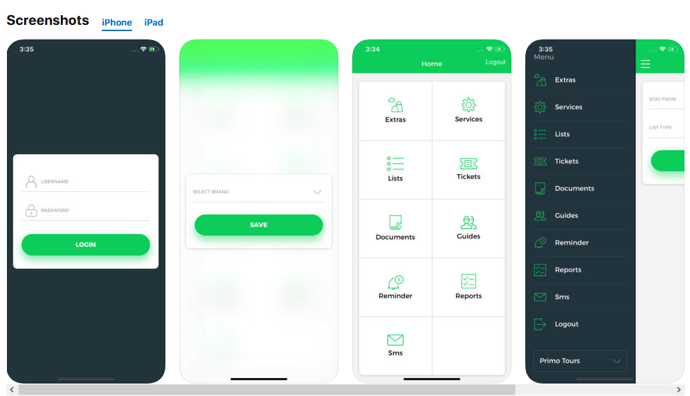
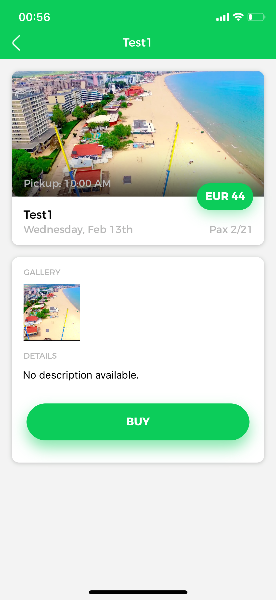

# Guide App

<figure><figcaption></figcaption></figure>

The Guide App tracks guides' activity, helps them coordinate with each other, creates complaints regarding the local environment, supports customers directly through chat, and exports passenger lists in multiple formats.

### Related pages

Use [guide-app](guest-app/guide-app/ "mention") for the Guide App Home screen and its sections:

* [extras.md](guest-app/guide-app/extras.md "mention"), [services.md](guest-app/guide-app/services.md "mention"), and [lists.md](guest-app/guide-app/lists.md "mention").
* [tickets.md](guest-app/guide-app/tickets.md "mention"), [documents.md](guest-app/guide-app/documents.md "mention"), and [guides.md](guest-app/guide-app/guides.md "mention").
* [reminder.md](guest-app/guide-app/reminder.md "mention"), [reports.md](guest-app/guide-app/reports.md "mention"), [sms.md](guest-app/guide-app/sms.md "mention"), and [conversations.md](guest-app/guide-app/conversations.md "mention").

Also see [visit-sun-app.md](visit-sun-app.md "mention"), [guide-profiles.md](guides/guide-profiles.md "mention"), and [weekly-activities](guest-app/weekly-activities/ "mention").

### Login screen

<figure><figcaption></figcaption></figure>

This is the first screen the guide will encounter when using the app. As shown in the picture, the login is quite basic, requiring the username and password used in Tourpaq.

### User session

The user session expires by default in 30 minutes from the last user action. To change this value, the admin must modify the "Destination API Token" value in the Edit Brand General tab. The newly set value will be used in order to make the session expire and stop notification from sending after the set value from the last user action. The sending of notifications will be stopped by a service, a slight delay might occur.

**The unit of measure for the value is minutes.**

<figure><figcaption></figcaption></figure>

### Available menus

The list of available menus is available right after the login request succeeds. You can access the menu either directly from the screen that pops up after the log in, or from the side-menu after clicking the top-left burger icon.

### Extras

**Excursions as Extra Orders**

An excursion sold in the Guide App or Guest App is an **Extra Order**: an [Extra](extras-setup/extras-general-page/extras.md) that is ordered and paid separately from the booking. An Extra becomes an Extra Order when two things are true:

* At least one brand assignment on the Extra includes **Guide sale**.
* The Extra uses an allotment type that supports Extra Orders: **Manual** or **Generic**.

The same Extra can be ordered in these places:

| Where                                                                                        | Who orders                                                                    |
| -------------------------------------------------------------------------------------------- | ----------------------------------------------------------------------------- |
| **Guide App**                                                                                | A guide, on behalf of the guest.                                              |
| **Guest App**                                                                                | The guest.                                                                    |
| [**Extra Orders**](booking/new-booking/extra-orders.md) tab of the booking in Tourpaq Office | An Administrator or Guide user.                                               |
| WebBooking (OneHome)                                                                         | The customer, before departure. The order is created through the Booking API. |


Extras with **Manual** and **Generic** allotment are sold in the same way in the Guide App and Guest App. The allotment type decides how availability is managed, not whether the excursion can be sold in the apps.


#### Configure an extra

<mark style="background-color:red;">**IMPORTANT NOTE:**</mark> <mark style="background-color:red;">Only guides can add products and make them available in the application.</mark>

<figure><figcaption></figcaption></figure>

Go to **Extras Setup → Extras**, click **Create** (or open an existing Extra) and fill in the **Basic setup**. Select an **Extras Category** of type **Tours**. Only Extras in a Tours category are shown in the apps.

**Select the allotment type**

In **Allotment Type** on the **Basic setup** tab, select **Manual** or **Generic**.

| Allotment type | Use it when                                                          | Allotment tab         |
| -------------- | -------------------------------------------------------------------- | --------------------- |
| **Manual**     | The excursion runs on set days, with one capacity per day.           | **Allotments**        |
| **Generic**    | The excursion runs in time slots, with a capacity per date and time. | **Generic Allotment** |

**None** and **LinkedToTransport** do not support Extra Orders.

<figure><figcaption>
Allotment Type on the Basic setup tab of the Extra.
</figcaption></figure>

#### Customize the excursion for the apps

The first information that appears to the guest is the description. Customize it under the main tab of the extra, specifically the **Description in customer center** box. This can also be customized per brand for a wider variety of descriptions. Add one or more representative pictures through the **Photos** tab of the extra (see the picture below).

<figure><figcaption></figcaption></figure>

#### Extra currency

By default, the price of the sold extra will represent either the currency of the agency (if it has one) or the currency of the company. However, you can customize this by creating a creditor with the desired currency and assign it to the required extra under the "Automatic billing" box (see the picture below).

<figure><figcaption></figcaption></figure>

#### Assign the excursion to a resort

An essential aspect of selling an excursion is that even if Tourpaq supports adding multiples resources to a product—such as transports, hotels, and so on—the application will only take into considerations the resort field. Assign the desired resort or resorts under the **Resurser** tab of the product. Click **New filter type**, select the desired resort, and click **Save filter type** (see the picture below).

<figure><figcaption></figcaption></figure>

#### Assign the excursion to a brand

In the **Brands** section at the top of the **Overview** tab of the Extra, select an option that includes **Guide sale** for each brand that sells the excursion, then click **Save**.

| Brand assignment                          | Effect on the excursion                                                                                                       |
| ----------------------------------------- | ----------------------------------------------------------------------------------------------------------------------------- |
| **Guide sale**                            | Orderable as an Extra Order in the Guide App and Guest App.                                                                   |
| **Guide sale + Internet Sale + For Sale** | Orderable as an Extra Order in the Guide App, Guest App, WebBooking (OneHome) and on the **Extra Orders** tab of the booking. |

<figure><figcaption>
Brand assignment options. Any option that includes Guide sale makes the Extra an Extra Order for that brand.
</figcaption></figure>

#### Generate allotments for the excursion

Open the allotment tab that matches the allotment type, click **Generate New Allotments**, and choose **Daily** or **Weekly**.

* **Manual** — open the **Allotments** tab. Each row is one date with one capacity.
* **Generic** — open the **Generic Allotment** tab. Each row is one date and time slot with its own capacity.

A guest is offered the excursion only on allotment dates that fall within the stay, and only while allotment is left. The field-by-field description is on [Allotments](extras-setup/extras-general-page/allotments.md).

<figure><figcaption>
Manual allotment: one row per date. BO1 shows the number of units booked.
</figcaption></figure>

#### Keep the excursion listed as read-only

If the allotment is generated with 0 availability, or runs out, the excursion can still be listed in the Guest App. Tick **Keep showing in app** on the **Basic setup** tab of the Extra (TO VERIFY — the screenshot below predates the current Basic setup layout; confirm it shows this setting):

<figure><figcaption></figcaption></figure>

In the Guest App, the effect will be that the excursion/product will continue to be listed, but no buy button will be available.

#### Set selling prices for an excursion

Open the **Prices** tab of the Extra and create one price line per age group and period. Prices for Extra Orders are defined on the **Prices** tab only. The **Generic Product Price Rules** page is no longer used.

| Price line  | From Age | To Age |
| ----------- | -------- | ------ |
| Child price | `2`      | `11`   |
| Adult price | `12`     | `120`  |

The apps and the Destination API show these as the **Adult Price** and **Child Price** of the excursion.

For an Extra Order, the Prices tab can also show **START TIME** and **END TIME**. Use them to give the same date different prices during the day — for example a morning and an afternoon departure. The **S** split button next to them divides a price line into two time periods. The defaults are `00:00` and `23:59`, which means one price for the whole day. See [Prices ](extras-setup/extras-general-page/prices.md)for every column.

<figure><figcaption>
START TIME and END TIME on the Prices tab of an Extra Order.
</figcaption></figure>

**Payment and cancellation**

How an Extra Order is paid depends on when it is ordered.

| Ordered                                          | Payment                                                                                                   | Where the order is visible                                                |
| ------------------------------------------------ | --------------------------------------------------------------------------------------------------------- | ------------------------------------------------------------------------- |
| In the Guide App or Guest App at the destination | Paid with the Extra Order, using the guide payment types below.                                           | **Extra Orders** tab, Destination lists, **Booked** tab in the Guide App. |
| Before departure, in WebBooking (OneHome)        | Added to the booking total and paid with the booking. No payment is registered on the Extra Order itself. | **Extra Orders** tab, Destination lists.                                  |

When an Extra is cancelled, what happens depends on the payment flow:

* **Extra Order** (ordered and paid in the app): cancelled in the same way as today, from the **Booked** tab, and refunded as described under **Book an excursion in the app**.
* **Pre-booked Extra** (booking payment flow): removed from the booking. The difference is shown as a negative balance for the booking in **Balance Administration**.
* **Booked through OneHome (WebBooking)**: the Booking API inserts the product as an Extra Order. Its price is added to the booking total and no payment is assigned to the Extra Order. The product is included in the Guide App export, and guides can cancel it from the Guide App. The amount is shown as a negative balance for the booking, not as an Extra Order refund.

See **Cancelling an Extra** on the [Extra Orders](booking/new-booking/extra-orders.md) page.

**Create a route for an excursion**

In order to do that, we will have to navigate under the **Extras -> Routes** page (see the picture below).

<figure><figcaption></figcaption></figure>

After you click insert, a route will be generated and you will be able to add **pickup points** (see picture below).

<figure><figcaption></figcaption></figure>

In here, you will have to fill the following fields:

* **Code** - the code of the pickup point,
* **Description** - a summarized description of the pickup point,
* **List name** - a name for the pickup point as it should be displayed on the export files,
* **Price** - **for this type of routes, we do not need to fill this one up**,
* **Cost** - **for this type of routes, we do not need to fill this one up**,
* **Price tag** - **for this type of routes, we do not need to fill this one up**,
* **Meeting hour** - the hour when the guests should start grouping up,
* **Departure hour** - the hour when the guests will move on with their excursion,
* **Return hour** - the hour when the guests will finish the excursion


<mark style="color:red;">IMPORTANT:</mark> There are also some more tabs under the Route, but for this type of extras, we should not take all of them into consideration. The remaining one that should be taken into consideration is the "Brands" tab. In here, we assign an agency to the defined route and mark it as for sale.


#### Set up guide payment

In order to take further steps in the process of booking the excursions, we must create two new guide payment types. One for debit (cash in) and one for credit (cash out). These payment types can be created in the backoffice on an Administrator account under Finance -> Method of payment (see below).

Once we got here, we can proceed with creating a new method of payment for the guide excursions by clicking on the "New" button in the right corner of the listing page.

<figure><figcaption></figcaption></figure>

In here, the user will encounter the following fields:

* **Code** - the code of the payment type,
* **Plaintext** - a summarized description of the payment type,
* **Debit/Credit** - if Debit, it will be used for buying the excursion (cash in), if Credit for refunds (cash out),
* **Is Dankort** - by checking this the user is setting up this payment type only for Dankort credit cards,
* **Guide payment** - this is mandatory, as all the excursions are being sold through the guides,
* **Active Y/N** - this is mandatory, settings the payment type as active or not,
* **Cash payment** - by checking this the user is setting up this payment type available only for Cash payments.
* **Agent Machine Payment** - this is similar to cash payment, the only difference being that while proceeding with the order in the app, a transaction code (usually generated by a machine) will have to be provided.,
* **'Pay from home' Payment** - by checking this the user is setting up method of payment as 'Paid from home' (it works similar to cash payment, the only difference being that it will show as 'Paid from home' on the Excursion list),

Above are all the required fields to properly set up a method of payment for the guide.

* \*\* Agencies\*\* - This set up allows the user to assign specific brands for the method of payment (Note! This section will be active only if "Guide Payment" is checked.)

<figure><figcaption></figcaption></figure>

Usage examples:

* If a guide has two methods of payment assigned, both on different brands, the system will take the one according to the selected agency.
* If a guide has two methods of payment assigned, both on the same brands, the system will take the first according to the selected agency.

After finishing with the creation of the payment types, we can proceed even further and assign the payment types to a guide. We can do that by entering the Edit Guide page in Users -> Guides and click edit on the desired guide to assign the payment types (see below picture).

<figure><figcaption></figcaption></figure>

Also, in here another important thing to consider is that we can override the DIBS settings for a specific guide (this only happens in the mobile apps).

In order to set this option up, one must select an option from the **Override agency DIBS** dropdown.

For example we can let it to default and the payment will be made using the selected agency in the app OR if we set up an agency in here all the payments made with this guide will be using the DIBS settings of that specific agency.

After finishing with setting up everything in here, the guide is ready to go.

#### Recommended setup

* 2 payment types for cash (1 cash in and 1 cash out)
* 2 payment types for regular credit cards (1 in and 1 out)
* 2 payment types for dankort credit cards( 1 in and 1 out)

#### Payment fees

* Most (if not all) credit card types come with a tax of 25 kr (3.33 EUR) which applies to an order.
* A tax of 25 kr (3.33 EUR) is also present for the cash payment if the currency of the order is DKK.

In order to proceed with using the earlier created payments, the user must select an available excursion from the list (**in the APP**), tap on buy, fill all the details and select a desired method of payment (cash, agent machine or card). If for example one selects Cash, but no Cash method of payment is configured in the backoffice, the system will not complete the order, as it will not find a matching method of payment into the system.

### Book an excursion in the app

After setting the excursion up, we can proceed to the next stage: the one of booking it. By doing this, the user can log in with the guide account that has been set up at the previous stage and click on the **Extras** option from the menu. If everything is configured properly, a list of available excursions will show up (see pictures below). Excursions with **Manual** and **Generic** allotment are listed in the same way.

**Remark:** Stop sales hours setup won't have any impact here. Guide should see all the available excursions, regardless of the stop sales hours setup.

#### Choose an excursion from the list

<figure><figcaption></figcaption></figure>

#### View excursion details

<figure><figcaption></figcaption></figure>

#### Configure excursion details for the shopping cart

<figure><figcaption></figcaption></figure>

#### Select a payment type and complete checkout

<figure><figcaption></figcaption></figure>

**IMPORTANT:** The Mobile Application also gives the possibility to cancel an existing order. In order to do this, the user has to click on the **Booked** tab in the **Extras** screen and tap on the existing order. In here, he can also decide whether he will refund the money back to the customer. In order to make the refund possible, a Credit method of payment assigned to this specific guide is required! (see pictures below)

<figure><figcaption></figcaption></figure>

<figure><figcaption></figcaption></figure>

**Note:** When ordering excursions from Guide App or Guest App the workflow is as follows: Allotment is taken but order is pending status (these orders do not appear in the system).

If payment approved, the order is set to status OK. If payment rejected, the allotment is restored and order is canceled. If payment not finalized (for any reason) the allotment is set back after 10 minutes. If pending payment, a pending payment is sent to the customer. As we get the notification on the status two scenarios may occur:

* Pending payment is reported as approved – an email saying your payment has been approved
* Pending payment is reported as rejected – an email saying your payment is rejected is sent and order is canceled and allotment set back

<figure><figcaption></figcaption></figure>

In the CXL/Error menu, you’ll see bookings where extra orders (such as excursions) were canceled by the service, but the payment was still confirmed. These entries are shown to help you identify and resolve any discrepancies.

The status in the app will be cleared when the guest is traveling home.

#### Example: an Extra Order with Manual allotment

The screenshots below show an excursion that uses **Manual** allotment. The steps are the same as for any other excursion.

**1. Add the excursion to the cart.** On the **Extras** screen, check the booking details and the number of adults and children, then tap **ADD TO CART**.

<figure><figcaption></figcaption></figure>

**2. Check out.** On **Cart Checkout**, check the excursion, date, number of passengers (**Pax**) and price. Select the payment type under **Paid by** and complete the order.

<figure><figcaption></figcaption></figure>

**3. Find the order.** The order is listed on the **Booked** tab of **Booked extras**, under **Unpaid orders** or **Paid orders**. Expand an order to see the excursion, date, time, number of passengers and price.

<figure><figcaption></figcaption></figure>

### Export lists

Now that we have managed to properly set things up for selling the excursions, we need a way to track down the guests that will book them. Tourpaq offers this functionality either by using the backoffice's **Destination Lists** page (under **Extras -> Destination Lists**) or by using the **Lists** menu item in the App (a guide or guide master login is required to be able to generate the export files).

#### Sales ledger

Sales ledger is used to check the excursions sold and the amount paid for each order by the booking that has bought it.

Also, when filtering after the allotment date, more information about the excursions a booking has will be displayed, even if they are not in the set interval of the search.
