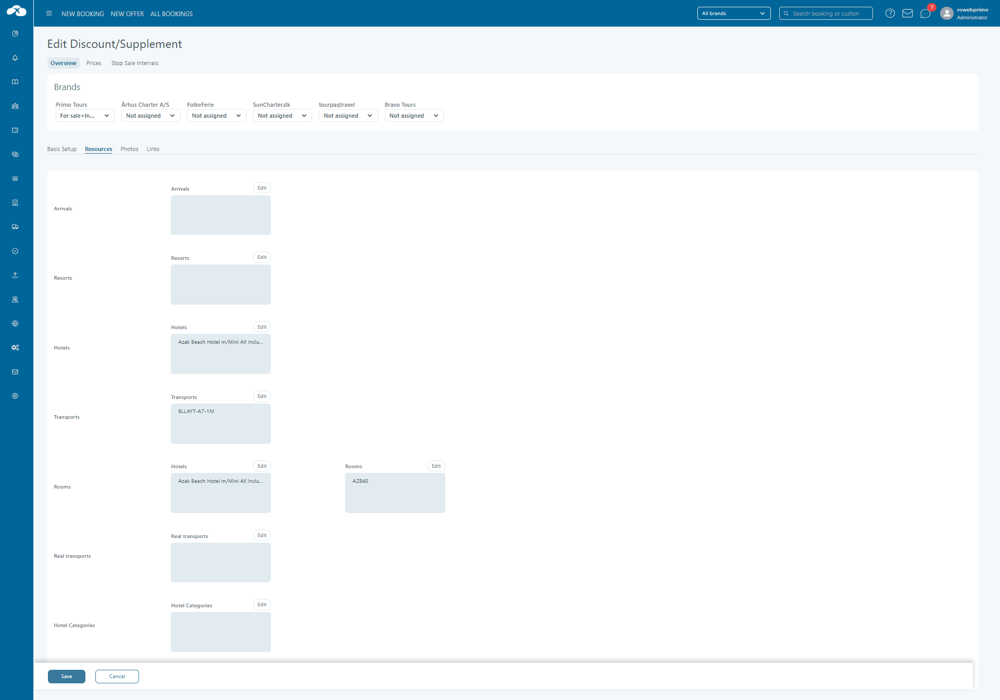

# Discounts/Supplements

Discount and supplements is a module from where discounts and supplements will be inserted for each company. A discount/supplement will be defined by the following information:

* Discount/supplement category
* Specify if is general or specific
* Specify if is permanent or manual
* General price
* Description
* An option that will establish if the discount/supplements is linked to extras(products)
* An option that will establish if the linked extras will be automatically selected( this option can be chosen only if the discount is linked to products and will establish if the chosen products will automatically be selected on web booking)

The discount/supplement categories will be inserted from Assets Management Center.

If a discount/supplement will be linked to a certain product, this should mean that the passenger will receive a discount equal to the product’s price.

Please note! ''Tourpaq does not provide stable support for having a passenger buying multiple supplements of the same supplement category. Though Tourpaq Office allows it, the Web Booking does not support it and leads to loss of supplements etc.''

### Discounts and supplements combinations in Tourpaq 

(Please set them as you will see them here, as other combinations are not defined or supported in Tourpaq)

**Specificate** + **Permanent** = **AUTOMATIC** (always on the booking, cannot be changed)

**Specificate** + **Manual** + **Bonus Code** = **Optional and/or Automatic** based on the bonus code.

### General versus Specific 

#### **General discount/supplements**

A general discount/supplement will be chosen manually for each passenger of a booking. It will be chosen from a range of discount/supplements that must fulfill the following conditions:

* If any price is defined, the booking’s departure date must be in the interval departure start date and departure end date; if booking start date and booking end date are filled in for that price, the booking date must be in the defined interval
* If any filter is chosen(destination, resort or hotel) it must correspond to the booking’s destination, resort or hotel
* It must be assigned to the booking’s agency Even if you define a general discount/supplement as "permanent", it will not be applied automatically(it must be specific + permanent in order to be applied automatically)

#### **Specific discount/supplements**

A specific discount/supplement will define the following extra information(not available for a general discount/supplement)

* Price type( the possible values should be: normal, discount, group, manual, all of them)
* Age( the possible values should be: adult, child, infant, no importance)
* Trip duration( possible values: Interval 1, Interval 2, Interval 3, Interval 4, No importance)
* Transport( possible values: a certain transport or no transport)
* Type of room( is chosen from all the room types that have been inserted in the system for the current company, or it can be no room selected)
* Departure start date, departure end date
* Booking start date, booking end date

### Permanent versus Manual 

#### **Permanent discount/supplements**

A permanent discount/supplement will automatically be applied for a passenger and cannot be deleted. It will be applied if it fulfills the following conditions:

* It must be specific
* If the price type is chosen, it must match the type of price chosen for the passenger or it must have the value “No importance”
* If the age is chosen, it must match the gender of the passenger or it must have the value “No importance” or “Everyone”
* If the travel length is chosen it must match the interval period of the booking or it must have the value “No importance”
* If the room type is chosen it must match the room type of the passenger
* If the transport is chosen, it must match the transport of the booking
* The booking’s departure date must be in the interval Departure start date and Departure end date (if these dates are set)
* The booking’s creation date must be in the interval Booking start date and Booking end date (if these dates are set)
* If any price is defined in the Prices section, it must be a price defined for the booking’s creation date and departure date
* If at least one filter is chosen for destination, resort or hotel, the value of the filter must correspond to the booking’s destination, resort or hotel
* The discount/supplement must be associated to the booking’s agency

![!](data:image/png;base64,iVBORw0KGgoAAAANSUhEUgAAACQAAAAkCAYAAADhAJiYAAAAAXNSR0IArs4c6QAAAARnQU1BAACxjwv8YQUAAAAJcEhZcwAADsMAAA7DAcdvqGQAAAAadEVYdFNvZnR3YXJlAFBhaW50Lk5FVCB2My41LjExR/NCNwAABUFJREFUWEe1WEtvW0UUvknaqkWlUEBdsa0EiAUSvwGxROIfwAoVAcqCPUhNHNsxdRALXqmglRAVoqgVlAYqBN0FNi1t7HttI7shrU1LHNtxkIgTH853zsz4+pmH8Uhf7tx758758p3HzNgjIu9+uUBXC2/QXPYJmkmPM7yRIro0RrGU9s/knqRvl1+jB+U/mQp53kq1QPPB0zTjT9A0D4iYgaMGbFl7U75HZzPPUImF8a7ceZ3ihkTMDB41YqlxijCJiPEG7qHYlZVT5CUyx5RI6lDXh/0Q8w/Tz39N0u9r83Szco5uVj+l29XP6VblLN2onqNfSm9TLFCjmFvARmdSB7rmiqYPOq8kM8fJw+RRebD72LldOU/NJnuc0aRN+N7dEzVom6831s8LiegSvhmnqcC4iElijqi54h0IAfHUEfLwYK+uqjXvKxkhpAAJ/os/8mCjuUrx9ISoInHChMQW3GUUAVyfCUaXJkCImTm2u0NlM89Gt9S4IdG0ZEwrN/IcI+YbGOOkQV+9ASJjIZUUiCMhhE6Y9U4o1BdUFm5NEOP+NunVPKbCxjWZFyoheOG6cCCDUGtOG9z7JHSr8hkT4NiBdWEAdUIK8TMEu4QCkzjN13iaFRG39bLVQWivuP73O9BDFQG06/po1x+8a8bDmBqEuzTIe8MRsox3q9LVe6+q4WZDjFtC1GSVDKnv777i4gZKwVXiMhM3vWy1uazz5SB8sfICGzVuUg7SV1Lav7D8ooyVWtSRWZ2wJIF9uezD3ElYNa1FpEWI6OPsSTNe3YVY6kdqaEKJ9CGXXSiE0rgQ2dTHNZE+bMaHCSGzzH0IQxMC/mkUjXHbjAu51beKxlUaP/Ybm/KdGJoQJihtLIoSLTc1WDWld2/jV1d7JKDFIMgwQsbD89n+vgn51a/ZtFFFeBhy3PzaVzJGqrJZOqL+2OhiCFhcTRjz6iY0JbTN7+KhseomKGWrdeudYmhCmPzH0qSYd7Jws8XyWnHS7SBEKVZH4okx3bZkKLoI7bUOYUP3ZfFltq1bDyHFsJl34e5LbtPXS5FODK0QMF94TnjYtiUxpO6bzz/fRWikhRGxkMw+wqY1oEUgk2F4Nsc7P1W9leYjJSS1hdepP9a/UzaGGJCr/9Dzm0EY3mVM5jRPkgwepp+Kb9Fvq7O0WH5P+rOZh3p+07kZC2N4hVDwsGBiIrOiwyWR9AHZN0t2wUViqHd1DmN4hbBhxyRm454MjtEcqxVeGtp3hEB/YkMTQi3BDjAZPOriCFmWq13i0+9jbcrYYI7wBr6fYm2E7LEWD5Gqg7IhDIzP1S4LGY1nrklchrL1y265cGM75oQdnDDkHRNECNgq7mGw3c2FP9oJs5mjUpntCtakf4UZjkOJ7BG3WwTEhoHciy1Wil3u7JpDZMhlfJjjl/aYMgjxpXE64x9lGpuqDv+RK9KfIZnW45RqCU0HfBLhviaAnu1xRTkRQuhANjtgJ8i4YIz89YtKAmykSG9TZv2ScVn3mmUBVexyBds2MxFjTiGJIxnUPxssENA42qAiB/VvmAbWtAYFtYtyPu8cb5WxkMKKKz/XPtvkfwKnW28uOCFFDnG0lxMsJpvyNXjxgwWKpDup7gAcHq0qUEv2Snw/lz1BHn6owgMnm/loEFwgmquct6CCf9C5QsaF+u3QHx+UiBZRFNqFO2+SVyqv0Ce5p2Si3cYQgBjBJHqv/6lVqD8RhbxnQvYetj/KPUvFSp7kJ72VtTwtLJ+i94PjPGl3dvzfQJaCfIRPLx/4j9MCe6m4tsxUyPsPEiJBxYwnODoAAAAASUVORK5CYII=) **Please note!** Do not use in the same supplement category both a permanent and a manual item. The system does not support this scenario. Please create special categories for the manual/optional supplements.

### Manual discount/supplements 

A manual discount/supplement will be manually chosen for a passenger; it can be either general or specific.

### Tabs 

#### **Overview**

<figure><figcaption></figcaption></figure>

* Discount or Suppl: choose between either discount or supplement behaviour
* General/Specified: choose between the general or specificate behaviour
* Fixed/Manual: choose between manual or fixed behaviour
* Price type: choose between normal, discount, group or manual prices
* Age: choose the gender of the guest that will benefit from the discount or supplement
* Period/Trip length: choose in which interval is the discount or supplement available
* Status: choose if anyone ca see the disc/suppl in Tourpaq
* Currency: choose the currency of the price
* Category: choose the category of the disc/suppl
* Dept.date Start: set the departure dates from which the disc/suppl is available
* Dept date Stop: set the departure dates from which the disc/suppl is unavailable
* Bkg.date Start: set the booking dates from which the disc/suppl is available
* Bkg.date Stop: set the booking dates from which the disc/suppl is unavailable
* Room type: select the room that will receive the disc/suppl
* Tranport no: select the transport for which the disc/supple is available
* Price: set the price of the disc/suppl
* Supplier: select the supplier of the disc/suppl
* Family discount: set the disc/suppl to behave as a family discount. This discount applies only if the first passager has the age between age rage from the discount's price section. Otherwise, a warning that the first passager doesn't meet the requirements is showing and the booking's status is changed in "Error".
* Include in basic price: add the price of the supplement to the price of the room, while hiding it from the guest
* Used for price adjust:

<figure><figcaption></figcaption></figure>

The entities having this checkbox active will:

* support and always keep on the booking the price adjustment,
* if is included in the room price it also is invisible to the end customer
* by being manual it will allow for manual value setting in Office for each individual booking scenario because of the new checkbox, this supplement will not appear in the Web Booking Customer Center as an optional choice a user can drop/add.
* multiple such supplement/discounts can exist in the same time and the seller can choose which to use on the booking
* One way: choose if the disc/suppl is available for one way flights or charter
* Minimum required lenght: number of minimum days per trip for the disc/suppl to be available
* Maximum allowed lenght: number of maximum days per trip for the disc/suppl to be available
* Percent: doesn't work
* Gift card discount: set the discount to behave as a gift card
* Add one disc/room Web:
* Issue voucher: vouchers can be issued for the disc/suppl
* Available for first pass: only the first passenger in the booking will receive the discount/supplement
* Generic service: allows to change the name of the discount/supplement. This type of discount has to be General/Manual and it can be combined with a "Not Combine with disc." discount. Also, the name inserted when the discount is used on a booking will be shown on the ticket
* Linked to extras: allows the discount/supplement to be linked to a product; will be given only if the product is selected in a booking (not compatible with bonus code). This discount gives an entire extra price discount.
* Automatically select extras:
* On room list: will appear on rooming list
* Only one book/person:
* Available for first passenger in room: only the first passenger in the room will receive the disc/suppl
* Don't display in Api:
* Passengers no. to apply discount to: number of passengers in a booking that can benefit from the disc/suppl (only if //Available for first pass// is checked) !!NOTE: The discount is applied only for adults. The children doesn't count.
* Auto Select in Bkg Wnd:
* Not combine with disc: if checked, the disc/suppl will not allow any other disc/suppl in the booking
* Not combine with extra bed disc: if checked, the disc/suppl wil not allow the extra bed discount to be given, also this rule applies to child price(CH1 in pricelist). Discount will remove all extra beds from the booking even if it is applied to only one pax.

#### Prices

Prices are defined for certain periods of time, periods that will consider the departure date of a booking. If defined here, this price will overrule the general price.

<figure><figcaption></figcaption></figure>

In the Discount/supplements general window, go to the Prices tab and click on New Price.

* Set the age limits.
* Set the departure start date and departure end date.
* Set the booking start date and the booking end date.
* Next, set the price of the discount/supplement. This price is overwritten by prices L1 to L4
  * Price L1 is the price for interval 1 of the transport
  * Price L2 is the price for interval 2
  * Price L3 is the price for interval 3
  * Price L4 is the price for interval 4

Any value from these intervals will overwrite the general price. To avoid overwriting the price, just let the prices for intervals empty (not 0).

* Then, set the general cost price for the discount/supplement and cost price for each interval.
* Per day check box sets the price for each stay day and will be placed as a total on the booking.
* DUD(days until departure) – this will prevent the discount to be applied on a booking, if the booking is created with the given number of days before departure date.
* BP% - sets the price as a percentage of the basic price
* CD - date when the price was created

#### Stop Sale Intervals

Any discount/supplement can be removed from selling by creating a stop sale interval for it. To do that, just go to Stop sale interval tab.

<figure><figcaption></figcaption></figure>

* Click new interval
* Set the start date and stop date for the interval in which the discount cannot be sold.
* Click on save.

The stop sale will run for each date and reduce the number of discounts/supplements available.

#### **Filters**

A discount/supplement could be universally available, or it could be available for certain destinations, resorts, hotels or room hotels. If at least on filter is chosen, it will be available only for the bookings that have the chosen destination, resort or hotel.

![!](data:image/png;base64,iVBORw0KGgoAAAANSUhEUgAAACQAAAAkCAYAAADhAJiYAAAAAXNSR0IArs4c6QAAAARnQU1BAACxjwv8YQUAAAAJcEhZcwAADsMAAA7DAcdvqGQAAAAadEVYdFNvZnR3YXJlAFBhaW50Lk5FVCB2My41LjExR/NCNwAABUFJREFUWEe1WEtvW0UUvknaqkWlUEBdsa0EiAUSvwGxROIfwAoVAcqCPUhNHNsxdRALXqmglRAVoqgVlAYqBN0FNi1t7HttI7shrU1LHNtxkIgTH853zsz4+pmH8Uhf7tx758758p3HzNgjIu9+uUBXC2/QXPYJmkmPM7yRIro0RrGU9s/knqRvl1+jB+U/mQp53kq1QPPB0zTjT9A0D4iYgaMGbFl7U75HZzPPUImF8a7ceZ3ihkTMDB41YqlxijCJiPEG7qHYlZVT5CUyx5RI6lDXh/0Q8w/Tz39N0u9r83Szco5uVj+l29XP6VblLN2onqNfSm9TLFCjmFvARmdSB7rmiqYPOq8kM8fJw+RRebD72LldOU/NJnuc0aRN+N7dEzVom6831s8LiegSvhmnqcC4iElijqi54h0IAfHUEfLwYK+uqjXvKxkhpAAJ/os/8mCjuUrx9ISoInHChMQW3GUUAVyfCUaXJkCImTm2u0NlM89Gt9S4IdG0ZEwrN/IcI+YbGOOkQV+9ASJjIZUUiCMhhE6Y9U4o1BdUFm5NEOP+NunVPKbCxjWZFyoheOG6cCCDUGtOG9z7JHSr8hkT4NiBdWEAdUIK8TMEu4QCkzjN13iaFRG39bLVQWivuP73O9BDFQG06/po1x+8a8bDmBqEuzTIe8MRsox3q9LVe6+q4WZDjFtC1GSVDKnv777i4gZKwVXiMhM3vWy1uazz5SB8sfICGzVuUg7SV1Lav7D8ooyVWtSRWZ2wJIF9uezD3ElYNa1FpEWI6OPsSTNe3YVY6kdqaEKJ9CGXXSiE0rgQ2dTHNZE+bMaHCSGzzH0IQxMC/mkUjXHbjAu51beKxlUaP/Ybm/KdGJoQJihtLIoSLTc1WDWld2/jV1d7JKDFIMgwQsbD89n+vgn51a/ZtFFFeBhy3PzaVzJGqrJZOqL+2OhiCFhcTRjz6iY0JbTN7+KhseomKGWrdeudYmhCmPzH0qSYd7Jws8XyWnHS7SBEKVZH4okx3bZkKLoI7bUOYUP3ZfFltq1bDyHFsJl34e5LbtPXS5FODK0QMF94TnjYtiUxpO6bzz/fRWikhRGxkMw+wqY1oEUgk2F4Nsc7P1W9leYjJSS1hdepP9a/UzaGGJCr/9Dzm0EY3mVM5jRPkgwepp+Kb9Fvq7O0WH5P+rOZh3p+07kZC2N4hVDwsGBiIrOiwyWR9AHZN0t2wUViqHd1DmN4hbBhxyRm454MjtEcqxVeGtp3hEB/YkMTQi3BDjAZPOriCFmWq13i0+9jbcrYYI7wBr6fYm2E7LEWD5Gqg7IhDIzP1S4LGY1nrklchrL1y265cGM75oQdnDDkHRNECNgq7mGw3c2FP9oJs5mjUpntCtakf4UZjkOJ7BG3WwTEhoHciy1Wil3u7JpDZMhlfJjjl/aYMgjxpXE64x9lGpuqDv+RK9KfIZnW45RqCU0HfBLhviaAnu1xRTkRQuhANjtgJ8i4YIz89YtKAmykSG9TZv2ScVn3mmUBVexyBds2MxFjTiGJIxnUPxssENA42qAiB/VvmAbWtAYFtYtyPu8cb5WxkMKKKz/XPtvkfwKnW28uOCFFDnG0lxMsJpvyNXjxgwWKpDup7gAcHq0qUEv2Snw/lz1BHn6owgMnm/loEFwgmquct6CCf9C5QsaF+u3QHx+UiBZRFNqFO2+SVyqv0Ce5p2Si3cYQgBjBJHqv/6lVqD8RhbxnQvYetj/KPUvFSp7kJ72VtTwtLJ+i94PjPGl3dvzfQJaCfIRPLx/4j9MCe6m4tsxUyPsPEiJBxYwnODoAAAAASUVORK5CYII=) **!Please note!**

* giftcard codes combined with room filters on the discount will work if the booking contains **at least** one room type that is set as filter/resource on the discount. The discount will be given to the first passenger, regardless of the room he is accomodated is or not a resource for the discount.
* a booking will HOLD its optional supplements regardless of their eligibility status being changed meanwhile. A booking ubdate will not remove optional supplements by it's own. The automatic ones will get removed.

#### Resources

In the discount/supplement general window, go to Resources tab.

Here we can select the resource type from the dropdown: destination, resort, hotel, room, transport, real transport, hotel categories

<figure><figcaption></figcaption></figure>

Resources are used to limit the availability of discount/supplement to the selected entities.

* Destinations will limit the availability of the discount/supplement to the selected destinations.
* Resorts will limit the availability of the discount/supplement to the selected resorts.
* Hotels will limit the availability of the discount/supplement to the selected hotels
* Transports will limit the availability of the discount/supplement to the selected transports.
* Rooms will limit the availability of the discount/supplement to the selected rooms from the selected hotels. There are two boxes: first containing the hotels and the second containing rooms. Rooms will not appear unless a hotel is selected.
* Real Transport will limit the availability of the discount/supplement to the selected transports.
* Hotel Categories will limit the availability of the discount/supplement to the selected hotel category

There are two rules (set from system setup ) when using resources:

1. The first one is "AND". If used, it will limit the discount to all selected resources types. With this configuration the extra will be bookable If all the requirements are met on the booking.
2. The second rule is "OR". If that rule is active, the extra can be booked if only one of the requirements is met.

After all these are set, click on save resources.

#### Photos

On Discount/supplement General window, go to Photos tab:

<figure><figcaption></figcaption></figure>

* Click on Add picture,
* Click on browse,
* Select which photo you want to add,
* Click open
* Insert the title for the picture you're adding,
* Click on save button.

We can add other pictures by repeating the previous process. We can add more pictures for the same product.

* Choose which of the added photos is the main photo, by clicking Main photo. Main photo is the photo that will be displayed for the discount/supplement. All the photos will be shown on the website.
* To remove images, just click delete.

#### Links

For a discount/supplement (set as Specified/Permanent) to be linked to a product, the extra will be chosen from this section. For this tab to be active, the "link to extras" checkbox must be selected in the general tab. This feature allows giving a product free of charge to the customers.

There are two scenarios to use this feature:

* First, if a discount is linked to a product, when the product is manually chosen for a certain passenger or automatically applied by the system (because of the option Automatically select extras (Web Booking), then a discount is automatically applied to that passenger. The value of the discount is the price of the product.
* Second, Tourpaq also supports giving a free product for a specific timeframe, without having it set as automatically to the customers. This can be obtained by having the discount permanent and linked to the product, but also set the discount as “Automatically select extras (in Web Booking)”. The product will be selected automatically in the offer even if the product is not set as automatically applicable.

Other destinations or booking dates outside the discount setting will not have the product auto selected or free of charge.

<figure><figcaption></figcaption></figure>

Go to links tab.

* Click on categories dropdown. For example, the Golf type of products is chosen for the filter, the golf extras will be displayed
* Choose the extra to link the discount/supplement to
* Click on save products.

Click save to have the link between the product and the discount/supplement

#### Brands

In Discount/supplement general window, go to Brands tab and choose the brand that will sale the discount/supplement.

* Default setting is Not assigned. At this stage the discount/supplement cannot be sold.
* For sale allows the discount/supplement to be selected only in Tourpaq office environment by seller and admin users when making or editing a booking.
* Internet sale allows the discount/supplement to be selected when making a booking from the website and also when editing the booking in customer center.
* For sale and internet sale, combines both options.

#### Bonus code

A coded discount or bonus code discount is a discount given to guests during a campaign when they use a certain code during the booking process.&#x20;

A bonus code is a text code that allows a visitor to book a trip with a certain discount as a campaign action. The text chosen for the bonus code has to be longer than 4 (including) characters and shorter than 20 (including) but NOT 12 characters. The 12 character lenght is reserved for giftcard codes that can be added in the Web Booking through the same field - this lenght rule is needed to differentiate between the two code types.

Tourpaq system allows multiple discounts to use the same bonus code. If all discounts are available they will all be applied by using the bonus code. The discounts can also be set as not combinable with other discounts, this would lead in applying only the most advantageous discount for the current booking (not per passenger but on the entire booking).

<figure><figcaption></figcaption></figure>

To set a coded discount, first set the code name, plain text, list text and bonus code name. The text chosen for the bonus code has to be between 4 and 20 characters long

General settings for a bonus code discount to perform as required are:

* discount
* specificate
* manual.

Click insert.

Click on brands and assign the discount to a brand. and click save.

Back to general settings and click save again.
