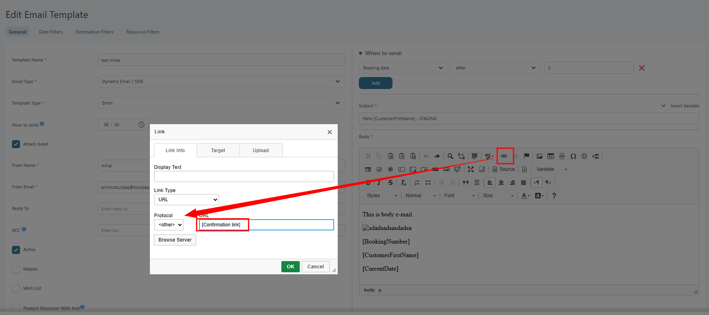

# Setup for Dynamic E-mail/SMS Center

### Overview

Use this page to set up **dynamic email or SMS templates**. You can send them automatically to bookings that match your rules and filters.

### Purpose

This feature is designed to:

* Send automatic messages for common situations (confirmations, reminders, promotions).
* Keep the wording consistent across email and SMS.
* Reduce manual work by sending messages based on rules and filters.

### Template setup

<figure><figcaption>
New Dynamic E-mail/SMS template setup.
</figcaption></figure>

### Access

Open **E-mail Setup → Dynamic E-mail/SMS Center**, then choose **New Email Template**.

### Template types

You can create different template types, such as:

* **Dynamic Email/SMS**
* **Confirmation Transfer**
* **Confirmation Hotel**

If you are setting up confirmation templates, also read [Hotel and transfer confirmation emails to suppliers](../../hotel-and-transfer-confirmation-e-mail-to-suppliers.md).

### Configure the template

Before you edit anything, select the correct **brand** in the top-left dropdown.

#### Basic template settings

* **Template name**: a clear name you can recognize later.
* **Email Type:** allow yo create different email type.
* **Template type**: the kind of message you are setting up.
* **Active**: allows the template to be used for sending.
* **Hidden**: hides the template from the Dynamic E-mail/SMS Dashboard list.
* **Hour to send**: the time the email/SMS should be sent. Sending can be delayed by up to about 20 minutes. If you leave it blank, it is sent as soon as all rules match.
* **Product Resourser With And:** when checked, the system finds all bookings with all resources purchased / not purchased

#### Email-only settings

* **Attach ticket**: attaches the booking ticket to the email.
* **From name**: sender name shown to the customer.
* **From e-mail**: sender email address. Use a real address.
* **Reply to**: where replies should go. Use a real address.
* **BCC**: email addresses that should receive a copy. Use real addresses.

#### Optional product filters

* **Customers who have bought**: include bookings that bought selected categories.
* **Customers who have not bought**: exclude bookings that bought selected categories.

### Sending options

<figure><figcaption>
Sending options and rule builder.
</figcaption></figure>

Use these fields to decide **when** the message should be sent.

The first dropdown contains the primary sending options for the template:

* Booking date
* Departure date
* Return home date
* Moved booking
* Canceled booking
* Last minute

The second dropdown contains the timeframe options:

* Before
* After

In the third field, enter the number of days. The email/SMS is sent as soon as all requirements are met.


**Important**

You can add more than one sending rule. Be careful when you combine rules.

* If you use **different rule types**, the booking must match **all** of them.
* If you use the **same rule type** more than once, the booking matches if **any** of them apply.

The examples below show how this works.


* If you use two or more different rule types, the booking must match all of them. The message is still sent only once.

#### Different rule types

Send an email or SMS **60 days before departure** and **2 days after booking date**.

<figure><figcaption>
Example of combined rule types.
</figcaption></figure>

* If you set the same rule type more than once, the booking matches any of them. The system still sends only one message.

#### Same rule type

<figure><figcaption>
Example of repeated departure-date rules.
</figcaption></figure>

1.  **First Booking**:\
    One booking is made more than 25 days before departure, and the email template is configured as follows:

    * 20 days before departure
    * 18 days before departure
    * 16 days before departure
    * 14 days before departure

    In this case, the booking will receive **only one email** scheduled for 20 days before departure. It will not receive additional emails at 18, 16, or 14 days before departure.
2. **Second Booking**:\
   This booking is made 17 days before departure. With the same configuration, it will receive **only one email** scheduled for 16 days before departure. No additional email will be sent at 14 days before departure.

The system sends **only one message per template**, even if you add several “when to send” conditions.

### Product and discount/supplement filters

<figure><figcaption>
Product and discount or supplement filters.
</figcaption></figure>

Use these fields to filter bookings based on what they bought. “Disc/suppl” means **discounts and supplements**.

#### Product Resourcer

**Default set-up**

If you select multiple items in **Customers who have bought**, a booking qualifies if it bought **at least one** of them.

If you select multiple items in **Customers who have not bought**, a booking is excluded if it bought **at least one** of them.

**Product Resourcer With And** changes the “at least one” behavior to “all of them”.

If you select multiple items in **Customers who have bought**, a booking qualifies only if it bought **all** of them.

If you select multiple items in **Customers who have not bought**, a booking is excluded if it bought **at least one** of them.

For example, the email will be sent out as follows:

Note: `1` means the email is sent. `0` means it is not sent.

### Message content

<figure><figcaption>
Dynamic template message editor.
</figcaption></figure>

The message editor works like the regular **E-mail Center**.

The email body can include the name of the Transport Supplier.

Support is available for Real Transport. The Transport Supplier name inserted into the email is taken from the outbound transport.

#### Add a link to the Customer Center

Write the link text (for example, “Open your booking”). Select it. Then click the link button shown in the screenshot.

<figure><figcaption>
Add link button in the message editor.
</figcaption></figure>

In the URL field, insert the `[Hash-key-link]`. Select the other protocol, as shown in the screenshot.

<figure><figcaption>
Customer Center link settings.
</figcaption></figure>

When using the Insert Link option with an already existing system-generated link (for example, a Confirmation link), the protocol must be set to "Other".\
This is required because the system automatically adds the correct protocol. If another protocol is manually added, the generated link becomes invalid and may result in an access error when the link is opened.

<figure><figcaption>
Protocol setting for a system-generated link.
</figcaption></figure>

### Date filters

<figure><figcaption>
Booking date filters.
</figcaption></figure>

Use these fields to filter bookings by booking, departure, arrival, and return dates.

### Destination and transport filters

<figure><figcaption>
Destination and transport filters.
</figcaption></figure>

Dynamic Emails can be configured to vary their content based on departure/arrival details and transport characteristics. This makes it possible to deliver highly targeted emails, such as departure specific instructions or airport related information.

Dynamic Emails can be filtered so that a specific email template is sent only when defined booking, destination, or transport conditions are met. Filters are combined to precisely control when an email is triggered.

#### Destination filters

Destination filters define **where** the booking applies. You can filter Dynamic Emails by:

* **Countries**
* **Departures** (departure airports or locations)
* **Arrivals**
* **Resorts**
* **Hotels**

This allows, for example, sending different emails based on the departure airport or destination hotel.

#### Transport filters

Transport-related filters define **how** the customer is traveling:

* **Transports**
* **Real Transports**
*   **Transport Suppliers -** The Transport Supplier filter supports Real Transport values.

    Filtering is evaluated only against the outbound transport. The transport supplier configured on the homebound transport is not taken into account.
* **Transport Modes**
* **Transport Types**

These filters make it possible to distinguish between different suppliers, charter vs GDS flights, or system vs external transports.

#### How filtering works

* Filters are **inclusive**. If a filter is set, the booking must match it for the email to be sent.
* Multiple filters can be combined to create highly specific rules.
* If a filter category is left empty, it does not restrict the email.

#### Typical use case

You can configure different Dynamic Email variants such as:

* One email for passengers departing from Airport A with Supplier X
* Another email for Airport A with Supplier Y
* A third email for Airport B with Supplier X

This is especially useful for departure-specific information, such as parking instructions or airline-specific details.

These filtering options ensure that customers receive only the most relevant communication for their exact booking context.

### Resource filters (product links)

Use **Resource filters** to send clickable product links to guests. Guests can add the product to their booking with very little effort.

<figure><figcaption>
Resource filters for product links.
</figcaption></figure>

When you use Resource filters, a special variable becomes available in the email body.

<figure><figcaption>
Variable for inserting product links.
</figcaption></figure>

You can attach this variable to a button, text, or image. When the guest clicks it, they are taken to the Customer Center. They will see a message that the product is added. They must save the booking to confirm it.

If you send several links, only the clicked link is applied.

**There can be only one link per category.**

**If you select multiple products in a category:**

* For a **multi-select** category, all selected products are added.
* For a **single-select** category, the cheapest selected product is added.


**Caution**

* An email or SMS template that has been sent to a booking cannot be resent.
* Be careful when creating a template. If you make a mistake, avoid editing the same template. A booking can receive a template only once.

