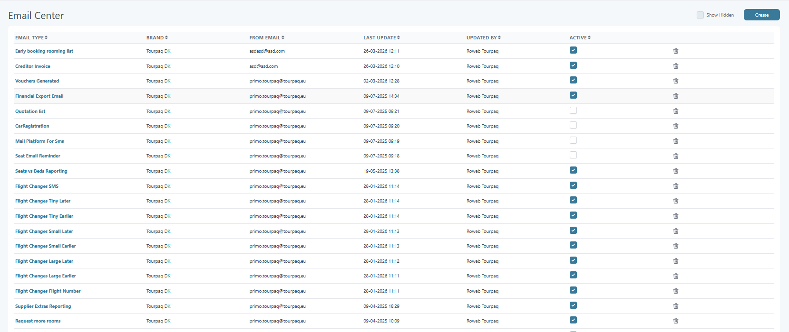

# E-mail center

### Overview

The **E-mail Center** is the place where administrators set up and maintain all **automated email templates** used by the system.

From here you can create, edit, and test templates. This keeps customer emails consistent and up to date.

### Purpose

The E-mail Center is used to:

* Create and maintain templates for automated emails.
* Insert booking details using built-in placeholders.
* Test emails before you send them to customers.
* Control sender details and whether a template is active.

### Access

Open **E-mail Setup → E-mail center** in the back office.

### Table Structure

<figure><figcaption></figcaption></figure>

Each email configuration is displayed in a row with the following columns:

**Email Type** - Defines the functional purpose of the email. Each type corresponds to a specific automated process or event trigger in the system.

**Brand** - Indicates the brand context under which the email configuration is applied. This ensures that email behavior can vary across different brand setups.

**From Email** - Specifies the sender email address used when emails are dispatched. This field controls the visible sender identity in outgoing emails.&#x20;

**Last Update** - Shows the timestamp of the most recent modification to the configuration. This helps track recent configuration changes.&#x20;

**Updated By** - Displays the user or system account that performed the last update.

**Active** - Indicates whether the email configuration is currently enabled.

* Checked: Active and used in workflows
* Unchecked: Disabled and ignored by the system


When an email template is activated, the system checks for any failed emails from the previous 7 days and attempts to resend them.

**Example**\
If an email template is activated on 10 June, the system will also include failed email attempts from 3 June to 10 June. Any emails that failed within this period become eligible for retry and can be resent after activation.


Row Actions - Each row includes action controls:

* **Edit (row click or open action depending on implementation)**\
  Allows modification of the email configuration.
* **Delete (trash icon)**\
  Removes the configuration from the system.

Deletion should be used carefully as it may affect live email workflows.

### Template fields

For each email template, you can configure the following fields:

* **Sender email address** – The “from” email address. Replies go to this address.
* **Sender name** – The “from” name shown in the inbox.
* **Activation status** – **Active** sends emails. **Inactive** blocks emails.
* **Email subject** – The subject line of the email.
* **Email body (text editor)** – The message content. You can add placeholders like customer name or booking number.


Placeholders are short codes the system replaces automatically.

For example, a booking number placeholder becomes the real booking number.


### Types of automatic emails

The system can send many types of automated emails. Common examples include:

* Thank You for Booking
* Reservation Canceled
* Payment Pre-reminder
* Payment Reminder
* Booking Canceled in 48 Hours
* Deposit Received
* Insurance Information Missing / Still Missing
* Second Payment Received
* Full Payment Received
* Welcome Home / Welcome Home Reminder
* Reporting Schedule Communication
* LMS Booking Confirmation
* Booking Updated
* Hotel Release
* Flight Changes Notification
* Seat Reminder Email
* Financial Export Email
* Post-Deposit Questionnaire
* Wait List Booking
* Voucher Generated Notification
* Missing Attributes Notification
* Creditor Invoice
* Special Offer Rejected
* Hotel Reporting / Extras Reporting / Supplier Extras Reporting
* Documents Uploaded
* Emails sent from **View All Bookings** or **Customer Export**
* Room Request Notification
* Early Booking Rooming List
* Quotation List
* Stop Sales Introduction
* Extras Category Reporting
* **Pending Payment Notification** – Sent when the payment provider (DIBS) needs more time. This usually takes 2–72 hours.
* **Captured Money But No Allotment** – Sent when payment succeeds, but availability is gone. A refund often follows.

### Step-by-step: configure an email template



**1. Open the E-mail Center**

Open **E-mail Setup → E-mail center**.



**2. Choose a template**

Either:

* Select an existing template from the list to edit it, **or**
* Create a new template (if available in your setup).



**3. Fill in sender details**

Set:

* **Sender email address** – Use a valid address that belongs to your domain.
* **Sender name** – Use a clear name that customers will recognize as your company or brand.



**4. Define subject and content**

* Enter a clear, descriptive **email subject**.
* In the **email body**, write the content of the message.
* Add placeholders where you want details filled in automatically.



**5. Set activation and save**

* Choose the **activation status** (keep it inactive while you are still testing).
* Save your changes.



**6. Test the template**

* Click the **Test** button for the template.
* Enter your own email address (or a dedicated test mailbox) as the recipient.
* Send the test email and then check your inbox.
* Verify that:
  * The sender, subject, and content look correct.
  * All placeholders are replaced with the expected values.
* When you are satisfied, set the template to **active**.
* The system will then use it automatically.



### Best practices


To keep email communication reliable and professional, follow these recommendations:

* **Use recognizable sender details** – Choose a sender name and email that clearly represent your company or brand.
* **Keep subjects clear and specific** – Make it obvious what the email is about (for example: _"Booking confirmation – \[Booking Number]"_).
* **Test placeholders** – Send a test email and check the details.
* **Avoid unnecessary changes to live templates** – When possible, clone or copy a template, adjust it, test it, and then switch over.
* **Test after major system changes** – If booking flows or payment providers change, re-test the key email templates (confirmation, payment, cancellation, etc.).


### FAQ

Why didn’t my email send?

Check that the template is set to **Active**. Then check you are testing the right email type.

Why do I see strange codes in my email?

Those are placeholders. The system fills them in when sending real emails. If they stay as codes, the placeholder is wrong or data is missing.

Who receives replies to automated emails?

Replies go to the sender email address in the template. Use an inbox your team actually monitors.

How do I safely change a live template?

Copy the template first, if your setup allows it. Test the copy. Then switch to the updated version.

Why did the customer not receive the email?

Ask them to check spam or junk folders first. Then send a test to the same domain, if possible. Keep attachments small to improve delivery.

