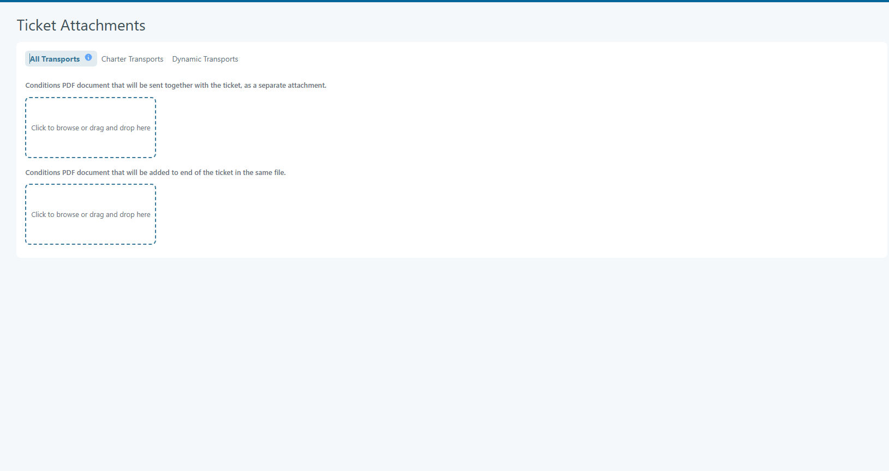
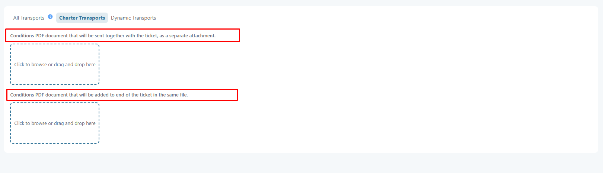
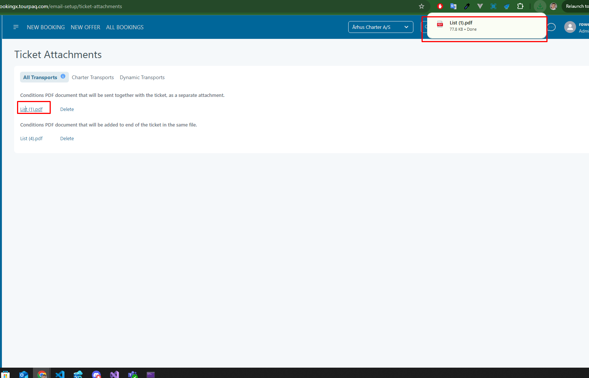

# Ticket Attachments

Ticket Attachments page is agency specific. Agency selection is required. Can be accessed from **E-mail Setup / Ticket Attachments**

This features allows adding conditions PDF documents for tickes. There are 3 tabs for the feature based in transport type:

* All Transports
* Charter Transports
* Dynamic Transports

<figure><figcaption></figcaption></figure>

#### All Transports 

Note: If a document is uploaded for a specific document type in 'All Transports', it will be set as the default for all other sections.

<figure><figcaption></figcaption></figure>

#### Actions 

* Upload

Upload types:

* Conditions PDF document that will be sent together with the ticket, as a separate attachment.
* Conditions PDF document that will be added to end of the ticket in the same file.

<figure><figcaption></figcaption></figure>

* Download

Documents can olso be downloaded:

<figure><figcaption></figcaption></figure>
